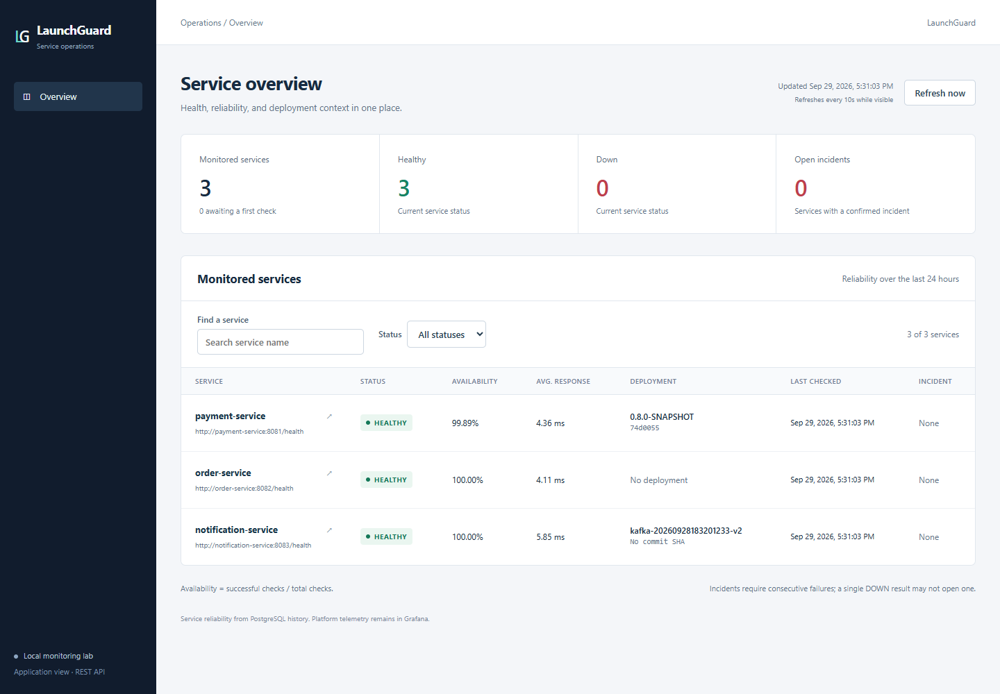
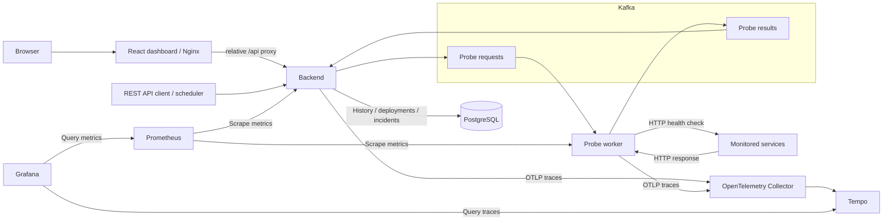

# LaunchGuard

[](https://github.com/doctor277/launchguard/actions/workflows/ci.yml) [](LICENSE) [](https://openjdk.org/projects/jdk/25/)

LaunchGuard is an event-driven service monitoring and deployment reliability platform built with Java, Kafka, and PostgreSQL. Its React dashboard presents service health, reliability, incidents, and deployments, while Prometheus, Grafana, OpenTelemetry, and Tempo provide platform metrics and distributed tracing.



## Features

- Scheduled and on-demand HTTP health checks, with asynchronous Kafka dispatch and a separate probe worker.
- PostgreSQL-backed check history, availability and latency statistics, timelines, and paginated APIs.
- Deployment tracking that preserves the deployment associated with each check and incident.
- Automatic incident detection and recovery using configurable consecutive-failure/healthy thresholds.
- Responsive application dashboard with service overview, reliability timelines, check history, incidents, and deployment context.
- Transactional result deduplication, bounded worker concurrency, consumer retries, and dead-letter topics.
- Provisioned observability dashboards, distributed traces, and structured correlation logs.
- Three independent demo services with failure/latency controls, plus CI validation and opt-in delivery demonstrations.

## Architecture



The backend dispatches probes through Kafka; the database-free worker performs bounded HTTP work and publishes results back through Kafka. The backend persists results, updates service status, and evaluates incidents in one transaction. Delivery is at-least-once, with database-backed result deduplication. A synchronous manual-check endpoint is also available.

## Tech Stack

| Area | Technology |
|---|---|
| Application | Java 25, Spring Boot 4.1.1 |
| Dashboard | React 19, TypeScript 7, Vite 8, Nginx |
| Build | Maven 3.9.16 via Maven Wrapper |
| Messaging | Apache Kafka 4.3.0, Spring Kafka |
| Persistence | PostgreSQL 18.6, Spring Data JPA, Flyway |
| Local environment | Docker Compose, six non-root application images |
| Metrics and dashboards | Micrometer, Prometheus 3.10.0, Grafana 12.4.11 |
| Tracing | OpenTelemetry, Collector 0.147.0, Tempo 2.10.7 |
| Testing | JUnit, Mockito, AssertJ, PostgreSQL/Kafka Testcontainers, Vitest, React Testing Library, Playwright |
| CI | GitHub Actions |

## Quick Start

Requirements: Git, Docker with Linux containers and Compose supporting `--wait`, and PowerShell 5.1+ or PowerShell 7 for demo registration. Java 25 is needed only for builds/tests outside Docker; no global Maven installation is required.

```bash
git clone https://github.com/doctor277/launchguard.git
cd launchguard
cp .env.example .env
docker compose up --build -d --wait --wait-timeout 180
```

On Windows PowerShell, use `Copy-Item .env.example .env` instead of `cp`. Review `.env` before startup if default ports are occupied; it is ignored by Git.

Register the three demos from a PowerShell terminal at the repository root:

```powershell
./scripts/register-demo-services.ps1
```

Registration reuses matching services and rejects conflicting targets without overwriting history. Compose checks every 5 seconds by default. Container targets use Docker DNS, not host `localhost`. If the backend host port changes, pass `-BackendUrl http://localhost:YOUR_PORT` to the registration script.

| Component | Default host address |
|---|---|
| LaunchGuard dashboard | [localhost:3001](http://localhost:3001) |
| Backend API | `http://localhost:8080` |
| Probe-worker health | `http://localhost:8084/actuator/health` |
| Payment health | `http://localhost:8081/health` |
| Order health | `http://localhost:8082/health` |
| Notification health | `http://localhost:8083/health` |
| PostgreSQL | `localhost:5432` |
| Kafka host listener | `localhost:9092` |
| Prometheus | [localhost:9090](http://localhost:9090) |
| Grafana dashboard | [LaunchGuard Platform](http://localhost:3000/d/launchguard-platform) |
| Tempo readiness | `http://localhost:3200/ready` |
| Collector OTLP HTTP / health | `http://localhost:4318/v1/traces` / `http://localhost:13133` |

Published ports bind to `127.0.0.1` and can be overridden in `.env`. The first build downloads images and Maven dependencies. Inspect the lab with `docker compose ps` and `docker compose logs backend probe-worker`; stop it with `docker compose down`. PostgreSQL and Prometheus named volumes survive normal stops. Do not add `-v` unless intentionally deleting stored lab data.

See the [technical guide](docs/technical-guide.md) for host-run Java setup, WSL, port overrides, demo scenarios, and troubleshooting.

## API

Service-scoped routes use `/api/services/{id}`:

| Area | Routes |
|---|---|
| Service registry | `GET/POST /api/services`, `GET/DELETE /api/services/{id}` |
| Health checks | `POST /check/async` (202), `POST /check` (synchronous), `GET /checks` |
| Reliability | `GET /metrics`, `GET /metrics/timeline` |
| Deployments | `POST/GET /deployments`, `GET /deployments/{deploymentId}`, `GET /deployments/{deploymentId}/metrics` |
| Incidents | `GET /incidents`, `GET /incidents/current`, `GET /incidents/{incidentId}`, `GET /incident-metrics` |

Register a deployment for a service returned by the bootstrap or `GET /api/services` (replace `SERVICE_ID`):

```bash
curl -i -X POST http://localhost:8080/api/services/SERVICE_ID/deployments \
  -H "Content-Type: application/json" \
  -d '{"version":"1.0.0","commitSha":"a921fc7","description":"Payment release"}'
```

The new deployment becomes current; existing checks retain their original association. Service metrics/timelines support `1h`, `24h`, `7d`, `30d`, and `all`, defaulting to `24h`. History endpoints use zero-based `page` and `size` (default 20, maximum 100). Responses are DTOs with structured validation errors.

Full payloads, pagination metadata, incident semantics, and CI-report replay behavior are in the [API reference](docs/technical-guide.md#api).

## Testing

The latest validation contains **134 Java tests** and **33 frontend unit/component tests**, with zero failures, errors, or skips, plus a real-browser Compose smoke test. Real PostgreSQL and Kafka Testcontainers exercise the asynchronous HTTP-to-database path, duplicate results, incident transitions, deployment correlation, and trace propagation. See the [V0.9 validation report](docs/v0.9-validation.md).

With Java 25 and Docker reachable from the JVM, run the same full build/test command used by CI:

```bash
sh ./mvnw -B -ntp clean verify
```

Windows PowerShell:

```powershell
./mvnw.cmd -B -ntp clean verify
./scripts/assert-test-results.ps1
```

The Compose lab does not need to be running for Testcontainers. Docker unavailability fails integration tests rather than silently skipping them.

Run the dashboard checks with the locked Node version from `dashboard/.node-version`:

```bash
cd dashboard
npm ci
npm test
npm run build
```

[GitHub Actions CI](.github/workflows/ci.yml) runs on pull requests, pushes to `main`, and reusable workflow calls. It checks locked frontend dependencies, frontend tests/build, all Maven modules, zero skipped Java tests, PowerShell contracts, workflow lint, Compose configuration, all six application image builds, and a real-browser dashboard smoke test against the Compose backend. The separate [delivery workflow](.github/workflows/delivery.yml) is manually dispatched; GHCR publishing is opt-in and disabled by default.

## Observability

- **Prometheus** scrapes backend/worker JVM, HTTP, Kafka, probe, incident, and workload metrics. Custom labels exclude service/request/deployment identifiers.
- **Grafana** provisions Prometheus and Tempo datasources and the LaunchGuard Platform dashboard automatically; local access is anonymous, read-only Viewer.
- **OpenTelemetry** propagates W3C context across Kafka messages and the worker's HTTP/thread boundaries. Traces go through the Collector to **Tempo**; metrics are scraped directly, not exported through OTLP.
- **Structured logs** correlate request/service/deployment fields with trace/span IDs where applicable.

Backend and worker expose `/actuator/health`, readiness/liveness health paths, and `/actuator/prometheus`, without sensitive management endpoints. Compose samples every trace for the demo. Prometheus retains 24 hours in a named volume; Tempo uses ephemeral local storage with 1-hour retention. Logs are not ingested into a separate logging backend.

See [observability details](docs/technical-guide.md#platform-observability) for metric names, tracing semantics, retention limits, and the repeatable failure/recovery/slow-probe demonstration.

## Repository Structure

```text
launchguard/
├── backend/             REST API, dispatch, persistence, incidents, Flyway
├── dashboard/           React application UI, tests, and Nginx API proxy
├── probe-worker/        Kafka consumer and bounded HTTP probe execution
├── monitoring-events/   Shared event contracts and Kafka configuration
├── demo-services/       payment-service, order-service, notification-service
├── observability/       Prometheus, Collector, Tempo, Grafana provisioning
├── scripts/             Registration, validation, deployment reporting
├── docs/                Technical reference and validation history
├── .github/workflows/   CI and opt-in delivery demonstration
├── docker-compose.yml   Twelve-container local lab
└── pom.xml              Seven-module Maven reactor, including the parent
```

## Project Status

LaunchGuard is under active development and currently intended for trusted local environments. It is not production-ready and does not yet provide application authentication or tenant isolation. The LaunchGuard dashboard is the application view; Grafana remains the separate platform telemetry view.

## Documentation

- [Technical guide](docs/technical-guide.md): detailed setup, configuration, APIs, Kafka processing, database design, CI/delivery, observability, and limitations.
- [Validation reports](docs/): dated milestone implementation and test evidence, including [V0.9 dashboard validation](docs/v0.9-validation.md).

Historical milestone detail lives in `docs/`; the README describes the current repository.

## Roadmap

- Security and controlled external exposure.
- Per-service policies, distributed scheduling, and data/telemetry retention.
- Deeper deployment integrations and operational automation.

These are future areas, not implemented capabilities.

## License

[MIT License](LICENSE).
