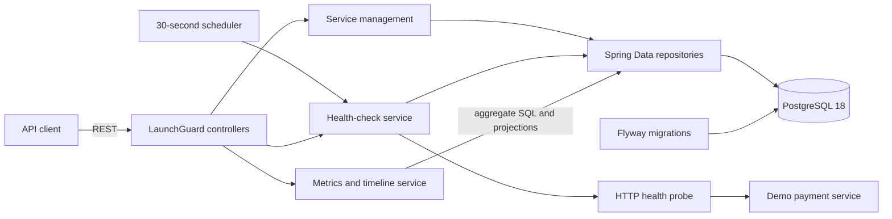

# LaunchGuard

LaunchGuard is a cloud-native deployment monitoring and reliability platform in development. Version 0.2 registers HTTP services, checks their health, retains every result in PostgreSQL, and turns that history into windowed reliability metrics and chart-ready latency data.

> LaunchGuard is currently a portfolio/software engineering project. It is not a production monitoring service and should not be used as the sole source of operational health information.

## V0.1 capabilities

- Register, list, inspect, and delete monitored services through a REST API.
- Run health checks on demand or automatically every 30 seconds.
- Treat HTTP `2xx` responses as `HEALTHY` and all other responses or network failures as `DOWN`.
- Record HTTP status, response time, error details, and check time for every attempt.
- Maintain each service's current status and last-checked timestamp.
- Exercise status changes with an included payment-service demo.
- Manage the PostgreSQL schema exclusively through Flyway migrations.

## V0.2 capabilities

- Calculate availability, healthy and failed check counts, latency statistics, and the last failure time.
- Filter metrics and timelines over `1h`, `24h`, `7d`, `30d`, or the complete history.
- Return timestamped status and latency observations for a future charting client.
- Paginate health-check history newest first, with an enforced maximum page size of 100.
- Aggregate metrics in PostgreSQL instead of loading an entire history into application memory.
- Preserve the V0.1 service registry, scheduler, manual checks, failure simulation, and Flyway-managed schema.

## Architecture



The backend uses a controller/service/repository structure. The HTTP probe owns network behavior and timing; the health-check service atomically persists the result and updates the current service status. An in-process guard prevents overlapping checks of the same service within one backend instance.

V0.2 adds a metrics service, a database aggregation repository, a dedicated time-window parser, lightweight timeline projections, and an API-owned pagination response. JPA entities, Spring `Page` objects, and database projection types do not leak through the REST contract.

## Technology stack

- Java 25 LTS
- Spring Boot 4.1.1
- Maven 3.9.16 through Maven Wrapper
- PostgreSQL 18
- Flyway
- Docker Compose
- JUnit 6, Mockito, AssertJ, and Testcontainers 2

## Repository structure

```text
launchguard/
|-- backend/                         LaunchGuard REST API and monitoring engine
|   |-- src/main/java/
|   |-- src/main/resources/db/migration/
|   `-- src/test/java/
|-- demo-services/
|   `-- payment-service/             Controllable demo HTTP service
|-- .mvn/wrapper/                    Maven Wrapper configuration
|-- docker-compose.yml               PostgreSQL and optional application stack
|-- pom.xml                          Multi-module reactor build
|-- mvnw / mvnw.cmd
`-- README.md
```

## Prerequisites

- Java 25
- Docker with Docker Compose for PostgreSQL and containerized execution

No global Maven installation is required.

## Quick start with Docker Compose

Build and start PostgreSQL, LaunchGuard, and the demo service:

```bash
docker compose up --build -d
```

The services are available at:

- LaunchGuard API: `http://localhost:8080`
- Demo payment service: `http://localhost:8081`
- PostgreSQL: `localhost:5432`

The Compose-only URL used when registering the demo is `http://payment-service:8081`, because the backend reaches it over the Compose network:

```bash
curl -X POST http://localhost:8080/api/services \
  -H "Content-Type: application/json" \
  -d '{"name":"payment-service","baseUrl":"http://payment-service:8081","healthPath":"/health"}'
```

Inspect containers and logs:

```bash
docker compose ps
docker compose logs -f backend payment-service
```

Stop the stack without deleting PostgreSQL data:

```bash
docker compose down
```

The local credentials in `docker-compose.yml` are development defaults only:

| Setting | Value |
|---|---|
| Database | `launchguard` |
| Username | `launchguard` |
| Password | `launchguard` |

PostgreSQL data is retained in the named `launchguard-postgres-data` volume.

## Run applications locally

Start only PostgreSQL:

```bash
docker compose up -d postgres
```

In one terminal, start the backend:

```bash
./mvnw -pl backend spring-boot:run
```

On Windows PowerShell or Command Prompt, use `mvnw.cmd` in place of `./mvnw`.

In another terminal, start the demo service:

```bash
./mvnw -pl demo-services/payment-service spring-boot:run
```

When both applications run directly on the host, register the demo with `http://localhost:8081` as its base URL.

### Configuration

The backend accepts these environment variables:

| Variable | Default | Purpose |
|---|---|---|
| `DB_URL` | `jdbc:postgresql://localhost:5432/launchguard` | JDBC connection URL |
| `DB_USERNAME` | `launchguard` | Database username |
| `DB_PASSWORD` | `launchguard` | Local development password |
| `MONITORING_INTERVAL` | `30s` | Delay between scheduled monitoring passes |
| `MONITORING_INITIAL_DELAY` | `30s` | Delay before the first scheduled pass |
| `MONITORING_CONNECT_TIMEOUT` | `2s` | HTTP connection timeout |
| `MONITORING_RESPONSE_TIMEOUT` | `5s` | HTTP response timeout |

Hibernate is configured with `ddl-auto: validate`; it never creates the production schema. Flyway applies `V1__create_monitoring_schema.sql` at startup.

## API

| Method | Path | Result |
|---|---|---|
| `POST` | `/api/services` | Register a service (`201 Created`) |
| `GET` | `/api/services` | List registered services |
| `GET` | `/api/services/{id}` | Get one service |
| `DELETE` | `/api/services/{id}` | Delete a service and its check history (`204 No Content`) |
| `POST` | `/api/services/{id}/check` | Run a health check immediately |
| `GET` | `/api/services/{id}/checks?page=0&size=20` | Paginated check history, newest first |
| `GET` | `/api/services/{id}/metrics?window=24h` | Windowed reliability metrics |
| `GET` | `/api/services/{id}/metrics/timeline?window=24h` | Timestamped status and latency history |

### Register and inspect a service

```bash
curl -X POST http://localhost:8080/api/services \
  -H "Content-Type: application/json" \
  -d '{"name":"payment-service","baseUrl":"http://localhost:8081","healthPath":"/health"}'
```

The response begins in `UNKNOWN` state. Save its `id` for the examples below.

```bash
curl http://localhost:8080/api/services
curl http://localhost:8080/api/services/SERVICE_ID
curl -X POST http://localhost:8080/api/services/SERVICE_ID/check
curl -X DELETE http://localhost:8080/api/services/SERVICE_ID
```

Invalid requests return structured `400` responses with field violations. Missing services return `404`; duplicate names and overlapping manual checks return `409`.

### Reliability metrics

Metrics default to the most recent 24 hours:

```bash
curl http://localhost:8080/api/services/SERVICE_ID/metrics
curl "http://localhost:8080/api/services/SERVICE_ID/metrics?window=7d"
curl "http://localhost:8080/api/services/SERVICE_ID/metrics?window=all"
```

Supported windows are `1h`, `24h`, `7d`, `30d`, and `all`. Values are case-insensitive. An unsupported value returns the existing structured HTTP `400` error response.

Example response:

```json
{
  "serviceId": "8d22722d-a1e0-49cb-a4b5-f033825a9811",
  "status": "HEALTHY",
  "totalChecks": 120,
  "healthyChecks": 116,
  "failedChecks": 4,
  "availabilityPercentage": 96.67,
  "averageResponseTimeMs": 72.4,
  "minResponseTimeMs": 31,
  "maxResponseTimeMs": 410,
  "lastFailureAt": "2026-09-24T15:14:01.246Z",
  "lastCheckedAt": "2026-09-24T15:18:31.107Z"
}
```

Availability is `healthyChecks / totalChecks * 100`, rounded to two decimal places. Empty windows report zero counts, `0.00` availability, and `null` latency and failure values. The `status` and `lastCheckedAt` fields describe the service's latest known state; the counts, latency values, and `lastFailureAt` are scoped to the selected window.

### Timeline

```bash
curl "http://localhost:8080/api/services/SERVICE_ID/metrics/timeline?window=24h"
```

The response is an oldest-to-newest JSON array of `{timestamp, status, responseTimeMs}` observations. It intentionally returns raw check points so a future client can choose its own chart aggregation.

### Paginated check history

```bash
curl "http://localhost:8080/api/services/SERVICE_ID/checks?page=0&size=20"
curl "http://localhost:8080/api/services/SERVICE_ID/checks?page=1&size=50"
```

`page` is zero-based, `size` defaults to 20, and the maximum size is 100. The response contains API-owned metadata:

```json
{
  "content": [],
  "page": 0,
  "size": 20,
  "totalElements": 0,
  "totalPages": 0,
  "first": true,
  "last": true
}
```

Negative page values, sizes below 1, and sizes above 100 return HTTP `400`.

## Demo failure and recovery

The payment service starts healthy:

```bash
curl http://localhost:8081/health
# {"status":"healthy"}
```

Enable failure mode and run another LaunchGuard check:

```bash
curl -X POST http://localhost:8081/admin/fail
curl -X POST http://localhost:8080/api/services/SERVICE_ID/check
```

The payment health endpoint now returns HTTP 500 and LaunchGuard records `DOWN`.

Recover and check again:

```bash
curl -X POST http://localhost:8081/admin/recover
curl -X POST http://localhost:8080/api/services/SERVICE_ID/check
```

LaunchGuard records a new `HEALTHY` result without removing the earlier history. Query `/metrics`, `/metrics/timeline`, or `/checks` to inspect the resulting reliability data.

## Tests and build

Run the complete reactor test suite:

```bash
./mvnw clean test
```

Build both executable applications:

```bash
./mvnw clean package
```

Unit tests cover the V0.1 probing, persistence, transitions, API validation, and demo failure/recovery behavior. V0.2 adds coverage for empty, fully healthy, and partial-outage histories; availability and latency aggregation; last-failure timestamps; time-window boundaries; invalid windows; history pagination and limits; and missing-service metrics. The PostgreSQL integration test exercises repository behavior against Testcontainers and explicitly skips when Docker is unavailable.

## Database and query design

`monitored_services` stores service identity, target URL, current status, and lifecycle timestamps. `health_checks` stores immutable check results and references `monitored_services` with `ON DELETE CASCADE`.

The V0.1 composite index `(service_id, checked_at DESC)` already supports the V0.2 access patterns: service-scoped time-window filtering, newest-first pagination, and ordered timeline reads. Consequently, V0.2 does not change the schema and does not add a redundant `V2` migration. Metrics use one PostgreSQL aggregate query with filtered counts, `AVG`, `MIN`, `MAX`, and the latest failed timestamp. Timeline reads use projections rather than materializing JPA entities.

## V0.2 limitations

- The concurrency guard is local to one backend process, not distributed.
- Checks run sequentially during each scheduled pass.
- No authentication, authorization, TLS policy management, or tenant isolation.
- No alerting, incidents, notification delivery, GitHub integration, or automatic rollback.
- No dashboard or frontend.
- Timeline results are raw and unpaginated; long `all` windows can produce a large response.
- Health-check history has no retention or archival policy.
- Registered URLs are trusted operator input; V0.2 does not implement an outbound SSRF allowlist.
- Local Compose credentials are intentionally unsuitable for production.

## Roadmap

V0.2 deliberately stops at monitoring history and reliability reporting. Potential capabilities such as a frontend, alerting, incident management, authentication, integrations, distributed scheduling, and automated remediation require separate design and scoping in future versions.
