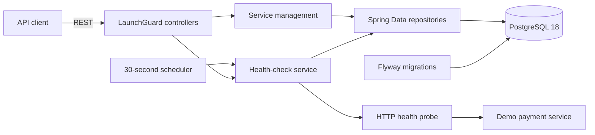

# LaunchGuard

LaunchGuard is a cloud-native deployment monitoring and reliability platform in development. Version 0.1 focuses on one well-defined capability: registering HTTP services, checking their health, and retaining a PostgreSQL-backed history of every check.

> LaunchGuard is currently a portfolio/software engineering project. It is not a production monitoring service and should not be used as the sole source of operational health information.

## V0.1 capabilities

- Register, list, inspect, and delete monitored services through a REST API.
- Run health checks on demand or automatically every 30 seconds.
- Treat HTTP `2xx` responses as `HEALTHY` and all other responses or network failures as `DOWN`.
- Record HTTP status, response time, error details, and check time for every attempt.
- Maintain each service's current status and last-checked timestamp.
- Exercise status changes with an included payment-service demo.
- Manage the PostgreSQL schema exclusively through Flyway migrations.

## Architecture



The backend uses a straightforward controller/service/repository structure. The HTTP probe owns network behavior and timing; the health-check service atomically persists the result and updates the current service status. An in-process guard prevents overlapping checks of the same service within one backend instance.

## Technology stack

- Java 25 LTS
- Spring Boot 4.1.1
- Maven 3.9.16 through Maven Wrapper
- PostgreSQL 18
- Flyway
- Docker Compose
- JUnit 6, Mockito, AssertJ, and Testcontainers 2

## Repository structure

```text
launchguard/
├── backend/                         LaunchGuard REST API and monitoring engine
│   ├── src/main/java/
│   ├── src/main/resources/db/migration/
│   └── src/test/java/
├── demo-services/
│   └── payment-service/             Controllable demo HTTP service
├── .mvn/wrapper/                    Maven Wrapper configuration
├── docker-compose.yml               PostgreSQL and optional application stack
├── pom.xml                          Multi-module reactor build
├── mvnw / mvnw.cmd
└── README.md
```

## Prerequisites

- Java 25
- Docker with Docker Compose for PostgreSQL and containerized execution

No global Maven installation is required.

## Quick start with Docker Compose

Build and start PostgreSQL, LaunchGuard, and the demo service:

```bash
docker compose up --build -d
```

The services are available at:

- LaunchGuard API: `http://localhost:8080`
- Demo payment service: `http://localhost:8081`
- PostgreSQL: `localhost:5432`

The Compose-only URL used when registering the demo is `http://payment-service:8081`, because the backend reaches it over the Compose network:

```bash
curl -X POST http://localhost:8080/api/services \
  -H "Content-Type: application/json" \
  -d '{"name":"payment-service","baseUrl":"http://payment-service:8081","healthPath":"/health"}'
```

Inspect containers and logs:

```bash
docker compose ps
docker compose logs -f backend payment-service
```

Stop the stack without deleting PostgreSQL data:

```bash
docker compose down
```

The local credentials in `docker-compose.yml` are development defaults only:

| Setting | Value |
|---|---|
| Database | `launchguard` |
| Username | `launchguard` |
| Password | `launchguard` |

PostgreSQL data is retained in the named `launchguard-postgres-data` volume.

## Run applications locally

Start only PostgreSQL:

```bash
docker compose up -d postgres
```

In one terminal, start the backend:

```bash
./mvnw -pl backend spring-boot:run
```

On Windows PowerShell or Command Prompt, use `mvnw.cmd` in place of `./mvnw`.

In another terminal, start the demo service:

```bash
./mvnw -pl demo-services/payment-service spring-boot:run
```

When both applications run directly on the host, register the demo with `http://localhost:8081` as its base URL.

### Configuration

The backend accepts these environment variables:

| Variable | Default | Purpose |
|---|---|---|
| `DB_URL` | `jdbc:postgresql://localhost:5432/launchguard` | JDBC connection URL |
| `DB_USERNAME` | `launchguard` | Database username |
| `DB_PASSWORD` | `launchguard` | Local development password |
| `MONITORING_INTERVAL` | `30s` | Delay between scheduled monitoring passes |
| `MONITORING_INITIAL_DELAY` | `30s` | Delay before the first scheduled pass |
| `MONITORING_CONNECT_TIMEOUT` | `2s` | HTTP connection timeout |
| `MONITORING_RESPONSE_TIMEOUT` | `5s` | HTTP response timeout |

Hibernate is configured with `ddl-auto: validate`; it never creates the production schema. Flyway applies `V1__create_monitoring_schema.sql` at startup.

## API

| Method | Path | Result |
|---|---|---|
| `POST` | `/api/services` | Register a service (`201 Created`) |
| `GET` | `/api/services` | List registered services |
| `GET` | `/api/services/{id}` | Get one service |
| `DELETE` | `/api/services/{id}` | Delete a service and its check history (`204 No Content`) |
| `POST` | `/api/services/{id}/check` | Run a health check immediately |
| `GET` | `/api/services/{id}/checks` | List check history, newest first |

### Register a service

```bash
curl -X POST http://localhost:8080/api/services \
  -H "Content-Type: application/json" \
  -d '{"name":"payment-service","baseUrl":"http://localhost:8081","healthPath":"/health"}'
```

The response begins in `UNKNOWN` state. Save its `id` for the examples below.

```bash
curl http://localhost:8080/api/services
curl http://localhost:8080/api/services/SERVICE_ID
curl -X POST http://localhost:8080/api/services/SERVICE_ID/check
curl http://localhost:8080/api/services/SERVICE_ID/checks
curl -X DELETE http://localhost:8080/api/services/SERVICE_ID
```

Invalid requests return structured `400` responses with field violations. Missing services return `404`; duplicate names and overlapping manual checks return `409`.

## Demo failure and recovery

The payment service starts healthy:

```bash
curl http://localhost:8081/health
# {"status":"healthy"}
```

Enable failure mode and run another LaunchGuard check:

```bash
curl -X POST http://localhost:8081/admin/fail
curl -X POST http://localhost:8080/api/services/SERVICE_ID/check
```

The payment health endpoint now returns HTTP 500 and LaunchGuard records `DOWN`.

Recover and check again:

```bash
curl -X POST http://localhost:8081/admin/recover
curl -X POST http://localhost:8080/api/services/SERVICE_ID/check
```

LaunchGuard records a new `HEALTHY` result without removing the earlier history.

## Tests and build

Run the complete reactor test suite:

```bash
./mvnw clean test
```

Build both executable applications:

```bash
./mvnw clean package
```

Unit tests cover healthy responses, HTTP 500 responses, response timeouts, `UNKNOWN -> HEALTHY` and `HEALTHY -> DOWN` transitions, result persistence, API registration/validation, and demo failure/recovery. The PostgreSQL integration test uses Testcontainers and automatically skips when Docker is unavailable.

## Database schema

`monitored_services` stores service identity, target URL, current status, and lifecycle timestamps. `health_checks` stores immutable check results and references `monitored_services` with `ON DELETE CASCADE`. The composite index `(service_id, checked_at DESC)` supports newest-first history reads.

## V0.1 limitations

- The concurrency guard is local to one backend process, not distributed.
- Checks run sequentially during each scheduled pass.
- No authentication, authorization, TLS policy management, or tenant isolation.
- No alerting, incidents, notification delivery, or automatic rollback.
- No metrics dashboard or frontend.
- No pagination or retention policy for health-check history.
- Registered URLs are trusted operator input; V0.1 does not implement an outbound SSRF allowlist.
- Local Compose credentials are intentionally unsuitable for production.

## Roadmap

Future versions may explore richer reliability workflows and cloud-native deployment integrations. Roadmap items will be designed and scoped separately; V0.1 intentionally stops at service health monitoring.
