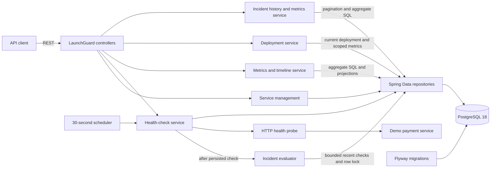
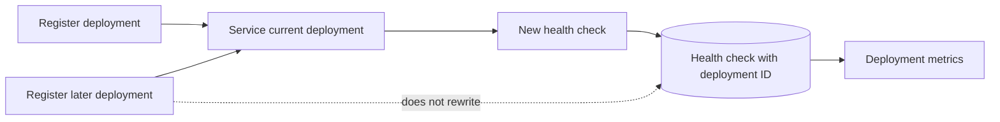
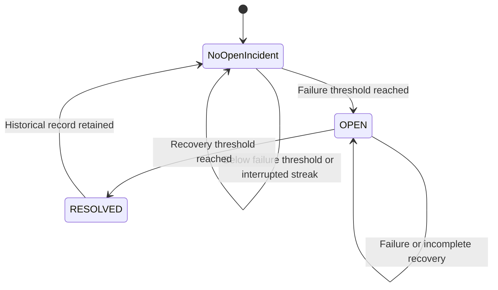

# LaunchGuard

LaunchGuard is a deployment monitoring and reliability platform in development. Version 0.4 adds automatic incident detection to service health checks, reliability history, and deployment correlation. Repeated failed checks open an incident; repeated successful checks resolve it. Earlier checks and resolved incidents retain their original deployment associations.

> LaunchGuard is currently a portfolio/software engineering project. It is not a production monitoring service and should not be used as the sole source of operational health information.

## V0.1 capabilities

- Register, list, inspect, and delete monitored services through a REST API.
- Run health checks on demand or automatically every 30 seconds.
- Treat HTTP `2xx` responses as `HEALTHY` and all other responses or network failures as `DOWN`.
- Record HTTP status, response time, error details, and check time for every attempt.
- Maintain each service's current status and last-checked timestamp.
- Exercise status changes with an included payment-service demo.
- Manage the PostgreSQL schema exclusively through Flyway migrations.

## V0.2 capabilities

- Calculate availability, healthy and failed check counts, latency statistics, and the last failure time.
- Filter metrics and timelines over `1h`, `24h`, `7d`, `30d`, or the complete history.
- Return timestamped status and latency observations for a future charting client.
- Paginate health-check history newest first, with an enforced maximum page size of 100.
- Aggregate metrics in PostgreSQL instead of loading an entire history into application memory.
- Preserve the V0.1 service registry, scheduler, manual checks, failure simulation, and Flyway-managed schema.

## V0.3 capabilities

- Register deployments with a version, optional commit SHA, and optional description.
- Keep one current deployment per service while preserving every earlier deployment.
- Associate each new health check with the deployment that was current when the check began.
- List deployments newest first with the same 100-item page limit as check history.
- Calculate deployment-specific availability, latency statistics, first failure, and last check in PostgreSQL.
- Show basic current deployment information in service responses and `deploymentId` in check responses.

## V0.4 capabilities

- Automatically open an incident after 3 consecutive failed checks by default.
- Automatically resolve it after 2 consecutive healthy checks; a failure resets recovery progress.
- Configure both thresholds through application properties or environment variables.
- Preserve the deployment current at incident opening, independently of later deployments.
- Enforce one OPEN incident per service in PostgreSQL.
- Read paginated/filterable incident history, current incidents, and windowed incident metrics.
- Expose `hasOpenIncident` in service responses without embedding incident history.

## Architecture



The backend uses a controller/service/repository structure. The HTTP probe owns network behavior and timing; the health-check service atomically persists the result and updates the current service status. An in-process guard prevents overlapping checks of the same service within one backend instance.

V0.2 adds a metrics service, a database aggregation repository, a dedicated time-window parser, lightweight timeline projections, and an API-owned pagination response. V0.3 adds a deployment service and deployment-specific SQL aggregation. V0.4 adds a dedicated incident evaluator and read-only incident APIs. Controllers return DTOs; JPA entities, Spring `Page` objects, and database projection types do not leak through the REST contract.



## Technology stack

- Java 25 LTS
- Spring Boot 4.1.1
- Maven 3.9.16 through Maven Wrapper
- PostgreSQL 18
- Flyway
- Docker Compose
- JUnit 6, Mockito, AssertJ, and Testcontainers 2

## Repository structure

```text
launchguard/
|-- backend/                         LaunchGuard REST API and monitoring engine
|   |-- src/main/java/
|   |-- src/main/resources/db/migration/
|   `-- src/test/java/
|-- demo-services/
|   `-- payment-service/             Controllable demo HTTP service
|-- .mvn/wrapper/                    Maven Wrapper configuration
|-- docker-compose.yml               PostgreSQL and optional application stack
|-- pom.xml                          Multi-module reactor build
|-- mvnw / mvnw.cmd
`-- README.md
```

## Prerequisites

- Java 25
- Docker with Docker Compose for PostgreSQL and containerized execution

No global Maven installation is required.

## Quick start with Docker Compose

Build and start PostgreSQL, LaunchGuard, and the demo service:

```bash
docker compose up --build -d
```

The services are available at:

- LaunchGuard API: `http://localhost:8080`
- Demo payment service: `http://localhost:8081`
- PostgreSQL: `localhost:5432`

The Compose-only URL used when registering the demo is `http://payment-service:8081`, because the backend reaches it over the Compose network:

```bash
curl -X POST http://localhost:8080/api/services \
  -H "Content-Type: application/json" \
  -d '{"name":"payment-service","baseUrl":"http://payment-service:8081","healthPath":"/health"}'
```

Inspect containers and logs:

```bash
docker compose ps
docker compose logs -f backend payment-service
```

Stop the stack without deleting PostgreSQL data:

```bash
docker compose down
```

The local credentials in `docker-compose.yml` are development defaults only:

| Setting | Value |
|---|---|
| Database | `launchguard` |
| Username | `launchguard` |
| Password | `launchguard` |

PostgreSQL data is retained in the named `launchguard-postgres-data` volume.

## Run applications locally

Start only PostgreSQL:

```bash
docker compose up -d postgres
```

In one terminal, start the backend:

```bash
./mvnw -pl backend spring-boot:run
```

On Windows PowerShell or Command Prompt, use `mvnw.cmd` in place of `./mvnw`.

In another terminal, start the demo service:

```bash
./mvnw -pl demo-services/payment-service spring-boot:run
```

When both applications run directly on the host, register the demo with `http://localhost:8081` as its base URL.

### Configuration

The backend accepts these environment variables:

| Variable | Default | Purpose |
|---|---|---|
| `DB_URL` | `jdbc:postgresql://localhost:5432/launchguard` | JDBC connection URL |
| `DB_USERNAME` | `launchguard` | Database username |
| `DB_PASSWORD` | `launchguard` | Local development password |
| `MONITORING_INTERVAL` | `30s` | Delay between scheduled monitoring passes |
| `MONITORING_INITIAL_DELAY` | `30s` | Delay before the first scheduled pass |
| `MONITORING_CONNECT_TIMEOUT` | `2s` | HTTP connection timeout |
| `MONITORING_RESPONSE_TIMEOUT` | `5s` | HTTP response timeout |
| `INCIDENT_FAILURE_THRESHOLD` | `3` | Consecutive DOWN checks required to open an incident |
| `INCIDENT_RECOVERY_THRESHOLD` | `2` | Consecutive HEALTHY checks required to resolve an incident |

Hibernate is configured with `ddl-auto: validate`; it never creates the production schema. Flyway applies `V1__create_monitoring_schema.sql`, `V2__add_deployment_tracking.sql`, and `V3__add_incidents.sql` in order. Existing V1/V2 data remains valid after V3.

## API

| Method | Path | Result |
|---|---|---|
| `POST` | `/api/services` | Register a service (`201 Created`) |
| `GET` | `/api/services` | List registered services |
| `GET` | `/api/services/{id}` | Get one service |
| `DELETE` | `/api/services/{id}` | Delete a service and its check history (`204 No Content`) |
| `POST` | `/api/services/{id}/check` | Run a health check immediately |
| `GET` | `/api/services/{id}/checks?page=0&size=20` | Paginated check history, newest first |
| `GET` | `/api/services/{id}/metrics?window=24h` | Windowed reliability metrics |
| `GET` | `/api/services/{id}/metrics/timeline?window=24h` | Timestamped status and latency history |
| `POST` | `/api/services/{id}/deployments` | Register the new current deployment (`201 Created`) |
| `GET` | `/api/services/{id}/deployments?page=0&size=20` | Paginated deployments, newest first |
| `GET` | `/api/services/{id}/deployments/{deploymentId}` | Deployment details and current flag |
| `GET` | `/api/services/{id}/deployments/{deploymentId}/metrics` | Reliability for checks linked to that deployment |
| `GET` | `/api/services/{id}/incidents?page=0&size=20` | Newest-first incident history; optional `status` filter |
| `GET` | `/api/services/{id}/incidents/{incidentId}` | One incident, deployment summary, and duration |
| `GET` | `/api/services/{id}/incidents/current` | Current OPEN incident, or `204 No Content` |
| `GET` | `/api/services/{id}/incident-metrics?window=30d` | Windowed incident counts and duration statistics |

### Register and inspect a service

```bash
curl -X POST http://localhost:8080/api/services \
  -H "Content-Type: application/json" \
  -d '{"name":"payment-service","baseUrl":"http://localhost:8081","healthPath":"/health"}'
```

The response begins in `UNKNOWN` state. Save its `id` for the examples below.

```bash
curl http://localhost:8080/api/services
curl http://localhost:8080/api/services/SERVICE_ID
curl -X POST http://localhost:8080/api/services/SERVICE_ID/check
curl -X DELETE http://localhost:8080/api/services/SERVICE_ID
```

Invalid requests return structured `400` responses with field violations. Missing services return `404`; duplicate names and overlapping manual checks return `409`.

### Reliability metrics

Metrics default to the most recent 24 hours:

```bash
curl http://localhost:8080/api/services/SERVICE_ID/metrics
curl "http://localhost:8080/api/services/SERVICE_ID/metrics?window=7d"
curl "http://localhost:8080/api/services/SERVICE_ID/metrics?window=all"
```

Supported windows are `1h`, `24h`, `7d`, `30d`, and `all`. Values are case-insensitive. An unsupported value returns the existing structured HTTP `400` error response.

Example response:

```json
{
  "serviceId": "8d22722d-a1e0-49cb-a4b5-f033825a9811",
  "status": "HEALTHY",
  "totalChecks": 120,
  "healthyChecks": 116,
  "failedChecks": 4,
  "availabilityPercentage": 96.67,
  "averageResponseTimeMs": 72.4,
  "minResponseTimeMs": 31,
  "maxResponseTimeMs": 410,
  "lastFailureAt": "2026-09-24T15:14:01.246Z",
  "lastCheckedAt": "2026-09-24T15:18:31.107Z"
}
```

Availability is `healthyChecks / totalChecks * 100`, rounded to two decimal places. Empty windows report zero counts, `0.00` availability, and `null` latency and failure values. The `status` and `lastCheckedAt` fields describe the service's latest known state; the counts, latency values, and `lastFailureAt` are scoped to the selected window.

### Timeline

```bash
curl "http://localhost:8080/api/services/SERVICE_ID/metrics/timeline?window=24h"
```

The response is an oldest-to-newest JSON array of `{timestamp, status, responseTimeMs}` observations. It intentionally returns raw check points so a future client can choose its own chart aggregation.

### Paginated check history

```bash
curl "http://localhost:8080/api/services/SERVICE_ID/checks?page=0&size=20"
curl "http://localhost:8080/api/services/SERVICE_ID/checks?page=1&size=50"
```

`page` is zero-based, `size` defaults to 20, and the maximum size is 100. The response contains API-owned metadata:

```json
{
  "content": [],
  "page": 0,
  "size": 20,
  "totalElements": 0,
  "totalPages": 0,
  "first": true,
  "last": true
}
```

Negative page values, sizes below 1, and sizes above 100 return HTTP `400`.

### Deployments and correlation

Registering a deployment makes it current for its service. `deployedAt` and `createdAt` are set by the server. `version` is required and at most 100 characters. An optional commit SHA must be 7 to 64 hexadecimal characters; an optional description is limited to 1000 characters. Invalid requests use the structured `400` response.

```bash
curl -X POST http://localhost:8080/api/services/SERVICE_ID/deployments \
  -H "Content-Type: application/json" \
  -d '{"version":"v1.0.0","commitSha":"a921fc7","description":"Initial payment release"}'
curl -X POST http://localhost:8080/api/services/SERVICE_ID/check
curl -X POST http://localhost:8080/api/services/SERVICE_ID/deployments \
  -H "Content-Type: application/json" \
  -d '{"version":"v1.1.0","commitSha":"b731e22","description":"Payment retry improvements"}'
curl -X POST http://localhost:8080/api/services/SERVICE_ID/check
```

The first check retains the v1.0.0 deployment ID; the later check receives the v1.1.0 ID. Checks made before the first deployment have `deploymentId: null` and remain part of service-wide metrics. The service response includes a `currentDeployment` summary with `id`, `version`, `commitSha`, and `deployedAt`.

```bash
curl "http://localhost:8080/api/services/SERVICE_ID/deployments?page=0&size=20"
curl http://localhost:8080/api/services/SERVICE_ID/deployments/DEPLOYMENT_ID
curl http://localhost:8080/api/services/SERVICE_ID/deployments/DEPLOYMENT_ID/metrics
```

Example deployment metrics response:

```json
{
  "deploymentId": "c16c66fb-227f-4082-b371-7047c06f74c0",
  "serviceId": "8d22722d-a1e0-49cb-a4b5-f033825a9811",
  "version": "v1.1.0",
  "commitSha": "b731e22",
  "current": true,
  "deployedAt": "2026-09-24T15:00:00Z",
  "totalChecks": 5,
  "healthyChecks": 3,
  "failedChecks": 2,
  "availabilityPercentage": 60.00,
  "averageResponseTimeMs": 355,
  "minResponseTimeMs": 31,
  "maxResponseTimeMs": 920,
  "firstFailureAt": "2026-09-24T15:05:00Z",
  "lastCheckedAt": "2026-09-24T15:10:00Z"
}
```

Deployment metrics include only checks whose `deploymentId` matches that deployment. A deployment with no checks reports zero counts, `0.00` availability, and `null` latency and check timestamps. A deployment ID used under another service returns `404`.

## Automatic incidents

An incident is a confirmed unhealthy period, not a single failed check. With the default thresholds, `DOWN, DOWN, DOWN` opens one incident. Additional failures keep that same incident open. `HEALTHY, HEALTHY` resolves it; `HEALTHY, DOWN` resets recovery, so two new consecutive healthy checks are required. A later outage creates a new incident without modifying the resolved record.



Configure `launchguard.incidents.failure-threshold` and `launchguard.incidents.recovery-threshold` (or the environment variables above). Both must be integers from 1 through 1000; invalid configuration fails application startup. Detection reads at most the applicable threshold's recent check projections using the existing service/time index. It does not load an entire history or keep restart-sensitive counters in memory.

The evaluator runs after the check is flushed, in the same transaction as the check and service status update. A service-row `FOR NO KEY UPDATE` lock serializes evaluation while remaining compatible with the parent-key locks acquired by check inserts; a partial unique index independently enforces at most one OPEN incident. `startedAt` is the threshold-reaching check time, not the first failed check time. `resolvedAt` is the final recovery check time. The incident captures the deployment current when evaluation opens it; an in-flight check can retain its earlier deployment while the new incident captures a newer deployment registered during its probe. No deployment is required.

Incident deployment, start, reason, and creation fields cannot be updated through the entity. The only lifecycle transition is OPEN to RESOLVED; a resolved incident cannot be resolved again. No incident mutation or manual-resolution API is exposed.

```bash
curl "http://localhost:8080/api/services/SERVICE_ID/incidents?page=0&size=20"
curl "http://localhost:8080/api/services/SERVICE_ID/incidents?status=OPEN"
curl "http://localhost:8080/api/services/SERVICE_ID/incidents?status=RESOLVED"
curl http://localhost:8080/api/services/SERVICE_ID/incidents/INCIDENT_ID
curl http://localhost:8080/api/services/SERVICE_ID/incidents/current
```

History uses zero-based pages, default size 20, and maximum size 100. Status filters are case-insensitive; invalid filters return structured `400` errors. Missing services and incident IDs used under the wrong service return `404`. When no OPEN incident exists, `/incidents/current` returns `204` with no body. Service responses include a boolean `hasOpenIncident` indicator, including when a service is HEALTHY but has not yet reached its recovery threshold.

Incident DTOs include `id`, `serviceId`, `serviceName`, `status`, an optional `{id, version, commitSha}` deployment summary, `triggerReason`, `startedAt`, `resolvedAt`, and `durationSeconds`. For OPEN incidents, `resolvedAt` and `durationSeconds` are null. For RESOLVED incidents, duration is elapsed time between start and resolution, truncated to whole seconds.

### Incident metrics

```bash
curl "http://localhost:8080/api/services/SERVICE_ID/incident-metrics?window=30d"
curl "http://localhost:8080/api/services/SERVICE_ID/incident-metrics?window=all"
```

The default window is `30d`; the existing `1h`, `24h`, `7d`, `30d`, and `all` values are supported. Windows select incidents whose `startedAt` is on or after the cutoff; incidents opened before the cutoff are excluded even if still OPEN. Database aggregation calculates counts, average resolution time for RESOLVED incidents only (rounded to two decimals), and the longest duration among both resolved and ongoing incidents (whole seconds, using request time for ongoing incidents).

```json
{
  "serviceId": "8d22722d-a1e0-49cb-a4b5-f033825a9811",
  "window": "30d",
  "totalIncidents": 4,
  "resolvedIncidents": 3,
  "openIncidents": 1,
  "averageResolutionTimeSeconds": 218.50,
  "longestIncidentSeconds": 512
}
```

Empty windows report zero counts and null duration statistics. An all-open selection has a null average resolution time.

## Demo failure and recovery

The payment service starts healthy:

```bash
curl http://localhost:8081/health
# {"status":"healthy"}
```

Enable failure mode and run another LaunchGuard check:

```bash
curl -X POST http://localhost:8081/admin/fail
curl -X POST http://localhost:8080/api/services/SERVICE_ID/check
```

The payment health endpoint now returns HTTP 500 and LaunchGuard records `DOWN`.

Recover and check again:

```bash
curl -X POST http://localhost:8081/admin/recover
curl -X POST http://localhost:8080/api/services/SERVICE_ID/check
```

LaunchGuard records a new `HEALTHY` result without removing the earlier history. Query `/metrics`, `/metrics/timeline`, or `/checks` to inspect the resulting reliability data.

### V0.4 incident lifecycle demo

Register the service and deployment v1.0.0 using the examples above, then generate a healthy check. With the default thresholds:

```bash
curl -X POST http://localhost:8081/admin/fail
curl -X POST http://localhost:8080/api/services/SERVICE_ID/check
curl -i http://localhost:8080/api/services/SERVICE_ID/incidents/current
# 204: only one failure
curl -X POST http://localhost:8080/api/services/SERVICE_ID/check
curl -i http://localhost:8080/api/services/SERVICE_ID/incidents/current
# 204: only two failures
curl -X POST http://localhost:8080/api/services/SERVICE_ID/check
curl http://localhost:8080/api/services/SERVICE_ID/incidents/current
# OPEN, associated with v1.0.0
curl -X POST http://localhost:8080/api/services/SERVICE_ID/check
# Additional failure does not duplicate the incident
curl -X POST http://localhost:8081/admin/recover
curl -X POST http://localhost:8080/api/services/SERVICE_ID/check
curl http://localhost:8080/api/services/SERVICE_ID/incidents/current
# Still OPEN after one healthy check
curl -X POST http://localhost:8080/api/services/SERVICE_ID/check
curl -i http://localhost:8080/api/services/SERVICE_ID/incidents/current
# 204: resolved after two healthy checks
curl "http://localhost:8080/api/services/SERVICE_ID/incidents?status=RESOLVED"
curl http://localhost:8080/api/services/SERVICE_ID/incident-metrics
```

Repeat failure mode and three failed checks to create a second incident. Registering v1.1.0 while an incident is OPEN changes future checks but not that incident's deployment. The same detection and recovery behavior works for a service with no registered deployment.

## Tests and build

Run the complete reactor test suite:

```bash
./mvnw clean test
```

Build both executable applications:

```bash
./mvnw clean package
```

Unit tests cover the V0.1 probing, persistence, transitions, API validation, and demo failure/recovery behavior. V0.2 adds coverage for windowed metrics and pagination. V0.3 adds deployment registration, replacement, correlation, scoped metrics, validation, and pagination tests. V0.4 adds failure/recovery thresholds, interrupted streaks, deployment snapshots, incident APIs, filtering, durations, and incident metrics. PostgreSQL integration tests exercise full lifecycles, concurrent evaluation, database uniqueness, foreign keys, deletion semantics, database aggregation, and staged V1-to-V2-to-V3 migration compatibility. They use Testcontainers when Docker is available and skip when neither Docker nor an external test database is configured.

To run the persistence tests without Docker, create a dedicated empty PostgreSQL database with username/password `launchguard` and provide its URL. The tests apply Flyway migrations and create test records. For example, in PowerShell:

```powershell
$env:LAUNCHGUARD_TEST_DB_URL = 'jdbc:postgresql://localhost:5432/launchguard_tests'
.\mvnw.cmd clean package
```

## Database and query design

`monitored_services` stores service identity, target URL, current status, and lifecycle timestamps. `health_checks` stores immutable check results and references `monitored_services` with `ON DELETE CASCADE`.

The V0.1 composite index `(service_id, checked_at DESC)` already supports the V0.2 access patterns: service-scoped time-window filtering, newest-first pagination, and ordered timeline reads. Consequently, V0.2 does not change the schema and does not add a redundant `V2` migration. Metrics use one PostgreSQL aggregate query with filtered counts, `AVG`, `MIN`, `MAX`, and the latest failed timestamp. Timeline reads use projections rather than materializing JPA entities.

V0.3 introduces `deployments` through Flyway V2 and adds nullable `current_deployment_id` and `deployment_id` references to existing tables. Composite foreign keys keep service and deployment IDs consistent. An index on `(service_id, deployed_at DESC, id DESC)` supports deployment listing; a partial `(deployment_id, checked_at DESC)` index supports deployment aggregation and check reads. Foreign keys are deferred so deleting a service can cascade to its deployments and checks even though the service references its current deployment. Direct deletion of a referenced deployment is rejected, preserving historical links. Older services and checks need no backfill.

V2 is a transactional, forward-only migration intended for this development-scale project. Adding constraints and indexes can block writes on large existing histories; production-scale rollout would require a separately planned maintenance or online migration strategy. Do not edit an applied migration or automatically downgrade the schema; any reversal should use a reviewed new migration that accounts for deployment history.

Health checks capture the current deployment before probing and never update their stored deployment link. Service updates write only changed columns, so a health check finishing during deployment registration cannot overwrite the newly registered current deployment.

V3 adds only the `incidents` table and its indexes; V1 and V2 are unchanged. A partial unique `(service_id)` index applies to OPEN rows, and `(service_id, started_at DESC, id DESC)` supports history and opening-window queries. Composite deployment ownership foreign keys reject cross-service associations. Service deletion cascades to incidents; the deferred deployment foreign key permits that service-history cascade but rejects direct deletion of a deployment referenced by an incident. V3 does not backfill historical incidents or change existing checks/deployments. It is a transactional, forward-only migration; reversals require a reviewed new migration, not edits to applied files.

## V0.4 limitations

- The concurrency guard is local to one backend process, not distributed.
- Checks run sequentially during each scheduled pass.
- No authentication, authorization, TLS policy management, or tenant isolation.
- Incidents are detected from sampled checks, not continuous observation or application telemetry; durations begin at confirmation, not the first failure.
- No external notifications, alert delivery, GitHub integration, automatic rollback, or AI functionality.
- Incident thresholds are global, not configurable per service; changing them affects the next evaluation of persisted recent history.
- No distributed scheduling infrastructure or support guarantee for multiple monitoring instances. Database locking and uniqueness protect incident transitions, but the check guard remains process-local.
- Historical failures before V0.4 are not backfilled into incidents; they can contribute to a streak evaluated by a new check.
- No dashboard or frontend.
- Timeline results are raw and unpaginated; long `all` windows can produce a large response.
- Deployment registration records the server time; importing historical deployment timestamps is not supported.
- Checks capture the current deployment before probing. If registration races with an in-flight probe, that check retains the deployment it observed at the start.
- Health-check history has no retention or archival policy.
- Registered URLs are trusted operator input; V0.4 does not implement an outbound SSRF allowlist.
- Local Compose credentials are intentionally unsuitable for production.

## Roadmap

The [V0.4 validation report](docs/v0.4-validation.md) records the implementation decisions, full test results, live incident lifecycle, database checks, and example responses.

V0.4 deliberately stops at automatic incident detection, historical correlation, and read-only incident analytics. A frontend, authentication, external notification delivery, integrations, per-service policies, distributed scheduling, and automated remediation require separate design and scoping in future versions.
