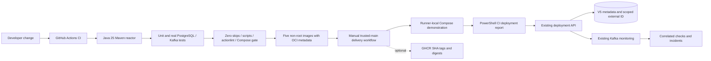
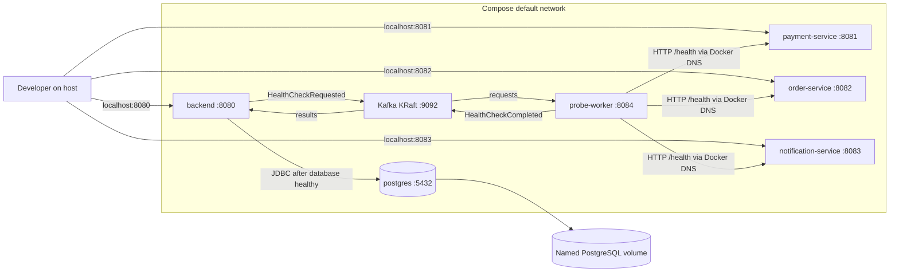
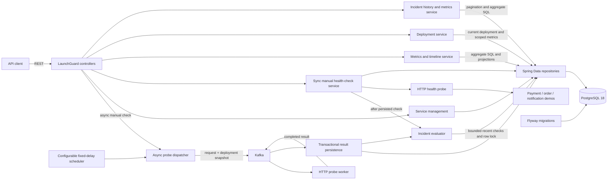
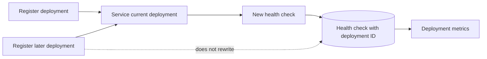
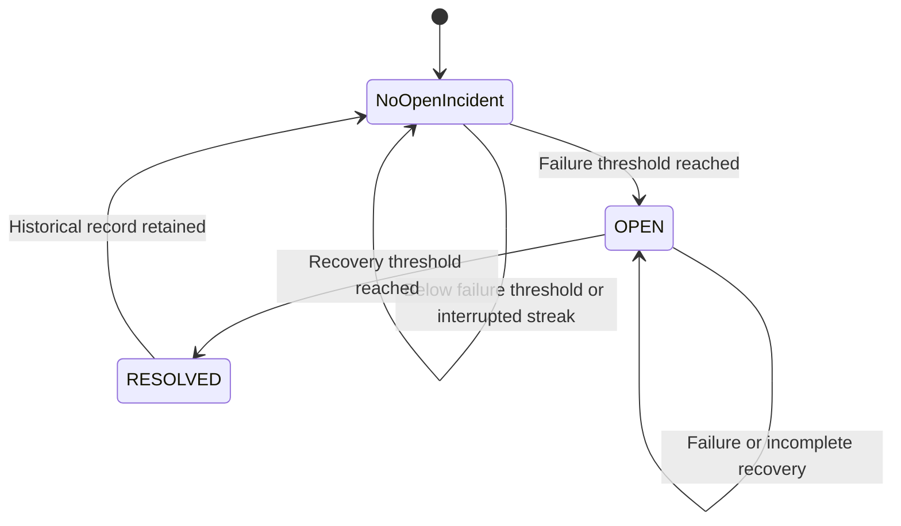
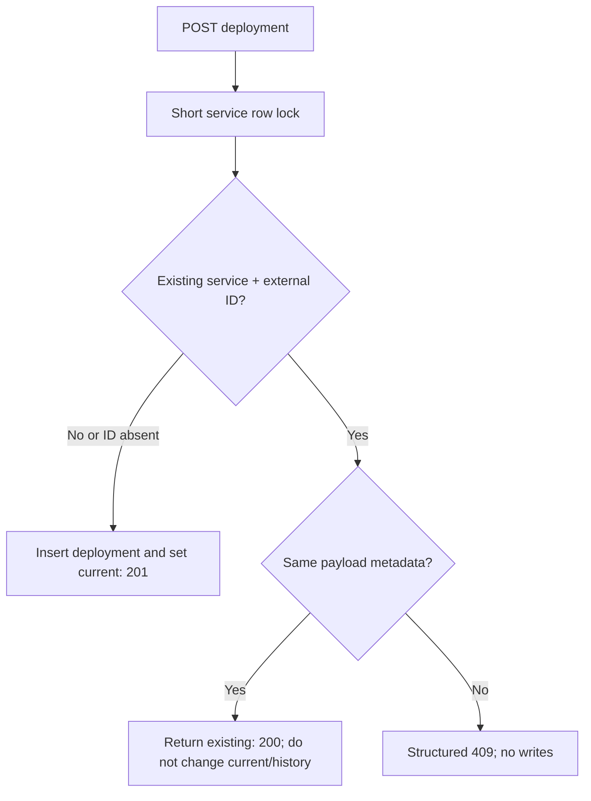

# LaunchGuard

LaunchGuard is a deployment monitoring and reliability platform in development. Version 0.7 adds CI/delivery workflows, image provenance metadata, and idempotent CI deployment reporting. The existing seven-container Kafka lab preserves deployment correlation, reliability metrics, and automatic incidents while processing independent services concurrently.

> LaunchGuard is currently a portfolio/software engineering project. It is not a production monitoring service and should not be used as the sole source of operational health information.

## V0.1 capabilities

- Register, list, inspect, and delete monitored services through a REST API.
- Run health checks on demand or automatically every 30 seconds.
- Treat HTTP `2xx` responses as `HEALTHY` and all other responses or network failures as `DOWN`.
- Record HTTP status, response time, error details, and check time for every attempt.
- Maintain each service's current status and last-checked timestamp.
- Exercise status changes with an included payment-service demo.
- Manage the PostgreSQL schema exclusively through Flyway migrations.

## V0.2 capabilities

- Calculate availability, healthy and failed check counts, latency statistics, and the last failure time.
- Filter metrics and timelines over `1h`, `24h`, `7d`, `30d`, or the complete history.
- Return timestamped status and latency observations for a future charting client.
- Paginate health-check history newest first, with an enforced maximum page size of 100.
- Aggregate metrics in PostgreSQL instead of loading an entire history into application memory.
- Preserve the V0.1 service registry, scheduler, manual checks, failure simulation, and Flyway-managed schema.

## V0.3 capabilities

- Register deployments with a version, optional commit SHA, and optional description.
- Keep one current deployment per service while preserving every earlier deployment.
- Associate each new health check with the deployment that was current when the check began.
- List deployments newest first with the same 100-item page limit as check history.
- Calculate deployment-specific availability, latency statistics, first failure, and last check in PostgreSQL.
- Show basic current deployment information in service responses and `deploymentId` in check responses.

## V0.4 capabilities

- Automatically open an incident after 3 consecutive failed checks by default.
- Automatically resolve it after 2 consecutive healthy checks; a failure resets recovery progress.
- Configure both thresholds through application properties or environment variables.
- Preserve the deployment current at incident opening, independently of later deployments.
- Enforce one OPEN incident per service in PostgreSQL.
- Read paginated/filterable incident history, current incidents, and windowed incident metrics.
- Expose `hasOpenIncident` in service responses without embedding incident history.

## V0.5 capabilities

- Start PostgreSQL 18, LaunchGuard, and three independent demos with `docker compose up --build`.
- Monitor demos using Docker DNS, with host ports reserved for developer API calls.
- Gate backend startup on database health and check every container's readiness.
- Build four multi-stage application images that run as non-root users.
- Register the demos explicitly and idempotently with a PowerShell bootstrap.
- Simulate HTTP failures, artificial latency, timeouts, and container outages.
- Validate automatic incident isolation, recovery, and persistent history across a full restart.
- Require the PostgreSQL Testcontainers suite to run by default; missing Docker is an error, not a skip.

## V0.6 capabilities

- Dispatch scheduled probes to Kafka without waiting for HTTP completion.
- Execute probes in a separate, database-free worker with bounded concurrency.
- Queue manual probes with HTTP 202 while preserving the synchronous endpoint.
- Capture deployment IDs at dispatch and correlate results using persistent request IDs.
- Ignore duplicate results transactionally, including their incident effects.
- Recover poison records to dead-letter topics using bounded consumer retries.
- Validate the complete Kafka/HTTP/PostgreSQL path with actual Testcontainers.

## Architecture

V0.7 adds delivery automation around the existing architecture, not a new deployment platform:







The backend retains its controller/service/repository structure. Scheduled probes now use the dispatcher, Kafka, and the worker. Result persistence atomically writes history, updates current status, and invokes the existing incident evaluator. Direct HTTP probing remains only for the synchronous manual endpoint. The worker has neither database dependencies nor credentials; Compose also places PostgreSQL on a network the worker does not join.

V0.2 adds a metrics service, a database aggregation repository, a dedicated time-window parser, lightweight timeline projections, and an API-owned pagination response. V0.3 adds a deployment service and deployment-specific SQL aggregation. V0.4 adds a dedicated incident evaluator and read-only incident APIs. Controllers return DTOs; JPA entities, Spring `Page` objects, and database projection types do not leak through the REST contract.

V0.5 preserves that structure and the applied migrations. The only new backend runtime component is Spring Boot Actuator's health endpoint, including the datasource health indicator; only `/actuator/health` is exposed and details are hidden. Compose waits for PostgreSQL health before starting LaunchGuard. Demos do not gate backend startup: an unavailable target is a normal monitored failure. Docker health status does not restart an unhealthy demo; `restart: unless-stopped` handles exited processes, not failed probes.



## Technology stack

- Java 25 LTS
- Spring Boot 4.1.1
- Maven 3.9.16 through Maven Wrapper
- PostgreSQL 18
- Flyway
- Docker Compose
- JUnit 6, Mockito, AssertJ, and Testcontainers 2

## Repository structure

```text
launchguard/
|-- backend/                         LaunchGuard REST API and monitoring engine
|   |-- src/main/java/
|   |-- src/main/resources/db/migration/
|   `-- src/test/java/
|-- monitoring-events/               Shared versioned JSON contracts and Kafka configuration
|-- probe-worker/                    Independent Kafka/HTTP worker; no database
|-- demo-services/
|   |-- payment-service/             Payment demo (8081)
|   |-- order-service/               Order demo (8082)
|   `-- notification-service/        Notification demo (8083; no delivery feature)
|-- scripts/                         Registration and repeatable lab validation
|-- .github/workflows/               CI and opt-in delivery demonstration
|-- docs/                            Milestone validation reports
|-- .mvn/wrapper/                    Maven Wrapper configuration
|-- docker-compose.yml               Complete seven-container reliability lab
|-- .env.example                     Optional Compose overrides
|-- pom.xml                          Multi-module reactor build
|-- mvnw / mvnw.cmd
`-- README.md
```

## Prerequisites

- Docker Engine/Desktop with Linux containers and Docker Compose v2+ for the lab.
- PowerShell 5.1+ or PowerShell 7 for the registration and validation scripts.
- Java 25 only when building/testing or running applications outside Docker.

No global Maven installation is required.

## Quick start with Docker Compose

Clone your checkout, change into `launchguard`, and start all seven containers:

```bash
git clone <your-launchguard-repository-url>
cd launchguard
docker compose up --build
```

The first build downloads Java images and Maven dependencies. For detached, readiness-checked startup use `docker compose up --build -d --wait --wait-timeout 180`.

All published ports are bound to host loopback, not all network interfaces:

- LaunchGuard API: `http://localhost:8080`
- Demo payment service: `http://localhost:8081`
- Demo order service: `http://localhost:8082`
- Demo notification service: `http://localhost:8083`
- PostgreSQL: `localhost:5432`
- Kafka host listener: `localhost:9092`
- Probe-worker health: `http://localhost:8084/actuator/health`

In a second terminal, register all three demos explicitly:

```powershell
.\scripts\register-demo-services.ps1
```

Repeat execution reuses the same service IDs. An existing name with a different target produces a clear error without overwriting or deleting history. Normal backend startup never seeds demo data.

The registered targets are `http://payment-service:8081`, `http://order-service:8082`, and `http://notification-service:8083`. Host port overrides do not change these internal URLs. In a backend container, `localhost` means that backend itself, not a demo. Equivalent manual registration for one demo:

```bash
curl -X POST http://localhost:8080/api/services \
  -H "Content-Type: application/json" \
  -d '{"name":"payment-service","baseUrl":"http://payment-service:8081","healthPath":"/health"}'
```

Inspect containers and logs:

```bash
docker compose ps
docker compose logs -f backend probe-worker kafka payment-service order-service notification-service
```

Stop the stack without deleting PostgreSQL data:

```bash
docker compose down
```

The local credentials in `docker-compose.yml` are development defaults only:

| Setting | Value |
|---|---|
| Database | `launchguard` |
| Username | `launchguard` |
| Password | `launchguard` |

PostgreSQL data is retained in the named `launchguard-postgres-data` volume (normally `launchguard_launchguard-postgres-data`, prefixed with the Compose project name). PostgreSQL 18 mounts `/var/lib/postgresql`, including its version-specific data directory. `docker compose down` followed by `docker compose up -d --wait` recreates containers without losing registrations, checks, deployments, or incidents.

To **erase all lab database history**, deliberately run `docker compose down -v`, then start and register the demos again. This is destructive; do not use it for ordinary stops/restarts. Do not change the Compose project name/directory if you intend to reuse the same volume.

Optional overrides: copy `.env.example` to `.env` and edit it before starting. For example, set `POSTGRES_PORT=5433` if a host PostgreSQL already owns port 5432. The backend still connects to `postgres:5432` internally. Host port overrides are `LAUNCHGUARD_PORT`, `PAYMENT_PORT`, `ORDER_PORT`, and `NOTIFICATION_PORT`; pass corresponding host URLs to scripts when changed.

## Run applications locally

Start PostgreSQL and Kafka:

```bash
docker compose up -d postgres kafka
```

In one terminal, start the backend:

```bash
./mvnw -DskipTests package
java -jar backend/target/launchguard-backend-0.7.0-SNAPSHOT.jar
```

On Windows PowerShell or Command Prompt, use `mvnw.cmd` in place of `./mvnw`.

Start the worker in another terminal:

```bash
java -jar probe-worker/target/probe-worker-0.7.0-SNAPSHOT-exec.jar
```

For host-run Java processes, Kafka defaults to `localhost:9092`; if its host port changes, set `KAFKA_BOOTSTRAP_SERVERS`. Containers use `kafka:9092` independently of host ports.

Start each demo in its own terminal:

```bash
./mvnw -pl demo-services/payment-service spring-boot:run
./mvnw -pl demo-services/order-service spring-boot:run
./mvnw -pl demo-services/notification-service spring-boot:run
```

When all applications run directly on the host, register with `.\scripts\register-demo-services.ps1 -Target Local`. This selects localhost ports 8081/8082/8083. Do not reuse Docker-target registrations against a host backend without explicitly resolving the conflicting targets. If PostgreSQL's host port is changed, set `DB_URL` accordingly before running the backend.

### Configuration

The backend accepts these environment variables:

| Variable | Default | Purpose |
|---|---|---|
| `DB_URL` | `jdbc:postgresql://localhost:5432/launchguard` | JDBC connection URL |
| `DB_USERNAME` | `launchguard` | Database username |
| `DB_PASSWORD` | `launchguard` | Local development password |
| `SERVER_PORT` | `8080` | Backend HTTP port; demos default to 8081/8082/8083 |
| `MONITORING_INTERVAL` | `30s` | Delay between scheduled monitoring passes |
| `MONITORING_INITIAL_DELAY` | `30s` | Delay before the first scheduled pass |
| `MONITORING_CONNECT_TIMEOUT` | `2s` | HTTP connection timeout |
| `MONITORING_RESPONSE_TIMEOUT` | `5s` | HTTP response timeout |
| `INCIDENT_FAILURE_THRESHOLD` | `3` | Consecutive DOWN checks required to open an incident |
| `INCIDENT_RECOVERY_THRESHOLD` | `2` | Consecutive HEALTHY checks required to resolve an incident |

Compose overrides the monitoring interval and initial delay to `5s` for an interactive lab; direct execution retains `30s`. A monitoring pass dispatches requests without waiting for HTTP; services with an asynchronous request still in flight are skipped until completion or expiry.

Each demo accepts `DEMO_SLOW_DELAY_MS` (default `2000`, range 1..30000) as the delay used by `POST /admin/slow` without an argument. Compose maps `PAYMENT_SLOW_DELAY_MS`, `ORDER_SLOW_DELAY_MS`, and `NOTIFICATION_SLOW_DELAY_MS` to the corresponding container. Demos always start healthy with delay disabled; controls are in-memory and reset on application restart.

Hibernate is configured with `ddl-auto: validate`; it never creates the production schema. Flyway applies V1 monitoring, V2 deployment tracking, V3 incidents, and V4 probe request correlation in order. Existing V1–V3 data remains valid after V4.

## API

| Method | Path | Result |
|---|---|---|
| `GET` | `/actuator/health` | Backend/database/Kafka connectivity health, without details |
| `POST` | `/api/services/{id}/check/async` | Queue a Kafka probe and return request ID (`202`) |
| `POST` | `/api/services` | Register a service (`201 Created`) |
| `GET` | `/api/services` | List registered services |
| `GET` | `/api/services/{id}` | Get one service |
| `DELETE` | `/api/services/{id}` | Delete a service and its check history (`204 No Content`) |
| `POST` | `/api/services/{id}/check` | Run a health check immediately |
| `GET` | `/api/services/{id}/checks?page=0&size=20` | Paginated check history, newest first |
| `GET` | `/api/services/{id}/metrics?window=24h` | Windowed reliability metrics |
| `GET` | `/api/services/{id}/metrics/timeline?window=24h` | Timestamped status and latency history |
| `POST` | `/api/services/{id}/deployments` | Register the new current deployment (`201 Created`) |
| `GET` | `/api/services/{id}/deployments?page=0&size=20` | Paginated deployments, newest first |
| `GET` | `/api/services/{id}/deployments/{deploymentId}` | Deployment details and current flag |
| `GET` | `/api/services/{id}/deployments/{deploymentId}/metrics` | Reliability for checks linked to that deployment |
| `GET` | `/api/services/{id}/incidents?page=0&size=20` | Newest-first incident history; optional `status` filter |
| `GET` | `/api/services/{id}/incidents/{incidentId}` | One incident, deployment summary, and duration |
| `GET` | `/api/services/{id}/incidents/current` | Current OPEN incident, or `204 No Content` |
| `GET` | `/api/services/{id}/incident-metrics?window=30d` | Windowed incident counts and duration statistics |

### Register and inspect a service

```bash
curl -X POST http://localhost:8080/api/services \
  -H "Content-Type: application/json" \
  -d '{"name":"payment-service","baseUrl":"http://localhost:8081","healthPath":"/health"}'
```

The response begins in `UNKNOWN` state. Save its `id` for the examples below.

```bash
curl http://localhost:8080/api/services
curl http://localhost:8080/api/services/SERVICE_ID
curl -X POST http://localhost:8080/api/services/SERVICE_ID/check
curl -X DELETE http://localhost:8080/api/services/SERVICE_ID
```

Invalid requests return structured `400` responses with field violations. Missing services return `404`; duplicate names and overlapping manual checks return `409`.

### Reliability metrics

Metrics default to the most recent 24 hours:

```bash
curl http://localhost:8080/api/services/SERVICE_ID/metrics
curl "http://localhost:8080/api/services/SERVICE_ID/metrics?window=7d"
curl "http://localhost:8080/api/services/SERVICE_ID/metrics?window=all"
```

Supported windows are `1h`, `24h`, `7d`, `30d`, and `all`. Values are case-insensitive. An unsupported value returns the existing structured HTTP `400` error response.

Example response:

```json
{
  "serviceId": "8d22722d-a1e0-49cb-a4b5-f033825a9811",
  "status": "HEALTHY",
  "totalChecks": 120,
  "healthyChecks": 116,
  "failedChecks": 4,
  "availabilityPercentage": 96.67,
  "averageResponseTimeMs": 72.4,
  "minResponseTimeMs": 31,
  "maxResponseTimeMs": 410,
  "lastFailureAt": "2026-09-24T15:14:01.246Z",
  "lastCheckedAt": "2026-09-24T15:18:31.107Z"
}
```

Availability is `healthyChecks / totalChecks * 100`, rounded to two decimal places. Empty windows report zero counts, `0.00` availability, and `null` latency and failure values. The `status` and `lastCheckedAt` fields describe the service's latest known state; the counts, latency values, and `lastFailureAt` are scoped to the selected window.

### Timeline

```bash
curl "http://localhost:8080/api/services/SERVICE_ID/metrics/timeline?window=24h"
```

The response is an oldest-to-newest JSON array of `{timestamp, status, responseTimeMs}` observations. It intentionally returns raw check points so a future client can choose its own chart aggregation.

### Paginated check history

```bash
curl "http://localhost:8080/api/services/SERVICE_ID/checks?page=0&size=20"
curl "http://localhost:8080/api/services/SERVICE_ID/checks?page=1&size=50"
```

`page` is zero-based, `size` defaults to 20, and the maximum size is 100. The response contains API-owned metadata:

```json
{
  "content": [],
  "page": 0,
  "size": 20,
  "totalElements": 0,
  "totalPages": 0,
  "first": true,
  "last": true
}
```

Negative page values, sizes below 1, and sizes above 100 return HTTP `400`.

### Deployments and correlation

Registering a deployment makes it current for its service. `deployedAt` and `createdAt` are set by the server. `version` is required and at most 100 characters. An optional commit SHA must be 7 to 64 hexadecimal characters; an optional description is limited to 1000 characters. Invalid requests use the structured `400` response.

```bash
curl -X POST http://localhost:8080/api/services/SERVICE_ID/deployments \
  -H "Content-Type: application/json" \
  -d '{"version":"v1.0.0","commitSha":"a921fc7","description":"Initial payment release"}'
curl -X POST http://localhost:8080/api/services/SERVICE_ID/check
curl -X POST http://localhost:8080/api/services/SERVICE_ID/deployments \
  -H "Content-Type: application/json" \
  -d '{"version":"v1.1.0","commitSha":"b731e22","description":"Payment retry improvements"}'
curl -X POST http://localhost:8080/api/services/SERVICE_ID/check
```

The first check retains the v1.0.0 deployment ID; the later check receives the v1.1.0 ID. Checks made before the first deployment have `deploymentId: null` and remain part of service-wide metrics. The service response includes a `currentDeployment` summary with `id`, `version`, `commitSha`, and `deployedAt`.

```bash
curl "http://localhost:8080/api/services/SERVICE_ID/deployments?page=0&size=20"
curl http://localhost:8080/api/services/SERVICE_ID/deployments/DEPLOYMENT_ID
curl http://localhost:8080/api/services/SERVICE_ID/deployments/DEPLOYMENT_ID/metrics
```

Example deployment metrics response:

```json
{
  "deploymentId": "c16c66fb-227f-4082-b371-7047c06f74c0",
  "serviceId": "8d22722d-a1e0-49cb-a4b5-f033825a9811",
  "version": "v1.1.0",
  "commitSha": "b731e22",
  "current": true,
  "deployedAt": "2026-09-24T15:00:00Z",
  "totalChecks": 5,
  "healthyChecks": 3,
  "failedChecks": 2,
  "availabilityPercentage": 60.00,
  "averageResponseTimeMs": 355,
  "minResponseTimeMs": 31,
  "maxResponseTimeMs": 920,
  "firstFailureAt": "2026-09-24T15:05:00Z",
  "lastCheckedAt": "2026-09-24T15:10:00Z"
}
```

Deployment metrics include only checks whose `deploymentId` matches that deployment. A deployment with no checks reports zero counts, `0.00` availability, and `null` latency and check timestamps. A deployment ID used under another service returns `404`.

## Automatic incidents

An incident is a confirmed unhealthy period, not a single failed check. With the default thresholds, `DOWN, DOWN, DOWN` opens one incident. Additional failures keep that same incident open. `HEALTHY, HEALTHY` resolves it; `HEALTHY, DOWN` resets recovery, so two new consecutive healthy checks are required. A later outage creates a new incident without modifying the resolved record.



Configure `launchguard.incidents.failure-threshold` and `launchguard.incidents.recovery-threshold` (or the environment variables above). Both must be integers from 1 through 1000; invalid configuration fails application startup. Detection reads at most the applicable threshold's recent check projections using the existing service/time index. It does not load an entire history or keep restart-sensitive counters in memory.

The evaluator runs after the check is flushed, in the same transaction as the check and service status update. A service-row `FOR NO KEY UPDATE` lock serializes evaluation while remaining compatible with the parent-key locks acquired by check inserts; a partial unique index independently enforces at most one OPEN incident. `startedAt` is the threshold-reaching check time, not the first failed check time. `resolvedAt` is the final recovery check time. The incident captures the deployment current when evaluation opens it; an in-flight check can retain its earlier deployment while the new incident captures a newer deployment registered during its probe. No deployment is required.

Incident deployment, start, reason, and creation fields cannot be updated through the entity. The only lifecycle transition is OPEN to RESOLVED; a resolved incident cannot be resolved again. No incident mutation or manual-resolution API is exposed.

```bash
curl "http://localhost:8080/api/services/SERVICE_ID/incidents?page=0&size=20"
curl "http://localhost:8080/api/services/SERVICE_ID/incidents?status=OPEN"
curl "http://localhost:8080/api/services/SERVICE_ID/incidents?status=RESOLVED"
curl http://localhost:8080/api/services/SERVICE_ID/incidents/INCIDENT_ID
curl http://localhost:8080/api/services/SERVICE_ID/incidents/current
```

History uses zero-based pages, default size 20, and maximum size 100. Status filters are case-insensitive; invalid filters return structured `400` errors. Missing services and incident IDs used under the wrong service return `404`. When no OPEN incident exists, `/incidents/current` returns `204` with no body. Service responses include a boolean `hasOpenIncident` indicator, including when a service is HEALTHY but has not yet reached its recovery threshold.

Incident DTOs include `id`, `serviceId`, `serviceName`, `status`, an optional `{id, version, commitSha}` deployment summary, `triggerReason`, `startedAt`, `resolvedAt`, and `durationSeconds`. For OPEN incidents, `resolvedAt` and `durationSeconds` are null. For RESOLVED incidents, duration is elapsed time between start and resolution, truncated to whole seconds.

### Incident metrics

```bash
curl "http://localhost:8080/api/services/SERVICE_ID/incident-metrics?window=30d"
curl "http://localhost:8080/api/services/SERVICE_ID/incident-metrics?window=all"
```

The default window is `30d`; the existing `1h`, `24h`, `7d`, `30d`, and `all` values are supported. Windows select incidents whose `startedAt` is on or after the cutoff; incidents opened before the cutoff are excluded even if still OPEN. Database aggregation calculates counts, average resolution time for RESOLVED incidents only (rounded to two decimals), and the longest duration among both resolved and ongoing incidents (whole seconds, using request time for ongoing incidents).

```json
{
  "serviceId": "8d22722d-a1e0-49cb-a4b5-f033825a9811",
  "window": "30d",
  "totalIncidents": 4,
  "resolvedIncidents": 3,
  "openIncidents": 1,
  "averageResolutionTimeSeconds": 218.50,
  "longestIncidentSeconds": 512
}
```

Empty windows report zero counts and null duration statistics. An all-open selection has a null average resolution time.

## Demo failure and recovery

The payment service starts healthy:

```bash
curl http://localhost:8081/health
# {"status":"healthy"}
```

Enable failure mode and run another LaunchGuard check:

```bash
curl -X POST http://localhost:8081/admin/fail
curl -X POST http://localhost:8080/api/services/SERVICE_ID/check
```

The payment health endpoint now returns HTTP 500 and LaunchGuard records `DOWN`.

Recover and check again:

```bash
curl -X POST http://localhost:8081/admin/recover
curl -X POST http://localhost:8080/api/services/SERVICE_ID/check
```

LaunchGuard records a new `HEALTHY` result without removing the earlier history. Query `/metrics`, `/metrics/timeline`, or `/checks` to inspect the resulting reliability data.

### V0.4 incident lifecycle demo

Register the service and deployment v1.0.0 using the examples above, then generate a healthy check. With the default thresholds:

```bash
curl -X POST http://localhost:8081/admin/fail
curl -X POST http://localhost:8080/api/services/SERVICE_ID/check
curl -i http://localhost:8080/api/services/SERVICE_ID/incidents/current
# 204: only one failure
curl -X POST http://localhost:8080/api/services/SERVICE_ID/check
curl -i http://localhost:8080/api/services/SERVICE_ID/incidents/current
# 204: only two failures
curl -X POST http://localhost:8080/api/services/SERVICE_ID/check
curl http://localhost:8080/api/services/SERVICE_ID/incidents/current
# OPEN, associated with v1.0.0
curl -X POST http://localhost:8080/api/services/SERVICE_ID/check
# Additional failure does not duplicate the incident
curl -X POST http://localhost:8081/admin/recover
curl -X POST http://localhost:8080/api/services/SERVICE_ID/check
curl http://localhost:8080/api/services/SERVICE_ID/incidents/current
# Still OPEN after one healthy check
curl -X POST http://localhost:8080/api/services/SERVICE_ID/check
curl -i http://localhost:8080/api/services/SERVICE_ID/incidents/current
# 204: resolved after two healthy checks
curl "http://localhost:8080/api/services/SERVICE_ID/incidents?status=RESOLVED"
curl http://localhost:8080/api/services/SERVICE_ID/incident-metrics
```

Repeat failure mode and three failed checks to create a second incident. Registering v1.1.0 while an incident is OPEN changes future checks but not that incident's deployment. The same detection and recovery behavior works for a service with no registered deployment.

## V0.5 multi-service failure lab

All three demos expose the same controls, independently:

| Method/path | Effect |
|---|---|
| `GET /health` | HTTP 200 normally, HTTP 500 in failure mode; applies artificial delay |
| `POST /admin/fail` | Enable failure mode |
| `POST /admin/recover` | Disable failure mode; does not remove delay |
| `POST /admin/slow?delayMs=250` | Set artificial latency (1..30000 ms); omit argument for configured default |
| `POST /admin/normal` | Remove delay; does not disable failure mode |

Invalid delay values return HTTP 400. These unauthenticated admin endpoints are intentional local demo controls, not production APIs. The notification demo does not send notifications.

Register the demos first and copy their IDs from the script or `GET /api/services`. The following scenarios rely on the scheduler; no manual check is needed.

### A: isolated order failure

```bash
curl -X POST http://localhost:8082/admin/fail
curl http://localhost:8080/api/services
curl http://localhost:8080/api/services/ORDER_ID/incidents/current
# After 3 DOWN checks: order has an OPEN incident; payment and notification remain HEALTHY.
curl -X POST http://localhost:8082/admin/recover
curl "http://localhost:8080/api/services/ORDER_ID/incidents?status=RESOLVED"
# After 2 HEALTHY checks: the original incident is RESOLVED; history remains.
```

With the lab's 5s delay, allow several passes for confirmation. `HEALTHY` can precede incident resolution by one recovery check.

### B: simultaneous independent outages

```bash
curl -X POST http://localhost:8081/admin/fail
curl -X POST http://localhost:8083/admin/fail
curl http://localhost:8080/api/services/PAYMENT_ID/incidents/current
curl http://localhost:8080/api/services/NOTIFICATION_ID/incidents/current
# Distinct incident IDs and service IDs; order remains HEALTHY.
curl -X POST http://localhost:8081/admin/recover
curl -X POST http://localhost:8083/admin/recover
```

### C: slow responses and timeouts

```bash
curl -X POST "http://localhost:8083/admin/slow?delayMs=250"
curl "http://localhost:8080/api/services/NOTIFICATION_ID/checks?size=20"
curl "http://localhost:8080/api/services/NOTIFICATION_ID/metrics/timeline?window=1h"
# New HEALTHY checks show >=250 ms.
curl -X POST "http://localhost:8083/admin/slow?delayMs=7000"
# Exceeds the default 5s response timeout: DOWN, null httpStatus, timeout error and duration recorded.
curl -X POST http://localhost:8083/admin/normal
# Subsequent checks recover; prolonged timeouts may also open an incident.
```

Docker's demo health probe has a 2s timeout, independent of LaunchGuard's 5s probe timeout. A demo can become Docker-unhealthy while LaunchGuard still accepts a 3s response. Intentional failures do not cause a Docker restart.

Transport error text is client-dependent: Java's HTTP client can report `Request cancelled` when the configured response deadline expires. For this scenario, a null HTTP status plus a duration near 5000ms (below the injected 7000ms) demonstrates the timeout; the original error text is preserved.

### Container outage and repeatable validation

```bash
docker compose stop order-service
# Scheduler records DOWN with a connection error; after the threshold, an OPEN incident.
docker compose start order-service
# Application starts healthy; scheduler records recovery and resolves the incident.
```

To execute all scenarios, inspect database UUIDs directly, restart the full environment without removing its volume, and verify every prior row survives:

```powershell
.\scripts\validate-demo-lab.ps1
# Docker engine/CLI inside Ubuntu WSL, with PowerShell scripts on Windows:
.\scripts\validate-demo-lab.ps1 -WslDistribution Ubuntu
# Custom host ports:
.\scripts\validate-demo-lab.ps1 -BackendUrl http://localhost:9080 -PaymentUrl http://localhost:9081 -OrderUrl http://localhost:9082 -NotificationUrl http://localhost:9083
```

This script intentionally changes demo controls and recreates this Compose project's containers. It never removes volumes or invokes manual LaunchGuard checks; incident confirmation must come from scheduled checks. Run it only against the local lab with the default 5s HTTP response timeout. It polls state with bounded deadlines rather than assuming fixed startup sleeps. The final report includes service/incident samples, latency/network failures, database counts, container health, and non-root runtime verification. Existing lab data is preserved.

## Tests and build

Run the complete reactor test suite:

```bash
./mvnw clean test
```

Build all five executable applications and the shared contracts in the seven-module reactor:

```bash
./mvnw clean package
```

Unit tests cover the V0.1 probing, persistence, transitions, API validation, and demo failure/recovery behavior. V0.2 adds coverage for windowed metrics and pagination. V0.3 adds deployment registration, replacement, correlation, scoped metrics, validation, and pagination tests. V0.4 adds failure/recovery thresholds, interrupted streaks, deployment snapshots, incident APIs, filtering, durations, and incident metrics. PostgreSQL integration tests exercise full lifecycles, concurrent evaluation, database uniqueness, foreign keys, deletion semantics, database aggregation, and staged V1-to-V2-to-V3 migration compatibility. V0.5 adds real HTTP probing of three independent targets with persisted isolated incident lifecycles, plus each demo's delay validation, recovery, and independent state.

By default, the persistence suite starts a disposable PostgreSQL 18 Testcontainers container against the Docker engine available to the JVM. **Docker unavailability fails the suite; no integration tests are silently skipped.** Start Docker first, use Linux containers, and ensure the current Docker context/socket is reachable. Maven does not need the Compose stack running. Docker image builds deliberately use `-DskipTests`; they compile/package but do not substitute for this full test run.

On Windows with a WSL-only Docker engine, run Maven with Java 25 inside that same WSL distribution, or configure a supported Docker connection for the Windows JVM. For example in Ubuntu with Java 25 installed:

```bash
cd /mnt/c/Users/YOUR_USER/launchguard
unset LAUNCHGUARD_TEST_DB_URL
./mvnw clean package
```

To run the persistence tests without Docker, create a dedicated empty PostgreSQL database with username/password `launchguard` and provide its URL. The tests apply Flyway migrations and create test records. For example, in PowerShell:

```powershell
$env:LAUNCHGUARD_TEST_DB_URL = 'jdbc:postgresql://localhost:5432/launchguard_tests'
.\mvnw.cmd clean package
Remove-Item Env:LAUNCHGUARD_TEST_DB_URL
```

The external mode is preserved for an explicitly selected dedicated test database. Never point it at your lab or production database. It affects only the original persistence suite: the V0.6 integration suite always starts actual Kafka and PostgreSQL containers, so a full build still requires Docker.

## V0.6 event-driven monitoring

Kafka separates dispatch from HTTP latency; it does not make a slow target faster. The backend schedules a small JSON request, and four bounded worker threads execute network calls independently. Existing metrics and incident APIs continue reading the same PostgreSQL history.

### Topics, contracts, and processing

Applications explicitly create these topics with six partitions and replication factor 1:

- `launchguard.health-check.requests`
- `launchguard.health-check.results`
- `launchguard.health-check.requests.dlt`
- `launchguard.health-check.results.dlt`

Broker auto-creation is disabled. All records use the service UUID string as their Kafka key. The `monitoring-events` module contains records, validation, JSON serialization, topic configuration, retry policy, and broker health checks; it contains no JPA model.

Request schema:

```json
{
  "eventVersion": 1,
  "requestId": "bf90b63e-7e1d-48b7-8d40-5b84bc83fda4",
  "serviceId": "cf846957-8023-45b8-a1b3-c513c67d598a",
  "deploymentId": null,
  "targetUrl": "http://payment-service:8081/health",
  "requestedAt": "2026-09-28T18:00:00Z",
  "timeoutMs": 5000
}
```

Completion schema:

```json
{
  "eventVersion": 1,
  "requestId": "bf90b63e-7e1d-48b7-8d40-5b84bc83fda4",
  "serviceId": "cf846957-8023-45b8-a1b3-c513c67d598a",
  "deploymentId": null,
  "status": "HEALTHY",
  "httpStatus": 200,
  "responseTimeMs": 42,
  "errorMessage": null,
  "checkedAt": "2026-09-28T18:00:00.042Z"
}
```

Only event version 1 is supported. UUIDs identify one dispatch and its captured service/deployment. Deployment is optional and copied unchanged by the worker. Timestamps are UTC instants; `checkedAt` is probe completion time. Timeout is 1..60000ms. Latency is nonnegative elapsed time measured with a monotonic clock. HTTP 2xx is HEALTHY; non-2xx, timeout, DNS, and connection failures are DOWN. HTTP status is null when the complete response was not obtained; errors are capped at 2048 characters. The worker bounds both headers and response-body completion and discards response bodies.

### Async API

```bash
curl -i -X POST http://localhost:8080/api/services/SERVICE_ID/check/async
# HTTP 202
# {"requestId":"...","serviceId":"...","status":"QUEUED"}
curl "http://localhost:8080/api/services/SERVICE_ID/checks?size=20"
# Kafka-generated history includes probeRequestId.
```

202 means accepted into the Kafka producer, not a durable broker acknowledgement or completed probe. Immediate queue failures return structured 503; an already in-flight asynchronous probe returns 409. Later publication failure is logged and releases the guard. Missing services return 404. No job/status API is added; look up the returned ID in check history. The synchronous `POST /check` remains unchanged and its `probeRequestId` is null.

### Reliability, concurrency, and ordering

Delivery is at-least-once, not exactly-once. The worker acknowledges requests only after result publication succeeds; the backend acknowledges a result after its database transaction commits. Re-delivery may repeat the HTTP GET. Result persistence takes a per-service PostgreSQL row lock, checks the request ID, inserts the result, updates status, and evaluates incidents within one transaction. V4's partial unique index is the durable final duplicate guard. Replays are logged and do not add history or incident transitions. Deleted-service results are safely ignored. Captured deployments must belong to the service.

There is no global ordering. To keep the first six registered services on separate request partitions, dispatch explicitly routes by creation-order ordinal modulo partition count, while retaining `serviceId` as key. Worker results retain that request partition. Affinity is stable while the registry is unchanged; adding later services preserves existing affinity, but deletions can change ordinals. Backend row locking and the `checkedAt` guard handle cross-partition/late arrivals: an older result is stored for metrics without regressing current status or evaluating a new incident. Historical arrivals do not retroactively rebuild incident history. Equal timestamps can still reflect arrival order.

Spring Kafka asynchronous acknowledgements pause a consumer until its current poll's outstanding results complete. Therefore keep consumer concurrency at least the partition count (defaults: six/six), so a slow partition does not pause another service's partition. More services than partitions can share this head-of-line delay. Four probe threads and a 64-task queue bound network work; `max.poll.records=8` bounds each poll. This is independent-service concurrency at local-lab scale, not unlimited isolation under saturation.

The asynchronous in-flight registry is local to one backend. It releases matching request IDs on consumed results, failed publication, or expiry (120s default; cleanup every 5s). An old result cannot unlock a newer request. The synchronous manual endpoint retains its separate existing guard; manually invoking it can overlap asynchronous work. Multiple backend instances, durable scheduling, and distributed locks are outside V0.6.

Transient consumer errors get two retries after the first attempt, 500ms apart. Malformed/unsupported contracts are non-retryable and go directly to the corresponding DLT. DLT publication must succeed before the failed record is recovered; broker outages can therefore defer recovery until Kafka returns. Normal HTTP DOWN results are successful monitoring messages, not DLT failures. DLT records retain raw payload and Spring Kafka exception headers; there is no automatic replay tool or external notification.

Both producers use `acks=all` and idempotent producer retries, with bounded queue/delivery timeouts. These do not provide an outbox or atomic Kafka/database transactions. A backend crash, expired in-flight entry, or failed publication can leave a requested observation missing; later scheduled checks recover monitoring, not that exact observation. Single-broker replication factor 1 is not high availability. Kafka's image supplies anonymous volumes, including `/var/lib/kafka/data`; Compose does not configure durable named Kafka storage. `restart kafka` retains broker state, but `compose down` followed by `up` does not automatically reuse those anonymous volumes. Recreation/volume renewal must not be treated as durable Kafka persistence. PostgreSQL history remains in its named volume.

### Compose and configuration

The seven services are `postgres`, `kafka`, `backend`, `probe-worker`, and the three demos. Kafka uses combined KRaft broker/controller roles without ZooKeeper. Backend startup waits for PostgreSQL and Kafka health; the worker waits only for Kafka. Application images run non-root. Only health is exposed via Actuator, without details. Backend health covers the datasource and broker; worker health covers the broker. This is connectivity readiness, not a guarantee that every consumer is assigned or every record is processed.

Extra environment variables:

| Variable | Default | Purpose |
|---|---|---|
| `KAFKA_PORT` | `9092` | Compose loopback host listener |
| `PROBE_WORKER_PORT` | `8084` | Compose loopback worker health port |
| `KAFKA_BOOTSTRAP_SERVERS` | `localhost:9092` | Host-run backend/worker broker address |
| `KAFKA_TOPIC_PARTITIONS` | `6` | Explicit topic partition count |
| `KAFKA_CONSUMER_CONCURRENCY` | `6` | Consumers per application |
| `PROBE_WORKER_THREADS` | `4` | Maximum simultaneous HTTP probes |
| `PROBE_WORKER_QUEUE_CAPACITY` | `64` | Bounded executor queue |
| `PROBE_IN_FLIGHT_TTL` | `120s` | Backend asynchronous guard expiry |

Worker connection timeout uses `PROBE_CONNECT_TIMEOUT` (2s default; Compose forwards `MONITORING_CONNECT_TIMEOUT`). Response timeout is captured from backend `MONITORING_RESPONSE_TIMEOUT` into each event. Changing a topic partition count does not shrink an existing topic. Partition changes/recreation need explicit operational planning.

### Repeatable performance and failure validation

Start the lab with an 8s response timeout for the 5000ms healthy-latency demonstration, then run:

```powershell
$env:MONITORING_RESPONSE_TIMEOUT = '8s'
$env:MONITORING_INTERVAL = '1s'
docker compose up -d --wait
.\scripts\validate-kafka-lab.ps1
# WSL-only engine:
.\scripts\validate-kafka-lab.ps1 -WslDistribution Ubuntu
```

The script explicitly registers/reuses demos, confirms automatic Kafka-generated history, queues three manual async probes close together, and proves payment/order rows appear while notification's row is still absent. It records dispatch and persistence timings, replaces a deployment during that slow request, verifies capture, stops/restarts order and checks isolated incident resolution, restarts Kafka and requires new healthy correlated results, replays an actual completion twice, and checks the unique row directly in PostgreSQL. It also inspects migrations/index validity, health, non-root users, metrics arithmetic, timeline, and pagination. It changes only the local lab and leaves it running; no data/volumes are deleted.

The full Maven suite includes real Kafka 4.3 and PostgreSQL 18.6 Testcontainers plus a separately started worker context with no datasource. It exercises backend → Kafka → worker → real HTTP server → Kafka → backend → PostgreSQL; it also tests poison/DLT handling, duplicate incident effects, deletion races, historical results, and concurrent duplicate persistence. Docker unavailability is a failure, never a silently skipped suite.

See the [V0.6 validation report](docs/v0.6-validation.md) for actual results and timings.

## V0.7: CI/CD and automatic deployment reporting

### CI and delivery workflows

[ci.yml](.github/workflows/ci.yml) runs on pull requests, pushes to `main`, and reusable workflow calls. It uses Java 25, Maven Wrapper `clean verify`, Maven caching, real PostgreSQL/Kafka Testcontainers, a strict Surefire report gate, PowerShell syntax/contract checks, actionlint 1.7.12 (digest-pinned, with ShellCheck), Compose configuration validation, and all five Docker image builds. Missing reports, missing integration suites, failures, errors, or skipped tests fail the gate. Reports upload even on failure. Obsolete runs for the same PR/branch are cancelled; the Ubuntu 24.04 job has a 40-minute timeout and only `contents: read`. Checkout credentials are not persisted. Only checkout, setup-java, and upload-artifact actions are used, pinned to reviewed release commit SHAs.

[delivery.yml](.github/workflows/delivery.yml) is manually dispatched. Its reusable CI job must succeed before delivery. Delivery itself runs only on a non-fork repository's `main` branch: build SHA-tagged images, start the full runner-local lab, report payment's CI deployment, verify metadata/check/incident correlation, replay it, reject a conflicting retry, and save JSON evidence. The job cleans up its disposable containers afterward. Publishing is disabled by default. Neither workflow creates cloud infrastructure or deploys to a remote host.

External reporting is explicitly skipped when repository variable `LAUNCHGUARD_URL` is unset. If set, also provide `LAUNCHGUARD_SERVICE_ID` and `LAUNCHGUARD_ENVIRONMENT`; the service must already exist. This **registers metadata only** for an operator-managed deployment, not deploys the service. The runner must actually reach that URL; its `localhost` is the runner, never the developer's Windows PC. Do not expose the unauthenticated API publicly just to run this demonstration.

### Image identification and optional GHCR

`set-build-metadata.ps1` reads the root POM version and actual checkout's full Git SHA, supplies a UTC build timestamp, and sets `IMAGE_TAG=sha-<full-sha>`. All five runtime images retain their non-root users and include OCI `version`, `revision`, `created`, and `title` labels. Build arguments contain no credentials. `IMAGE_PREFIX`, `IMAGE_TAG`, `APP_VERSION`, `GIT_SHA`, and `BUILD_TIMESTAMP` are optional Compose overrides; plain local builds use the snapshot tag and `unknown` provenance values rather than inventing a commit/time.

Delivery's `publish_ghcr` input optionally publishes `ghcr.io/<lowercase-owner>/launchguard-<application>:sha-<full-sha>` and `<version>-<full-sha>` for backend, worker, and all three demos. No `latest` or bare-version tag is pushed. It logs in through stdin with built-in `GITHUB_TOKEN`, logs out afterward, and grants only `contents: read` plus `packages: write` to the trusted delivery job. PR CI cannot publish. No PAT or custom secret is required. Package/repository policies may still need maintainer configuration on GitHub.

SHA-based tags identify a tested commit; registries can still permit tag replacement, especially on rebuilds with a new timestamp. For strict content immutability, consumers must pin the registry image digest. Local dirty builds warn that HEAD does not identify uncommitted changes. Hosted clean checkouts are the provenance reference, not uncommitted local demonstrations.

### Deployment contract and retry semantics

The existing endpoint is extended, not replaced:

```http
POST /api/services/{serviceId}/deployments
Content-Type: application/json

{
  "version": "0.7.0-SNAPSHOT",
  "commitSha": "a921fc7",
  "description": "GitHub Actions deployment",
  "source": "CI",
  "environment": "local",
  "imageTag": "sha-a921fc7",
  "externalId": "github-run-192837"
}
```

All responses from deployment creation/detail/paginated history include `source`, `environment`, `imageTag`, and `externalId`. DTOs remain the API boundary. Missing/null source defaults to `MANUAL`; old three-field request bodies still work. The source enum contains only `MANUAL` and `CI`. Environment names use 1–64 alphanumeric/dot/underscore/hyphen characters; image identifiers are at most 512 characters, external IDs at most 200, and supplied values must not be blank. These fields are metadata, not shell commands or credentials. Existing history pagination is unchanged; no optional filtering was added.

External IDs are **case-sensitive, scoped to `(serviceId, externalId)`**, and compared exactly (no trimming). One pipeline run can report multiple services, but different environments for the **same** service need distinct external IDs. Omitted IDs create a fresh manual/CI deployment on each call. The first report returns **201 Created** and `Location`; an identical replay returns **200 OK**, the same ID/timestamps, and `Location`. Version is trimmed as before; all other payload fields, including description, SHA case, source, environment, and image tag, must match exactly. Changed metadata returns the existing structured **409 Conflict** error, without changing the original row or current deployment. A retry of an older deployment reports `current=false` and does not reactivate it. Current/incident summary DTOs retain their existing compact fields; retrieve deployment detail for CI metadata.



### PowerShell reporting and repeatable local delivery

PowerShell 5.1/7 is first-class; Ubuntu GitHub runners use built-in `pwsh`, so a duplicate Bash client is unnecessary. The small reporting script validates inputs, safely encodes JSON (including quotes/newlines), fails on HTTP/network errors, and prints and returns the deployment ID/version. Retry with the **same** external ID and **identical** arguments. No automatic retry loop or authentication is introduced.

```powershell
.\scripts\set-build-metadata.ps1
docker compose build
$env:MONITORING_INTERVAL = '1s'
$env:MONITORING_INITIAL_DELAY = '1s'
docker compose up -d --wait --wait-timeout 180
$services = @(.\scripts\register-demo-services.ps1)
$payment = $services | Where-Object Name -eq 'payment-service'
.\scripts\report-deployment.ps1 -LaunchGuardUrl http://localhost:8080 -ServiceId $payment.Id `
  -Version $env:APP_VERSION -CommitSha $env:GIT_SHA -Environment local `
  -ImageTag $env:IMAGE_TAG -ExternalId local-release-001 -Description 'Local CI-style deployment'
.\scripts\validate-delivery-lab.ps1
# Engine accessible only through WSL, lab already running:
.\scripts\validate-delivery-lab.ps1 -WslDistribution Ubuntu
# Nondefault host ports:
.\scripts\validate-delivery-lab.ps1 -WslDistribution Ubuntu `
  -BackendUrl http://localhost:9080 -PaymentUrl http://localhost:9081
```

The delivery validation script reuses registrations, records HEAD, reports one CI deployment, requires a **new Kafka-generated** healthy check referencing it, triggers payment failure, requires an incident referencing it, recovers payment, and verifies resolution. It snapshots all historical check row IDs and compares a database row digest before/after replay while allowing ongoing monitoring to append new rows. It verifies unchanged deployment count, the same replay ID, a structured conflict, applied V5, and a valid unique index. Evidence is written to ignored `target/delivery-evidence.json`. It leaves the local stack/data intact and always sends payment recovery in `finally`. It requires normal automatic monitoring; this is a small lab validation, not an unbounded production-history export.

### Gates and validation evidence

```powershell
.\scripts\validate-powershell.ps1
.\scripts\test-report-deployment.ps1
.\scripts\assert-test-results.ps1   # after the successful full Maven build
.\scripts\demonstrate-ci-failure.ps1
# Or: .\scripts\demonstrate-ci-failure.ps1 -WslDistribution Ubuntu
```

The safe negative demonstration supplies an invalid Compose schema over stdin, requires a non-zero exit, and checks that the error identifies the invalid property. It changes no source files or containers. That is the same configuration gate used before CI image building: a genuine non-zero gate stops later delivery steps. Maven/Surefire failures similarly stop the pipeline; test-report upload is diagnostic, not permission to continue. Real integration tests are not replaced with mocks.

See [V0.7 validation](docs/v0.7-validation.md) for actual local build/test/lint/image/database/demo evidence. Workflow syntax and equivalent commands are locally verifiable. **GitHub-hosted Actions execution, artifact upload, cache behavior, GITHUB_TOKEN/GHCR permissions, and publication still require a real hosted run.** No repository was pushed and no image publication is claimed.

## Database and query design

`monitored_services` stores service identity, target URL, current status, and lifecycle timestamps. `health_checks` stores immutable check results and references `monitored_services` with `ON DELETE CASCADE`.

The V0.1 composite index `(service_id, checked_at DESC)` already supports the V0.2 access patterns: service-scoped time-window filtering, newest-first pagination, and ordered timeline reads. Consequently, V0.2 does not change the schema and does not add a redundant `V2` migration. Metrics use one PostgreSQL aggregate query with filtered counts, `AVG`, `MIN`, `MAX`, and the latest failed timestamp. Timeline reads use projections rather than materializing JPA entities.

V0.3 introduces `deployments` through Flyway V2 and adds nullable `current_deployment_id` and `deployment_id` references to existing tables. Composite foreign keys keep service and deployment IDs consistent. An index on `(service_id, deployed_at DESC, id DESC)` supports deployment listing; a partial `(deployment_id, checked_at DESC)` index supports deployment aggregation and check reads. Foreign keys are deferred so deleting a service can cascade to its deployments and checks even though the service references its current deployment. Direct deletion of a referenced deployment is rejected, preserving historical links. Older services and checks need no backfill.

V2 is a transactional, forward-only migration intended for this development-scale project. Adding constraints and indexes can block writes on large existing histories; production-scale rollout would require a separately planned maintenance or online migration strategy. Do not edit an applied migration or automatically downgrade the schema; any reversal should use a reviewed new migration that accounts for deployment history.

Health checks capture the current deployment before probing and never update their stored deployment link. Service updates write only changed columns, so a health check finishing during deployment registration cannot overwrite the newly registered current deployment.

V3 adds only the `incidents` table and its indexes; V1 and V2 are unchanged. A partial unique `(service_id)` index applies to OPEN rows, and `(service_id, started_at DESC, id DESC)` supports history and opening-window queries. Composite deployment ownership foreign keys reject cross-service associations. Service deletion cascades to incidents; the deferred deployment foreign key permits that service-history cascade but rejects direct deletion of a deployment referenced by an incident. V3 does not backfill historical incidents or change existing checks/deployments. It is a transactional, forward-only migration; reversals require a reviewed new migration, not edits to applied files.

V0.5 adds no schema or SQL changes: V1, V2, and V3 remain unchanged. Compose persists the same PostgreSQL-managed history in a named volume; failure controls affect real HTTP probes, not fabricated database rows.

V4 adds nullable `health_checks.probe_request_id` and a unique partial index over non-null IDs, without rewriting V1–V3 or backfilling legacy history. The index is built concurrently using Flyway's non-transactional script metadata and session-level PostgreSQL advisory locking (`spring.flyway.postgresql.transactional-lock=false`); transaction-level locking would block the concurrent index. Column addition still takes a brief schema lock. A failed non-transactional migration can leave partial changes/an invalid index: inspect database state and use a reviewed recovery plan rather than automatic repair/drop. Rollback is forward-only through a separately reviewed new migration.

Metrics remain database aggregates and history remains paginated. Async dispatch adds one indexed service/deployment lookup and a creation-order count query for partition routing. The count is appropriate for this small registry, not an optimized large-scale scheduler. Result processing adds a service row lock and an indexed request-ID existence check; the incident evaluator continues querying only bounded recent history.

V5 adds nullable environment/image/external-ID columns and `source NOT NULL DEFAULT 'MANUAL'` with a two-value check constraint. Existing rows remain manual with null CI metadata; their original identifiers/times/check links are preserved. V1–V4 are unchanged. The partial unique `(service_id, external_id)` index is created concurrently; `.sql.conf` disables migration transactions, using the existing session-level Flyway advisory lock configuration. Column/constraint changes still require a short schema lock; this was validated at lab scale, not with millions of deployment rows. A failed non-transactional migration may leave partial DDL/an invalid index: inspect state and use a reviewed recovery plan, never automatic repair/drop/downgrade. Reversal is a separate reviewed forward migration.

Registration uses PostgreSQL `FOR NO KEY UPDATE` on the service row before checking/inserting the external ID, serializing concurrent reports (including manual registrations) without conflicting with foreign-key `KEY SHARE` locks from check inserts. The unique index is the final database safeguard. A native service-only lookup avoids locking the nullable side of the current-deployment outer join. Replays do not update rows; existing metrics queries and Kafka dispatch/result contracts remain intact. New registration timestamps are normalized to PostgreSQL microsecond precision.

## Troubleshooting the lab

- `docker` not found / daemon unreachable: install/start Docker with Linux containers, then check `docker --version`, `docker compose version`, and `docker info`. If Docker lives only in WSL, run Compose inside that distribution (`wsl -d Ubuntu -- docker compose up --build` from the repository).
- Port already allocated: stop the conflicting application or set the matching host port in `.env`. A host PostgreSQL often occupies 5432; use `POSTGRES_PORT=5433`. Keep Docker-internal ports and DNS targets unchanged.
- Backend starting/unhealthy: inspect `docker compose ps`, `docker compose logs backend probe-worker kafka postgres`, and `curl http://localhost:8080/actuator/health`. PostgreSQL/Kafka readiness gates startup; schema validation/Flyway errors should be investigated, not fixed by deleting history.
- Demo unhealthy after failure/slow mode: expected. Call `/admin/recover` and `/admin/normal`, allow health probes/recovery checks to complete, or deliberately restart that demo (its in-memory controls reset).
- Registered demo stays DOWN with a connection error: confirm its stored URL is Docker DNS for a container backend, or localhost for a host backend. Bootstrap rejects mismatched existing registrations instead of silently changing them.
- Full restart appears to lose data: check whether `down -v` was used or the Compose project name/directory changed. A different project gets a different default-prefixed named volume.
- Testcontainers cannot connect: run `docker info` in the same environment as Java, remove an unintended `LAUNCHGUARD_TEST_DB_URL`, and inspect the test error. Do not enable Docker-unavailable test skipping. Initial runs also need registry/Maven network access.
- PowerShell blocks scripts: follow your organization's execution policy; a one-process `powershell -ExecutionPolicy Bypass -File scripts/register-demo-services.ps1` is a local option if permitted. In PowerShell use `curl.exe`, not the older `curl` alias, for the curl examples.

## Current limitations

- The concurrency guard is local to one backend process, not distributed.
- Probe concurrency is bounded, not unlimited. Four simultaneous slow probes can occupy all default worker threads.
- No authentication, authorization, TLS policy management, or tenant isolation.
- Incidents are detected from sampled checks, not continuous observation or application telemetry; durations begin at confirmation, not the first failure.
- No external notifications, alert delivery, automatic rollback, or AI functionality. GitHub integration is limited to delivery workflows/metadata reporting, not webhooks or repository synchronization.
- Incident thresholds are global, not configurable per service; changing them affects the next evaluation of persisted recent history.
- No distributed scheduling infrastructure or support guarantee for multiple monitoring instances. Database locking and uniqueness protect incident transitions, but the check guard remains process-local.
- Historical failures before V0.4 are not backfilled into incidents; they can contribute to a streak evaluated by a new check.
- No dashboard or frontend.
- Timeline results are raw and unpaginated; long `all` windows can produce a large response.
- Deployment registration records the server time; importing historical deployment timestamps is not supported.
- Checks capture the current deployment before probing. If registration races with an in-flight probe, that check retains the deployment it observed at the start.
- Health-check history has no retention or archival policy.
- Registered URLs are trusted operator input; V0.5 does not implement an outbound SSRF allowlist.
- Local Compose credentials are intentionally unsuitable for production.
- Demo failures/delays are volatile, reset on restart, and simulate HTTP behavior rather than real business workloads.
- The lab is a single-host Compose setup, not a deployment platform. Java and Kafka images are pinned by digest; PostgreSQL uses a specific version tag.
- Artificial delay occupies a demo request thread; high-volume load testing and resource/exhaustion guarantees are outside this milestone.
- Bootstrap/validation automation is PowerShell-based; other environments can use PowerShell 7 or the documented HTTP/Compose commands.

## Roadmap

The [V0.4 validation report](docs/v0.4-validation.md) records the implementation decisions, full test results, live incident lifecycle, database checks, and example responses.

The [V0.5 validation report](docs/v0.5-validation.md) records the Maven/Testcontainers run, four image builds, five-container readiness, multi-service outage/latency scenarios, and persisted history across a full Compose restart.

V0.7 stops at CI/CD automation and deployment reporting. Hosted pipeline execution/GHCR policy validation remains an operator follow-up after an authorized push. A frontend, authentication, external notifications, repository/webhook integration, per-service policies, distributed scheduling, AWS/Kubernetes, automatic rollback, AI, and full OpenTelemetry/Prometheus/Grafana observability require separate design and scope in future milestones.
