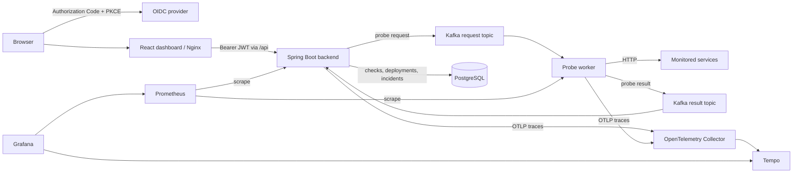

# LaunchGuard

[](https://github.com/doctor277/launchguard/actions/workflows/ci.yml) [](https://github.com/doctor277/launchguard/actions/workflows/codeql.yml) [](LICENSE) [](https://openjdk.org/projects/jdk/25/)

LaunchGuard is an event-driven service monitoring and deployment reliability platform. It combines a Spring Boot API, Kafka probe pipeline, PostgreSQL reliability history, and an authenticated React dashboard with Prometheus, Grafana, OpenTelemetry, and Tempo observability.


## Features

- Scheduled, synchronous, and asynchronous HTTP health checks through a dedicated Kafka probe worker.
- Availability, latency, timeline, deployment, and incident history backed by PostgreSQL aggregate queries.
- Automatic incident opening and recovery with deployment correlation and at-least-once result deduplication.
- OIDC Authorization Code with PKCE, JWT resource-server validation, and `VIEWER` / `OPERATOR` / `ADMIN` authorization.
- Authenticated React dashboard with role-aware operational controls and secure session-expiry handling.
- Prometheus metrics, provisioned Grafana dashboards, distributed OpenTelemetry traces, Tempo, and structured correlation logs.
- Reproducible 13-service Docker Compose lab with local Keycloak and three controllable demo services.
- CI, CodeQL, Dependabot, CycloneDX SBOMs, and optional Terraform/AWS ECS architecture.

## Architecture



The backend snapshots the current deployment when it dispatches a request. A database-free worker performs bounded HTTP probes and returns results through Kafka. Transactional backend processing deduplicates results, writes history, updates current health, and evaluates incident state. The browser obtains an OIDC access token with PKCE; backend authorization remains authoritative.

The optional AWS design retains the same application boundaries on ECS Fargate. An ALB routes `/` to the dashboard and `/api/*` to the backend; RDS and optional MSK Serverless remain private. The identity provider is external and configurable—Keycloak is local-development infrastructure and is not exposed by the AWS ALB.

## Tech Stack

| Area | Technology |
|---|---|
| Backend | Java 25, Spring Boot 4.1.1, Spring Security resource server |
| Dashboard | React 19, TypeScript 7, Vite 8, `oidc-client-ts`, unprivileged Nginx |
| Messaging | Apache Kafka 4.3.0, Spring Kafka |
| Persistence | PostgreSQL 18.6, Spring Data JPA, Flyway |
| Identity | Generic OIDC/OAuth 2.0; Keycloak 26.7.0 for the local lab |
| Observability | Micrometer, Prometheus 3.10.0, Grafana 12.4.11, OpenTelemetry Collector 0.147.0, Tempo 2.10.7 |
| Testing | JUnit, Mockito, AssertJ, PostgreSQL/Kafka Testcontainers, Vitest, Testing Library, Playwright |
| Delivery | Maven Wrapper, Docker Compose, GitHub Actions, CodeQL, Dependabot, CycloneDX |
| Optional cloud | Terraform 1.14, ECR, ECS Fargate, ALB, RDS, optional MSK Serverless, CloudWatch, GitHub OIDC |

## Quick Start

Requirements: Git, Docker with Linux containers and Compose `--wait`, and PowerShell 5.1+ or PowerShell 7. Java 25 is needed only for host-side builds and tests; Maven is provided by the wrapper.

```bash
git clone https://github.com/doctor277/launchguard.git
cd launchguard
cp .env.example .env
docker compose up --build -d --wait --wait-timeout 180
```

On Windows, use `Copy-Item .env.example .env`. The values in `.env.example` are local demonstration defaults; `.env` is ignored by Git.

Register the demo services from PowerShell. The script obtains a short-lived local automation token and never prints or persists it:

```powershell
./scripts/register-demo-services.ps1
```

Open [http://localhost:3001](http://localhost:3001), select **Sign in with OIDC**, and use one of the clearly local-only accounts:

| Role | Username | Demo password |
|---|---|---|
| Viewer | `launchguard-viewer` | `viewer-demo-only` |
| Operator | `launchguard-operator` | `operator-demo-only` |
| Administrator | `launchguard-admin` | `admin-demo-only` |

| Component | Default host address |
|---|---|
| Dashboard | `http://localhost:3001` |
| Backend API | `http://localhost:8080` |
| Local Keycloak | `http://localhost:8085` |
| Probe worker health | `http://localhost:8084/actuator/health` |
| Payment / order / notification | `http://localhost:8081` / `:8082` / `:8083` |
| PostgreSQL / Kafka | `localhost:5432` / `localhost:9092` |
| Prometheus / Grafana | `http://localhost:9090` / `http://localhost:3000` |
| Tempo / Collector health | `http://localhost:3200/ready` / `http://localhost:13133` |

All published ports bind to loopback. Inspect the lab with `docker compose ps`, and stop it without deleting named volumes using `docker compose down`.

## API

All `/api/**` routes require a Bearer access token. Reads require `VIEWER`, checks and deployment registration require `OPERATOR`, and service creation/deletion require `ADMIN`.

| Area | Routes |
|---|---|
| Services | `GET/POST /api/services`, `GET/DELETE /api/services/{id}` |
| Checks | `POST /check`, `POST /check/async`, `GET /checks` |
| Reliability | `GET /metrics`, `GET /metrics/timeline` |
| Deployments | `POST/GET /deployments`, `GET /deployments/{deploymentId}`, `GET /deployments/{deploymentId}/metrics` |
| Incidents | `GET /incidents`, `/incidents/current`, `/incidents/{incidentId}`, `/incident-metrics` |

Service metrics support `1h`, `24h`, `7d`, `30d`, and `all`. History uses zero-based `page` and `size`, with a maximum page size of 100. Responses are DTOs with structured errors. See the [technical guide](docs/technical-guide.md#api) and [security model](docs/security.md).

## Testing

The V1.0 suite includes Java unit and integration tests, 43 dashboard unit/component tests, and an authenticated Playwright flow against the real Compose stack. PostgreSQL and Kafka Testcontainers exercise persistence, event delivery, concurrency, incidents, deployments, and trace propagation; Docker unavailability fails integration tests instead of silently skipping them.

```bash
sh ./mvnw -B -ntp clean verify
cd dashboard
npm ci
npm audit --audit-level=high
npm test
npm run build
```

GitHub Actions also checks zero skipped Java tests, PowerShell contracts, Terraform, TFLint, workflow lint, Compose, all six application images, local OIDC, and the real-browser secured monitoring flow. CycloneDX Java and dashboard SBOMs are retained as CI artifacts. CodeQL analyzes Java and TypeScript separately.

## Observability

- **Prometheus** scrapes bounded backend and worker metrics. Backend Prometheus access is anonymous for the private scrape path, but the AWS ALB does not route Actuator endpoints.
- **Grafana** provisions Prometheus and Tempo datasources plus the LaunchGuard Platform dashboard; local Grafana access is anonymous read-only.
- **OpenTelemetry** carries W3C context through Kafka and worker HTTP execution; the Collector exports traces to **Tempo**.
- **Structured logs** include safe trace and audit context such as subject ID, roles, action, path, and status—never JWTs or authorization headers.

## Repository Structure

```text
launchguard/
├── backend/             REST API, OIDC resource server, persistence, incidents
├── dashboard/           Authenticated React UI and Nginx same-origin proxy
├── probe-worker/        Kafka consumer and bounded HTTP probe execution
├── monitoring-events/   Shared event contracts and Kafka configuration
├── demo-services/       Three controllable monitored services
├── identity/            Reproducible local Keycloak realm
├── observability/       Prometheus, Grafana, Collector, and Tempo configuration
├── infra/terraform/     Optional AWS development architecture
├── scripts/             Bootstrap, validation, and deployment reporting
├── docs/                Security, architecture, operations, and validation evidence
└── .github/workflows/   CI, CodeQL, delivery, and opt-in AWS deployment
```

## Project Status

LaunchGuard 1.0 is an actively developed engineering/portfolio project. The secured local lab is its primary demonstration environment; the AWS architecture is opt-in and is never deployed by CI. It is not a production monitoring service or a multi-tenant platform.

## Documentation

- [Security model](docs/security.md)
- [Technical guide](docs/technical-guide.md)
- [AWS deployment guide](docs/aws-deployment.md)
- [V1.0 validation report](docs/v1.0-validation.md)
- [Historical validation reports](docs/)
- [Changelog](CHANGELOG.md)

## Roadmap

- Per-service monitoring policies and distributed scheduling.
- Data and telemetry retention management.
- Deeper deployment integrations and operational automation.

These are future areas, not implemented capabilities.

## License

[MIT License](LICENSE).
