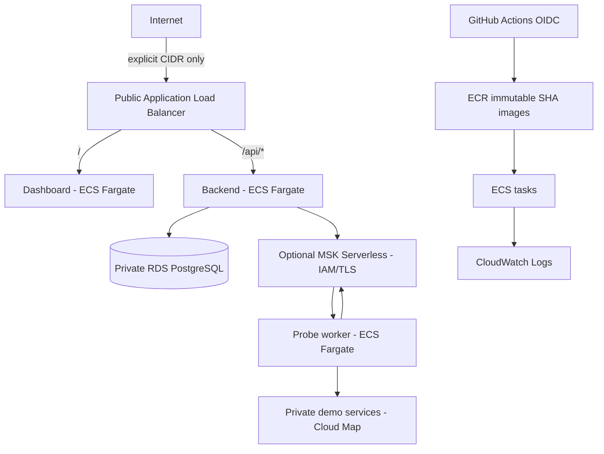

# AWS deployment guide

LaunchGuard's optional AWS environment is a short-lived development/demo architecture. Terraform defines it, but neither CI nor this repository runs `terraform apply` automatically. Review the plan, cost, exposure, and teardown settings before creating resources.

## Architecture decision

The default cloud design keeps LaunchGuard's Kafka semantics and uses managed AWS building blocks:



| Kafka option | Fit | Operations | Cost posture | Decision |
|---|---|---|---|---|
| MSK Serverless | Native Kafka API and managed capacity | Lowest Kafka operations | High continuous cluster-hour cost, even when idle | Preferred managed option, but disabled by default and intended only for short demonstrations |
| MSK provisioned | Native Kafka with broker/storage control | Capacity sizing, upgrades, and broker tuning | Minimum multi-broker footprint runs continuously | Not used for this milestone |
| Kafka/Redpanda on ECS or EC2 | Native or compatible protocol | Stateful storage, stable identity, upgrades, and recovery become project responsibilities | Can be cheaper at tiny scale, but with much higher operational risk | Rejected for the default architecture |
| Another AWS transport | Managed and potentially cheaper | New application semantics and integration | Service-dependent | Rejected because LaunchGuard is explicitly Kafka-based |

MSK Serverless requires IAM access control. The `aws` Spring profile enables `SASL_SSL` with `AWS_MSK_IAM`, and ECS task roles authorize only the cluster/topics/groups required by the backend and worker. Local Compose remains PLAINTEXT on its private Docker network and keeps a replication factor of 1; AWS uses 3.

## Resources and security boundaries

Terraform is split into `network`, `ecr`, `data`, `messaging`, `platform`, and `github_oidc` modules under `infra/terraform/modules/`. The `environments/dev` root composes them.

- One VPC across two availability zones, with public ALB, private application, and isolated data subnets.
- Six immutable ECR repositories with scan-on-push and lifecycle retention.
- One ECS cluster, six Fargate services/task definitions, deployment circuit breakers, container health checks, and per-service CloudWatch log groups.
- One ALB with dashboard default routing and a higher-priority `/api`/`/api/*` backend rule. An ACM certificate ARN enables HTTPS and HTTP redirect.
- One encrypted, private RDS PostgreSQL instance, with `18.6` as the configurable dev default rather than a claim of availability in every region. RDS manages the master password in Secrets Manager; only the backend execution role may read that secret, and only the backend task carries the database-client security group.
- Optional MSK Serverless in isolated subnets, reachable only from backend and probe-worker tasks carrying the Kafka-client security group on its IAM/TLS listener.
- Private Cloud Map DNS for the three demo services. The probe worker reaches them without public endpoints.
- An optional GitHub OIDC provider and narrowly scoped deploy role for ECR push, ECS task-definition registration/service update, and passing only LaunchGuard task roles.

The ALB is the only public resource. Its security group has **no ingress by default**. Set `allowed_ingress_cidrs` to specific client `/32` addresses for a demo; do not use `0.0.0.0/0` casually because LaunchGuard has no authentication yet. Backend management routes, worker management, PostgreSQL, MSK, and demo services are not ALB routes and have no public addresses.

## Cost model and safe defaults

The checked-in defaults deliberately set every ECS desired count to zero and disable MSK, NAT, VPC endpoints, GitHub OIDC, and ALB ingress. A blocking Terraform precondition also requires `acknowledge_billable_resources = true` before any plan can succeed. This is an acknowledgement gate, not a cost waiver: an apply still creates the ALB, RDS instance, ECR repositories, ECS definitions, networking, logs, and the managed database secret, so the default architecture is **not free**.

Review these billable categories in the [AWS Pricing Calculator](https://calculator.aws/) for the selected region:

| Category | Cost behavior and control |
|---|---|
| MSK Serverless | Largest likely expense. AWS's current us-east example prices the base cluster at USD 0.75 per cluster-hour (about USD 558 for 744 hours) before partition, traffic, and storage charges. Keep `enable_msk = false` except for short demonstrations. |
| RDS | Instance-hours, gp3 storage, backups beyond the free allocation, and monitoring/log ingestion. The dev default is single-AZ `db.t4g.micro`, 20 GiB, and one-day backup retention. RDS cannot scale to zero. |
| ALB | Load-balancer hours plus LCUs while it exists; it does not scale to zero. |
| ECS Fargate | Per-task vCPU/memory time. Desired count zero stops Fargate compute charges but does not remove ALB/RDS/MSK charges. |
| Private egress | A NAT gateway has hourly and per-GB charges. Interface endpoints charge per AZ-hour and data; four endpoints across two AZs can cost more than one NAT for a brief low-traffic demo. Both choices are optional. |
| ECR/CloudWatch/Secrets Manager | Stored image bytes, logs beyond free usage, and managed secret charges. Retention defaults are bounded. |

Pricing changes and varies by region. The [MSK pricing page](https://aws.amazon.com/msk/pricing/) is authoritative for current cluster, partition, traffic, and storage charges. A real plan and current calculator estimate should be reviewed immediately before any apply.

## Prerequisites

- Terraform 1.14.x and AWS CLI v2.
- Docker with Compose for building the six images.
- An AWS account and an operator identity authorized to provision VPC, ECR, ECS, ELB, RDS, MSK, CloudWatch, Secrets Manager, service discovery, and IAM resources.
- A globally unique existing S3 bucket for encrypted Terraform state. The repository does not create the backend bucket to avoid a state/bootstrap cycle.
- For GitHub deployment: repository administrator access to create the protected `aws-dev` environment and Actions variables.

Use short-lived AWS credentials (IAM Identity Center or an assumed role) for Terraform. Do not create or store access keys in this repository.

## Terraform workflow

From `infra/terraform/environments/dev`, create an untracked configuration:

```bash
cp terraform.tfvars.example terraform.tfvars
```

The `.gitignore` rules exclude `.terraform/`, state, crash logs, binary plan files, `terraform.tfvars`, and `*.auto.tfvars`. Keep account-specific values and all sensitive data out of Git.

Initialize the S3 backend with native lock-file support:

```bash
terraform init \
  -backend-config="bucket=YOUR_STATE_BUCKET" \
  -backend-config="key=launchguard/dev/terraform.tfstate" \
  -backend-config="region=us-east-1" \
  -backend-config="encrypt=true" \
  -backend-config="use_lockfile=true"

terraform fmt -check -recursive ../..
terraform validate
terraform test
terraform plan -out=dev.tfplan
terraform show dev.tfplan
```

`dev.tfplan` is ignored. Set `acknowledge_billable_resources = true` only after reviewing current prices, then review the complete saved plan. Applying it is an explicit operator decision:

```bash
terraform apply dev.tfplan
```

No application containers run with the example's zero desired counts. The first apply creates task definitions referencing a placeholder `bootstrap` tag; an image is not pulled until a service is scaled above zero.

### Optional MSK and private egress

For the supported managed-Kafka demo, set `enable_msk = true`. A task in the private application subnets cannot start with both NAT and VPC endpoints disabled. A blocking plan-time precondition requires at least one of these approaches whenever any desired count is nonzero:

- `enable_nat_gateway = true`: one NAT gateway for the two application subnets. It supports ECR pulls, logs, secret retrieval, AWS APIs, external OTLP exporters, external Kafka endpoints, and public HTTP probe targets, subject to destination behavior and security groups.
- `enable_vpc_endpoints = true`: `ecr.api`, `ecr.dkr`, `logs`, and `secretsmanager` interface endpoints plus an S3 gateway endpoint. This exact set supports ECR authentication/manifests, image layers, the `awslogs` driver, and backend database-secret injection without public Internet access.

Fargate itself does not require an ECS interface endpoint. The MSK client uses the ECS task role credentials delivered through the container credential endpoint and does not assume another role, so this design does not require an STS endpoint. VPC DNS resolves Cloud Map and MSK names without an endpoint. RDS and MSK traffic stays inside the VPC.

Endpoint-only networking does **not** provide arbitrary Internet access. It is suitable only when probe targets, any external Kafka broker, and any configured OTLP exporter are privately reachable. Set `require_internet_egress = true` when any task must reach an Internet-only destination; Terraform then requires NAT. Terraform cannot inspect service URLs stored later in PostgreSQL, so the operator must set this declaration before registering public targets.

If MSK is disabled, backend and probe-worker desired counts must remain zero unless `external_kafka_bootstrap_servers` points to an operator-managed broker reachable through the selected networking strategy. Dashboard and demo-only tasks do not require Kafka. The AWS IAM profile is enabled only when Terraform creates MSK.

### HTTPS

Without `certificate_arn`, the restricted demo endpoint uses HTTP. Supply a validated ACM certificate ARN to add an HTTPS listener using the TLS 1.3/1.2 policy and redirect HTTP to HTTPS. DNS/ACM issuance is deliberately outside this milestone.

## GitHub OIDC and deployment

Set these values before the bootstrap apply:

```hcl
enable_github_oidc         = true
create_github_oidc_provider = true
github_repository          = "doctor277/launchguard"
github_environment         = "aws-dev"
```

An AWS account can have one GitHub OIDC provider. If one already exists, set `create_github_oidc_provider = false` and provide its ARN in `existing_github_oidc_provider_arn`. The trust policy accepts only `repo:doctor277/launchguard:environment:aws-dev` with audience `sts.amazonaws.com`. The workflow requests its token only in the job that declares `environment: aws-dev` and `id-token: write`.

After apply:

1. Create a GitHub environment named `aws-dev` and require a reviewer.
2. Add environment variable `AWS_REGION` with the Terraform region.
3. Add environment variable `AWS_DEPLOY_ROLE_ARN` from `terraform output -raw github_deploy_role_arn`.
4. Optionally add `LAUNCHGUARD_AWS_URL` and `LAUNCHGUARD_SERVICE_ID` after registration. Reporting often cannot reach a CIDR-restricted ALB from a hosted runner; leaving either unset produces an explicit skip.
5. Manually run **AWS deployment** from `main` and type `DEPLOY` exactly.

The workflow first reuses the complete CI workflow. Only after it passes does GitHub request a short-lived OIDC token, build all six containers, tag them `sha-<40-character commit>`, push them to immutable ECR repositories, register new task-definition revisions, update all ECS services, wait for stabilization, and save deployment evidence. It contains no long-lived AWS key inputs.

For initial bootstrap, deploy images while desired counts are zero, then set the six `desired_counts` values to 1, run a new plan, review it, and explicitly apply. ECS does not provide Compose `depends_on`; health checks, application retries, and the deployment circuit breaker handle independent dependency readiness.

## Registration and verification

After the six services are running, get the URL:

```bash
terraform output -raw application_url
```

Register the private demo targets through the ALB API (replace `APP_URL`):

```bash
curl -X POST "$APP_URL/api/services" -H 'Content-Type: application/json' \
  -d '{"name":"payment-service","baseUrl":"http://payment-service.dev-launchguard.internal:8081","healthPath":"/health"}'
```

Repeat for `order-service` on 8082 and `notification-service` on 8083. Then verify:

- `GET APP_URL/` returns the dashboard.
- `GET APP_URL/api/services` returns registered DTOs.
- ECS shows six stable services and healthy ALB targets.
- RDS reports private networking and Flyway history contains V1-V5; Flyway remains the only schema mechanism.
- MSK topics exist with six partitions and replication factor 3.
- CloudWatch log groups contain structured JSON with trace/span fields when sampled.
- RDS, MSK, worker, demo, and management endpoints are not publicly reachable.

The ALB rule matches only `/api` and `/api/*`; `/actuator/*` therefore remains on the dashboard target and never reaches the backend. Browser API calls remain same-origin through the ALB and require no CORS exception.

Prometheus, Grafana, the OpenTelemetry Collector, and Tempo remain part of the local Compose lab. ECS trace export is optional through `otel_exporter_endpoint`; no managed cloud tracing backend is provisioned.

## Teardown

Destroy is always manual. Before destroying, disable RDS deletion protection if it was enabled and decide whether a final snapshot is required. ECR repositories intentionally refuse deletion while they contain images; delete only the reviewed `dev-launchguard/*` image contents through the AWS console/CLI, then:

```bash
terraform plan -destroy -out=destroy.tfplan
terraform show destroy.tfplan
terraform apply destroy.tfplan
```

Confirm the ALB, NAT/endpoints, RDS, MSK, ECS tasks/services, log groups, and ECR repositories are gone, then review retained snapshots and the S3 state object separately. Never automate teardown from a normal push workflow.

## Limitations

- The design is a single-region development deployment, not a production architecture or disaster-recovery plan.
- LaunchGuard has no authentication, authorization, tenant isolation, WAF policy, or production TLS/domain automation. CIDR restriction is the demo boundary.
- RDS is single-AZ by default; MSK capacity/retention and high-availability performance are not production tuned.
- Application autoscaling, scheduled scale-to-zero, alarms, managed Prometheus/Grafana, and managed tracing are outside V0.10.
- Terraform has been validated without an AWS account; no resource existence, quota, plan, apply, or live-cloud health claim is made until an operator performs those steps.
- PostgreSQL engine-version and instance-class availability are regional. Confirm `database_engine_version` and every selected resource with a real saved AWS plan before apply.
