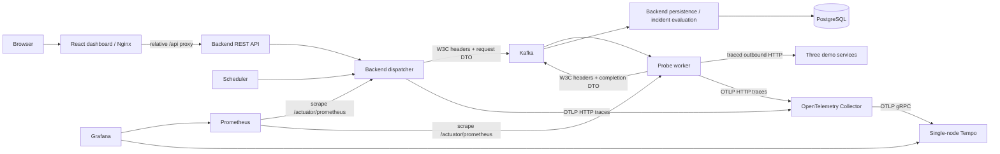
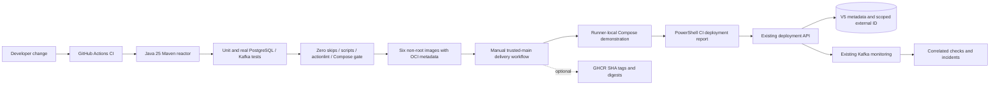
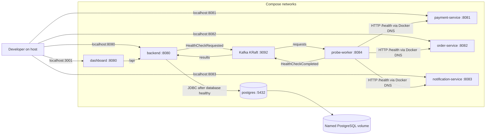
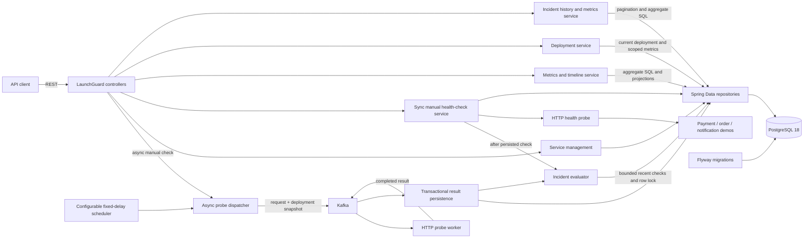
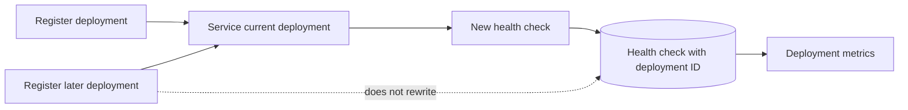
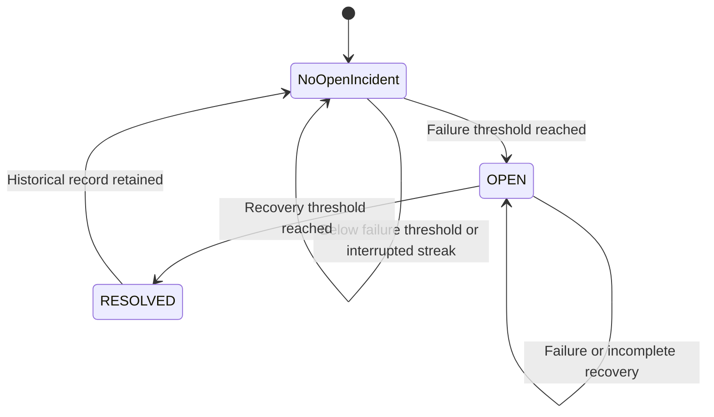
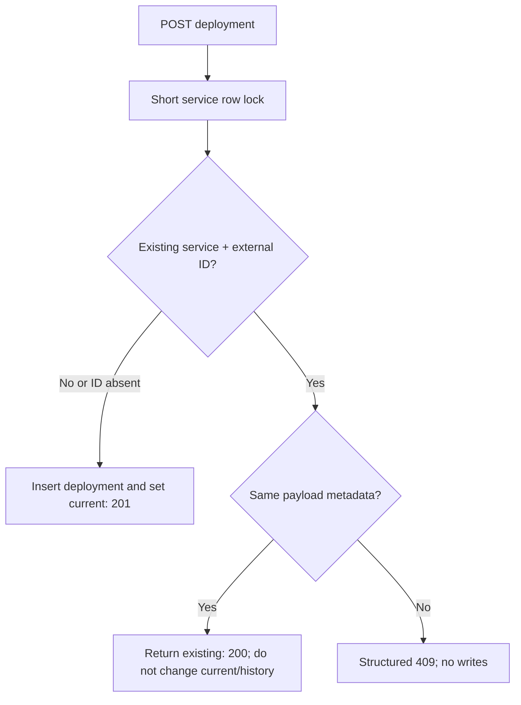

# Technical Guide

Detailed configuration, API contracts, reliability semantics, and operational procedures for LaunchGuard. Start with the [repository README](../README.md) for the overview and default Compose quick start. All commands below run from the repository root.

This guide preserves useful technical material from the former milestone-oriented README. Historical design references describe when behavior was introduced; [validation reports](#validation-history) remain dated evidence, not a promise about a current running environment.

## Architecture

Platform telemetry surrounds the asynchronous monitoring path:



Delivery automation validates the existing architecture; it is not a remote deployment platform:







The backend retains its controller/service/repository structure. Scheduled probes now use the dispatcher, Kafka, and the worker. Result persistence atomically writes history, updates current status, and invokes the existing incident evaluator. Direct HTTP probing remains only for the synchronous manual endpoint. The worker has neither database dependencies nor credentials; Compose also places PostgreSQL on a network the worker does not join.

The authenticated dashboard consumes the existing DTO APIs through a same-origin reverse proxy and sends its OIDC Bearer token on every API request. Production needs no cross-origin API access; the backend permits only the configured local Vite origin for development. Metrics remain database aggregates, history remains paginated, and JPA entities, Spring `Page` objects, and database projection types do not leak through the REST contract.

Actuator exposes health and Prometheus endpoints on backend and worker, with hidden health details and separate readiness/liveness groups. Compose waits for PostgreSQL and Kafka health before starting the backend. Demos do not gate backend startup: an unavailable target is a normal monitored failure. Docker health status does not restart an unhealthy demo; `restart: unless-stopped` handles exited processes, not failed probes.



## Technology stack

- Java 25
- Spring Boot 4.1.1
- Maven 3.9.16 through Maven Wrapper
- PostgreSQL 18
- Flyway
- Docker Compose
- JUnit 6, Mockito, AssertJ, and Testcontainers 2
- React 19, TypeScript 7, Vite 8, Vitest 5, React Testing Library, and Playwright
- Nginx unprivileged for the production dashboard image

## Repository structure

```text
launchguard/
|-- backend/                         LaunchGuard REST API and monitoring engine
|   |-- src/main/java/
|   |-- src/main/resources/db/migration/
|   `-- src/test/java/
|-- dashboard/                       React application, tests, and Nginx API proxy
|-- monitoring-events/               Shared versioned JSON contracts and Kafka configuration
|-- probe-worker/                    Independent Kafka/HTTP worker; no database
|-- demo-services/
|   |-- payment-service/             Payment demo (8081)
|   |-- order-service/               Order demo (8082)
|   `-- notification-service/        Notification demo (8083; no delivery feature)
|-- scripts/                         Registration and repeatable lab validation
|-- .github/workflows/               CI and opt-in delivery demonstration
|-- docs/                            Milestone validation reports
|-- .mvn/wrapper/                    Maven Wrapper configuration
|-- observability/                   Collector / Prometheus / Tempo / Grafana provisioning
|-- identity/                        Reproducible local Keycloak realm and clients
|-- docker-compose.yml               Complete thirteen-container secured lab
|-- .env.example                     Optional Compose overrides
|-- pom.xml                          Multi-module reactor build
|-- mvnw / mvnw.cmd
`-- README.md
```

## Prerequisites

- Docker Engine/Desktop with Linux containers and Docker Compose v2+ for the lab.
- PowerShell 5.1+ or PowerShell 7 for the registration and validation scripts.
- Java 25 only when building/testing or running applications outside Docker.

No global Maven installation is required.

## Quick start with Docker Compose

Clone the public repository, change into `launchguard`, and start all thirteen containers:

```bash
git clone https://github.com/doctor277/launchguard.git
cd launchguard
cp .env.example .env
docker compose up --build
```

The first build downloads Java images and Maven dependencies. For detached, readiness-checked startup use `docker compose up --build -d --wait --wait-timeout 180`.

All published ports are bound to host loopback, not all network interfaces:

- LaunchGuard API: `http://localhost:8080`
- LaunchGuard application dashboard: `http://localhost:3001`
- Local Keycloak: `http://localhost:8085`
- Demo payment service: `http://localhost:8081`
- Demo order service: `http://localhost:8082`
- Demo notification service: `http://localhost:8083`
- PostgreSQL: `localhost:5432`
- Kafka host listener: `localhost:9092`
- Probe-worker health: `http://localhost:8084/actuator/health`

In a second terminal, register all three demos explicitly. The script obtains a short-lived local automation token without printing it:

```powershell
.\scripts\register-demo-services.ps1
```

Repeat execution reuses the same service IDs. An existing name with a different target produces a clear error without overwriting or deleting history. Normal backend startup never seeds demo data.

The registered targets are `http://payment-service:8081`, `http://order-service:8082`, and `http://notification-service:8083`. Host port overrides do not change these internal URLs. In a backend container, `localhost` means that backend itself, not a demo. Open the dashboard and sign in through Keycloak using a local account documented in [security.md](security.md). Equivalent manual registration requires an ADMIN token:

```bash
curl -X POST http://localhost:8080/api/services \
  -H "Authorization: Bearer $ACCESS_TOKEN" \
  -H "Content-Type: application/json" \
  -d '{"name":"payment-service","baseUrl":"http://payment-service:8081","healthPath":"/health"}'
```

Inspect containers and logs:

```bash
docker compose ps
docker compose logs -f backend probe-worker kafka payment-service order-service notification-service
```

Stop the stack without deleting PostgreSQL data:

```bash
docker compose down
```

The local credentials in `docker-compose.yml` are development defaults only:

| Setting | Value |
|---|---|
| Database | `launchguard` |
| Username | `launchguard` |
| Password | `launchguard` |

PostgreSQL data is retained in the named `launchguard-postgres-data` volume (normally `launchguard_launchguard-postgres-data`, prefixed with the Compose project name). PostgreSQL 18 mounts `/var/lib/postgresql`, including its version-specific data directory. `docker compose down` followed by `docker compose up -d --wait` recreates containers without losing registrations, checks, deployments, or incidents.

To **erase all lab database history**, deliberately run `docker compose down -v`, then start and register the demos again. This is destructive; do not use it for ordinary stops/restarts. Do not change the Compose project name/directory if you intend to reuse the same volume.

Optional overrides: copy `.env.example` to `.env` and edit it before starting. For example, set `POSTGRES_PORT=5433` if a host PostgreSQL already owns port 5432. The backend still connects to `postgres:5432` internally. Host port overrides are `DASHBOARD_PORT`, `LAUNCHGUARD_PORT`, `PAYMENT_PORT`, `ORDER_PORT`, and `NOTIFICATION_PORT`; pass corresponding host URLs to scripts when changed.

## Run applications locally

Start PostgreSQL, Kafka, and the local identity provider:

```bash
docker compose up -d postgres kafka keycloak
```

In one terminal, start the backend:

```bash
sh ./mvnw -DskipTests package
java -jar backend/target/launchguard-backend-1.0.0.jar
```

On Windows PowerShell or Command Prompt, use `mvnw.cmd` in place of `sh ./mvnw`.

Start the worker in another terminal:

```bash
java -jar probe-worker/target/probe-worker-1.0.0-exec.jar
```

For host-run Java processes, Kafka defaults to `localhost:9092`; if its host port changes, set `KAFKA_BOOTSTRAP_SERVERS`. Containers use `kafka:9092` independently of host ports.

Start each demo in its own terminal:

```bash
sh ./mvnw -pl demo-services/payment-service spring-boot:run
sh ./mvnw -pl demo-services/order-service spring-boot:run
sh ./mvnw -pl demo-services/notification-service spring-boot:run
```

When all applications run directly on the host, register with `.\scripts\register-demo-services.ps1 -Target Local`. This selects localhost ports 8081/8082/8083. Do not reuse Docker-target registrations against a host backend without explicitly resolving the conflicting targets. If PostgreSQL's host port is changed, set `DB_URL` accordingly before running the backend.

### Configuration

The backend accepts these environment variables:

| Variable | Default | Purpose |
|---|---|---|
| `DB_URL` | `jdbc:postgresql://localhost:5432/launchguard` | JDBC connection URL |
| `DB_USERNAME` | `launchguard` | Database username |
| `DB_PASSWORD` | `launchguard` | Local development password |
| `SERVER_PORT` | `8080` | Backend HTTP port; demos default to 8081/8082/8083 |
| `MONITORING_INTERVAL` | `30s` | Delay between scheduled monitoring passes |
| `MONITORING_INITIAL_DELAY` | `30s` | Delay before the first scheduled pass |
| `MONITORING_CONNECT_TIMEOUT` | `2s` | HTTP connection timeout |
| `MONITORING_RESPONSE_TIMEOUT` | `5s` | HTTP response timeout |
| `INCIDENT_FAILURE_THRESHOLD` | `3` | Consecutive DOWN checks required to open an incident |
| `INCIDENT_RECOVERY_THRESHOLD` | `2` | Consecutive HEALTHY checks required to resolve an incident |

Compose overrides the monitoring interval and initial delay to `5s` for an interactive lab; direct execution retains `30s`. A monitoring pass dispatches requests without waiting for HTTP; services with an asynchronous request still in flight are skipped until completion or expiry.

Each demo accepts `DEMO_SLOW_DELAY_MS` (default `2000`, range 1..30000) as the delay used by `POST /admin/slow` without an argument. Compose maps `PAYMENT_SLOW_DELAY_MS`, `ORDER_SLOW_DELAY_MS`, and `NOTIFICATION_SLOW_DELAY_MS` to the corresponding container. Demos always start healthy with delay disabled; controls are in-memory and reset on application restart.

Hibernate uses `ddl-auto: validate`; Flyway owns schema changes. Applied migrations cover V1 monitoring, V2 deployments, V3 incidents, V4 probe-request correlation, and V5 CI deployment metadata. Existing history is preserved; never edit an applied migration.

## API

Every `/api/**` request requires an OIDC Bearer access token. Set `ACCESS_TOKEN` to a short-lived token from the configured provider and add `-H "Authorization: Bearer $ACCESS_TOKEN"` to each LaunchGuard API curl command below. Demo-service controls on ports 8081–8083 remain local-only fixtures. See [security.md](security.md) for the role matrix and token-handling model.

| Method | Path | Result |
|---|---|---|
| `GET` | `/actuator/health` | Backend/database/Kafka connectivity health, without details |
| `POST` | `/api/services/{id}/check/async` | Queue a Kafka probe and return request ID (`202`) |
| `POST` | `/api/services` | Register a service (`201 Created`) |
| `GET` | `/api/services` | List registered services |
| `GET` | `/api/services/{id}` | Get one service |
| `DELETE` | `/api/services/{id}` | Delete a service and its check history (`204 No Content`) |
| `POST` | `/api/services/{id}/check` | Run a health check immediately |
| `GET` | `/api/services/{id}/checks?page=0&size=20` | Paginated check history, newest first |
| `GET` | `/api/services/{id}/metrics?window=24h` | Windowed reliability metrics |
| `GET` | `/api/services/{id}/metrics/timeline?window=24h` | Timestamped status and latency history |
| `POST` | `/api/services/{id}/deployments` | Register the new current deployment (`201 Created`) |
| `GET` | `/api/services/{id}/deployments?page=0&size=20` | Paginated deployments, newest first |
| `GET` | `/api/services/{id}/deployments/{deploymentId}` | Deployment details and current flag |
| `GET` | `/api/services/{id}/deployments/{deploymentId}/metrics` | Reliability for checks linked to that deployment |
| `GET` | `/api/services/{id}/incidents?page=0&size=20` | Newest-first incident history; optional `status` filter |
| `GET` | `/api/services/{id}/incidents/{incidentId}` | One incident, deployment summary, and duration |
| `GET` | `/api/services/{id}/incidents/current` | Current OPEN incident, or `204 No Content` |
| `GET` | `/api/services/{id}/incident-metrics?window=30d` | Windowed incident counts and duration statistics |

### Register and inspect a service

The following target is Docker DNS for the Compose backend. For host-run Java applications, use `http://localhost:8081` instead. If the bootstrap already registered this name, inspect/reuse its ID rather than creating it again.

```bash
curl -X POST http://localhost:8080/api/services \
  -H "Content-Type: application/json" \
  -d '{"name":"payment-service","baseUrl":"http://payment-service:8081","healthPath":"/health"}'
```

The response begins in `UNKNOWN` state. Save its `id` for the examples below.

```bash
curl http://localhost:8080/api/services
curl http://localhost:8080/api/services/SERVICE_ID
curl -X POST http://localhost:8080/api/services/SERVICE_ID/check
curl -X DELETE http://localhost:8080/api/services/SERVICE_ID
```

Invalid requests return structured `400` responses with field violations. Missing services return `404`; duplicate names and overlapping manual checks return `409`.

### Reliability metrics

Metrics default to the most recent 24 hours:

```bash
curl http://localhost:8080/api/services/SERVICE_ID/metrics
curl "http://localhost:8080/api/services/SERVICE_ID/metrics?window=7d"
curl "http://localhost:8080/api/services/SERVICE_ID/metrics?window=all"
```

Supported windows are `1h`, `24h`, `7d`, `30d`, and `all`. Values are case-insensitive. An unsupported value returns the existing structured HTTP `400` error response.

Example response:

```json
{
  "serviceId": "8d22722d-a1e0-49cb-a4b5-f033825a9811",
  "status": "HEALTHY",
  "totalChecks": 120,
  "healthyChecks": 116,
  "failedChecks": 4,
  "availabilityPercentage": 96.67,
  "averageResponseTimeMs": 72.4,
  "minResponseTimeMs": 31,
  "maxResponseTimeMs": 410,
  "lastFailureAt": "2026-09-24T15:14:01.246Z",
  "lastCheckedAt": "2026-09-24T15:18:31.107Z"
}
```

Availability is `healthyChecks / totalChecks * 100`, rounded to two decimal places. Empty windows report zero counts, `0.00` availability, and `null` latency and failure values. The `status` and `lastCheckedAt` fields describe the service's latest known state; the counts, latency values, and `lastFailureAt` are scoped to the selected window.

### Timeline

```bash
curl "http://localhost:8080/api/services/SERVICE_ID/metrics/timeline?window=24h"
```

The response is an oldest-to-newest JSON array of `{timestamp, status, responseTimeMs}` observations. It intentionally returns raw check points so a future client can choose its own chart aggregation.

### Paginated check history

```bash
curl "http://localhost:8080/api/services/SERVICE_ID/checks?page=0&size=20"
curl "http://localhost:8080/api/services/SERVICE_ID/checks?page=1&size=50"
```

`page` is zero-based, `size` defaults to 20, and the maximum size is 100. The response contains API-owned metadata:

```json
{
  "content": [],
  "page": 0,
  "size": 20,
  "totalElements": 0,
  "totalPages": 0,
  "first": true,
  "last": true
}
```

Negative page values, sizes below 1, and sizes above 100 return HTTP `400`.

### Deployments and correlation

Registering a deployment makes it current for its service. `deployedAt` and `createdAt` are set by the server. `version` is required and at most 100 characters. An optional commit SHA must be 7 to 64 hexadecimal characters; an optional description is limited to 1000 characters. Invalid requests use the structured `400` response.

```bash
curl -X POST http://localhost:8080/api/services/SERVICE_ID/deployments \
  -H "Content-Type: application/json" \
  -d '{"version":"v1.0.0","commitSha":"a921fc7","description":"Initial payment release"}'
curl -X POST http://localhost:8080/api/services/SERVICE_ID/check
curl -X POST http://localhost:8080/api/services/SERVICE_ID/deployments \
  -H "Content-Type: application/json" \
  -d '{"version":"v1.1.0","commitSha":"b731e22","description":"Payment retry improvements"}'
curl -X POST http://localhost:8080/api/services/SERVICE_ID/check
```

The first check retains the v1.0.0 deployment ID; the later check receives the v1.1.0 ID. Checks made before the first deployment have `deploymentId: null` and remain part of service-wide metrics. The service response includes a `currentDeployment` summary with `id`, `version`, `commitSha`, and `deployedAt`.

```bash
curl "http://localhost:8080/api/services/SERVICE_ID/deployments?page=0&size=20"
curl http://localhost:8080/api/services/SERVICE_ID/deployments/DEPLOYMENT_ID
curl http://localhost:8080/api/services/SERVICE_ID/deployments/DEPLOYMENT_ID/metrics
```

Example deployment metrics response:

```json
{
  "deploymentId": "c16c66fb-227f-4082-b371-7047c06f74c0",
  "serviceId": "8d22722d-a1e0-49cb-a4b5-f033825a9811",
  "version": "v1.1.0",
  "commitSha": "b731e22",
  "current": true,
  "deployedAt": "2026-09-24T15:00:00Z",
  "totalChecks": 5,
  "healthyChecks": 3,
  "failedChecks": 2,
  "availabilityPercentage": 60.00,
  "averageResponseTimeMs": 355,
  "minResponseTimeMs": 31,
  "maxResponseTimeMs": 920,
  "firstFailureAt": "2026-09-24T15:05:00Z",
  "lastCheckedAt": "2026-09-24T15:10:00Z"
}
```

Deployment metrics include only checks whose `deploymentId` matches that deployment. A deployment with no checks reports zero counts, `0.00` availability, and `null` latency and check timestamps. A deployment ID used under another service returns `404`.

## Automatic incidents

An incident is a confirmed unhealthy period, not a single failed check. With the default thresholds, `DOWN, DOWN, DOWN` opens one incident. Additional failures keep that same incident open. `HEALTHY, HEALTHY` resolves it; `HEALTHY, DOWN` resets recovery, so two new consecutive healthy checks are required. A later outage creates a new incident without modifying the resolved record.



Configure `launchguard.incidents.failure-threshold` and `launchguard.incidents.recovery-threshold` (or the environment variables above). Both must be integers from 1 through 1000; invalid configuration fails application startup. Detection reads at most the applicable threshold's recent check projections using the existing service/time index. It does not load an entire history or keep restart-sensitive counters in memory.

The evaluator runs after the check is flushed, in the same transaction as the check and service status update. A service-row `FOR NO KEY UPDATE` lock serializes evaluation while remaining compatible with the parent-key locks acquired by check inserts; a partial unique index independently enforces at most one OPEN incident. `startedAt` is the threshold-reaching check time, not the first failed check time. `resolvedAt` is the final recovery check time. The incident captures the deployment current when evaluation opens it; an in-flight check can retain its earlier deployment while the new incident captures a newer deployment registered during its probe. No deployment is required.

Incident deployment, start, reason, and creation fields cannot be updated through the entity. The only lifecycle transition is OPEN to RESOLVED; a resolved incident cannot be resolved again. No incident mutation or manual-resolution API is exposed.

```bash
curl "http://localhost:8080/api/services/SERVICE_ID/incidents?page=0&size=20"
curl "http://localhost:8080/api/services/SERVICE_ID/incidents?status=OPEN"
curl "http://localhost:8080/api/services/SERVICE_ID/incidents?status=RESOLVED"
curl http://localhost:8080/api/services/SERVICE_ID/incidents/INCIDENT_ID
curl http://localhost:8080/api/services/SERVICE_ID/incidents/current
```

History uses zero-based pages, default size 20, and maximum size 100. Status filters are case-insensitive; invalid filters return structured `400` errors. Missing services and incident IDs used under the wrong service return `404`. When no OPEN incident exists, `/incidents/current` returns `204` with no body. Service responses include a boolean `hasOpenIncident` indicator, including when a service is HEALTHY but has not yet reached its recovery threshold.

Incident DTOs include `id`, `serviceId`, `serviceName`, `status`, an optional `{id, version, commitSha}` deployment summary, `triggerReason`, `startedAt`, `resolvedAt`, and `durationSeconds`. For OPEN incidents, `resolvedAt` and `durationSeconds` are null. For RESOLVED incidents, duration is elapsed time between start and resolution, truncated to whole seconds.

### Incident metrics

```bash
curl "http://localhost:8080/api/services/SERVICE_ID/incident-metrics?window=30d"
curl "http://localhost:8080/api/services/SERVICE_ID/incident-metrics?window=all"
```

The default window is `30d`; the existing `1h`, `24h`, `7d`, `30d`, and `all` values are supported. Windows select incidents whose `startedAt` is on or after the cutoff; incidents opened before the cutoff are excluded even if still OPEN. Database aggregation calculates counts, average resolution time for RESOLVED incidents only (rounded to two decimals), and the longest duration among both resolved and ongoing incidents (whole seconds, using request time for ongoing incidents).

```json
{
  "serviceId": "8d22722d-a1e0-49cb-a4b5-f033825a9811",
  "window": "30d",
  "totalIncidents": 4,
  "resolvedIncidents": 3,
  "openIncidents": 1,
  "averageResolutionTimeSeconds": 218.50,
  "longestIncidentSeconds": 512
}
```

Empty windows report zero counts and null duration statistics. An all-open selection has a null average resolution time.

## Demo failure and recovery

The payment service starts healthy:

```bash
curl http://localhost:8081/health
# {"status":"healthy"}
```

Enable failure mode and run another LaunchGuard check:

```bash
curl -X POST http://localhost:8081/admin/fail
curl -X POST http://localhost:8080/api/services/SERVICE_ID/check
```

The payment health endpoint now returns HTTP 500 and LaunchGuard records `DOWN`.

Recover and check again:

```bash
curl -X POST http://localhost:8081/admin/recover
curl -X POST http://localhost:8080/api/services/SERVICE_ID/check
```

LaunchGuard records a new `HEALTHY` result without removing the earlier history. Query `/metrics`, `/metrics/timeline`, or `/checks` to inspect the resulting reliability data.

### Incident lifecycle demo

Exact manual-check counts below assume scheduled dispatches are disabled (for example, start the backend with `MONITORING_INITIAL_DELAY=24h`) and no other probes are in flight. For the normally scheduled Compose lab, use the polling validation scripts instead.

Register the service and deployment v1.0.0 using the examples above, then generate a healthy check. With the default thresholds:

```bash
curl -X POST http://localhost:8081/admin/fail
curl -X POST http://localhost:8080/api/services/SERVICE_ID/check
curl -i http://localhost:8080/api/services/SERVICE_ID/incidents/current
# 204: only one failure
curl -X POST http://localhost:8080/api/services/SERVICE_ID/check
curl -i http://localhost:8080/api/services/SERVICE_ID/incidents/current
# 204: only two failures
curl -X POST http://localhost:8080/api/services/SERVICE_ID/check
curl http://localhost:8080/api/services/SERVICE_ID/incidents/current
# OPEN, associated with v1.0.0
curl -X POST http://localhost:8080/api/services/SERVICE_ID/check
# Additional failure does not duplicate the incident
curl -X POST http://localhost:8081/admin/recover
curl -X POST http://localhost:8080/api/services/SERVICE_ID/check
curl http://localhost:8080/api/services/SERVICE_ID/incidents/current
# Still OPEN after one healthy check
curl -X POST http://localhost:8080/api/services/SERVICE_ID/check
curl -i http://localhost:8080/api/services/SERVICE_ID/incidents/current
# 204: resolved after two healthy checks
curl "http://localhost:8080/api/services/SERVICE_ID/incidents?status=RESOLVED"
curl http://localhost:8080/api/services/SERVICE_ID/incident-metrics
```

Repeat failure mode and three failed checks to create a second incident. Registering v1.1.0 while an incident is OPEN changes future checks but not that incident's deployment. The same detection and recovery behavior works for a service with no registered deployment.

## Multi-service failure lab

All three demos expose the same controls, independently:

| Method/path | Effect |
|---|---|
| `GET /health` | HTTP 200 normally, HTTP 500 in failure mode; applies artificial delay |
| `POST /admin/fail` | Enable failure mode |
| `POST /admin/recover` | Disable failure mode; does not remove delay |
| `POST /admin/slow?delayMs=250` | Set artificial latency (1..30000 ms); omit argument for configured default |
| `POST /admin/normal` | Remove delay; does not disable failure mode |

Invalid delay values return HTTP 400. These unauthenticated admin endpoints are intentional local demo controls, not production APIs. The notification demo does not send notifications.

Register the demos first and copy their IDs from the script or `GET /api/services`. The following scenarios rely on the scheduler; no manual check is needed.

### A: isolated order failure

```bash
curl -X POST http://localhost:8082/admin/fail
curl http://localhost:8080/api/services
curl http://localhost:8080/api/services/ORDER_ID/incidents/current
# After 3 DOWN checks: order has an OPEN incident; payment and notification remain HEALTHY.
curl -X POST http://localhost:8082/admin/recover
curl "http://localhost:8080/api/services/ORDER_ID/incidents?status=RESOLVED"
# After 2 HEALTHY checks: the original incident is RESOLVED; history remains.
```

With the lab's 5s delay, allow several passes for confirmation. `HEALTHY` can precede incident resolution by one recovery check.

### B: simultaneous independent outages

```bash
curl -X POST http://localhost:8081/admin/fail
curl -X POST http://localhost:8083/admin/fail
curl http://localhost:8080/api/services/PAYMENT_ID/incidents/current
curl http://localhost:8080/api/services/NOTIFICATION_ID/incidents/current
# Distinct incident IDs and service IDs; order remains HEALTHY.
curl -X POST http://localhost:8081/admin/recover
curl -X POST http://localhost:8083/admin/recover
```

### C: slow responses and timeouts

```bash
curl -X POST "http://localhost:8083/admin/slow?delayMs=250"
curl "http://localhost:8080/api/services/NOTIFICATION_ID/checks?size=20"
curl "http://localhost:8080/api/services/NOTIFICATION_ID/metrics/timeline?window=1h"
# New HEALTHY checks show >=250 ms.
curl -X POST "http://localhost:8083/admin/slow?delayMs=7000"
# Exceeds the default 5s response timeout: DOWN, null httpStatus, timeout error and duration recorded.
curl -X POST http://localhost:8083/admin/normal
# Subsequent checks recover; prolonged timeouts may also open an incident.
```

Docker's demo health probe has a 2s timeout, independent of LaunchGuard's 5s probe timeout. A demo can become Docker-unhealthy while LaunchGuard still accepts a 3s response. Intentional failures do not cause a Docker restart.

Transport error text is client-dependent: Java's HTTP client can report `Request cancelled` when the configured response deadline expires. For this scenario, a null HTTP status plus a duration near 5000ms (below the injected 7000ms) demonstrates the timeout; the original error text is preserved.

### Container outage and repeatable validation

```bash
docker compose stop order-service
# Scheduler records DOWN with a connection error; after the threshold, an OPEN incident.
docker compose start order-service
# Application starts healthy; scheduler records recovery and resolves the incident.
```

To execute all scenarios, inspect database UUIDs directly, restart the full environment without removing its volume, and verify every prior row survives:

```powershell
.\scripts\validate-demo-lab.ps1
# Docker engine/CLI inside Ubuntu WSL, with PowerShell scripts on Windows:
.\scripts\validate-demo-lab.ps1 -WslDistribution Ubuntu
# Custom host ports:
.\scripts\validate-demo-lab.ps1 -BackendUrl http://localhost:9080 -PaymentUrl http://localhost:9081 -OrderUrl http://localhost:9082 -NotificationUrl http://localhost:9083
```

This script intentionally changes demo controls and recreates this Compose project's containers. It never removes volumes or invokes manual LaunchGuard checks; incident confirmation must come from scheduled checks. Run it only against the local lab with the default 5s HTTP response timeout. It polls state with bounded deadlines rather than assuming fixed startup sleeps. The final report includes service/incident samples, latency/network failures, database counts, container health, and non-root runtime verification. Existing lab data is preserved.

## Application dashboard

The dashboard is a separate React application. Its overview route loads the service registry and 24-hour reliability metrics with a maximum of four concurrent metric requests. It derives service counts from current API status, displays `HEALTHY`, `DOWN`, and `UNKNOWN` explicitly, and shows current-deployment and open-incident summaries supplied by the backend. A failed per-service metric request remains local to that row instead of blanking the whole overview.

Hash-based service routes (`#/services/{id}`) provide reliability metrics, a bounded SVG latency/status timeline, paginated health checks, current deployment metadata, deployment history and deployment-specific metrics, the current incident, paginated incident history, and incident metrics. The chart reduces long timelines to at most 240 plotted points while preserving failures and latency peaks; the backend timeline response itself remains raw and unpaginated.

Data refreshes every 10 seconds while the tab is visible and can also be refreshed manually. Requests have a 10-second client timeout and are aborted when a view changes or unmounts. Loading, empty, structured API error, backend-unavailable, partial-section failure, and missing-service states are rendered explicitly. VIEWER users have read-only access; OPERATOR and ADMIN users can trigger a health check from a service detail page. Registration, demo failure controls, and deployment reporting remain API/script operations.

For local frontend development, run the backend separately and use the Vite proxy:

```bash
cd dashboard
npm ci
npm run dev
```

Vite listens on `http://localhost:3001` and proxies `/api` to `DASHBOARD_BACKEND_URL` (default `http://localhost:8080`). The production multi-stage image builds static assets with the lockfile, runs Nginx unprivileged, serves the SPA on container port 8080, exposes `/healthz`, generates public OIDC runtime configuration, and proxies relative `/api` requests to `backend:8080`. The same-origin production design needs no CORS exception; direct Vite development uses the explicitly configured origin. Grafana remains the platform telemetry dashboard; it is not replaced by this application UI.

## Tests and build

Run the complete reactor test suite:

```bash
sh ./mvnw clean test
```

Build all five executable Java applications and the shared contracts in the seven-module reactor:

```bash
sh ./mvnw clean package
```

Run the dashboard unit/component tests and production build independently:

```bash
cd dashboard
npm ci
npm test
npm run build
```

Unit tests cover the V0.1 probing, persistence, transitions, API validation, and demo failure/recovery behavior. V0.2 adds coverage for windowed metrics and pagination. V0.3 adds deployment registration, replacement, correlation, scoped metrics, validation, and pagination tests. V0.4 adds failure/recovery thresholds, interrupted streaks, deployment snapshots, incident APIs, filtering, durations, and incident metrics. PostgreSQL integration tests exercise full lifecycles, concurrent evaluation, database uniqueness, foreign keys, deletion semantics, database aggregation, and staged V1-to-V2-to-V3 migration compatibility. V0.5 adds real HTTP probing of three independent targets with persisted isolated incident lifecycles, plus each demo's delay validation, recovery, and independent state.

By default, the persistence suite starts a disposable PostgreSQL 18 Testcontainers container against the Docker engine available to the JVM. **Docker unavailability fails the suite; no integration tests are silently skipped.** Start Docker first, use Linux containers, and ensure the current Docker context/socket is reachable. Maven does not need the Compose stack running. Docker image builds deliberately use `-DskipTests`; they compile/package but do not substitute for this full test run.

On Windows with a WSL-only Docker engine, run Maven with Java 25 inside that same WSL distribution, or configure a supported Docker connection for the Windows JVM. For example in Ubuntu with Java 25 installed:

```bash
cd launchguard
unset LAUNCHGUARD_TEST_DB_URL
sh ./mvnw clean package
```

To run the persistence tests without Docker, create a dedicated empty PostgreSQL database with username/password `launchguard` and provide its URL. The tests apply Flyway migrations and create test records. For example, in PowerShell:

```powershell
$env:LAUNCHGUARD_TEST_DB_URL = 'jdbc:postgresql://localhost:5432/launchguard_tests'
.\mvnw.cmd clean package
Remove-Item Env:LAUNCHGUARD_TEST_DB_URL
```

The external mode is preserved for an explicitly selected dedicated test database. Never point it at your lab or production database. It affects only the original persistence suite: the V0.6 integration suite always starts actual Kafka and PostgreSQL containers, so a full build still requires Docker.

## Event-driven monitoring

Kafka separates dispatch from HTTP latency; it does not make a slow target faster. The backend schedules a small JSON request, and four bounded worker threads execute network calls independently. Existing metrics and incident APIs continue reading the same PostgreSQL history.

### Topics, contracts, and processing

Applications explicitly create these topics with six partitions and replication factor 1:

- `launchguard.health-check.requests`
- `launchguard.health-check.results`
- `launchguard.health-check.requests.dlt`
- `launchguard.health-check.results.dlt`

Broker auto-creation is disabled. All records use the service UUID string as their Kafka key. The `monitoring-events` module contains records, validation, JSON serialization, topic configuration, retry policy, and broker health checks; it contains no JPA model.

Request schema:

```json
{
  "eventVersion": 1,
  "requestId": "bf90b63e-7e1d-48b7-8d40-5b84bc83fda4",
  "serviceId": "cf846957-8023-45b8-a1b3-c513c67d598a",
  "deploymentId": null,
  "targetUrl": "http://payment-service:8081/health",
  "requestedAt": "2026-09-28T18:00:00Z",
  "timeoutMs": 5000
}
```

Completion schema:

```json
{
  "eventVersion": 1,
  "requestId": "bf90b63e-7e1d-48b7-8d40-5b84bc83fda4",
  "serviceId": "cf846957-8023-45b8-a1b3-c513c67d598a",
  "deploymentId": null,
  "status": "HEALTHY",
  "httpStatus": 200,
  "responseTimeMs": 42,
  "errorMessage": null,
  "checkedAt": "2026-09-28T18:00:00.042Z"
}
```

Only event version 1 is supported. UUIDs identify one dispatch and its captured service/deployment. Deployment is optional and copied unchanged by the worker. Timestamps are UTC instants; `checkedAt` is probe completion time. Timeout is 1..60000ms. Latency is nonnegative elapsed time measured with a monotonic clock. HTTP 2xx is HEALTHY; non-2xx, timeout, DNS, and connection failures are DOWN. HTTP status is null when the complete response was not obtained; errors are capped at 2048 characters. The worker bounds both headers and response-body completion and discards response bodies.

### Async API

```bash
curl -i -X POST http://localhost:8080/api/services/SERVICE_ID/check/async
# HTTP 202
# {"requestId":"...","serviceId":"...","status":"QUEUED"}
curl "http://localhost:8080/api/services/SERVICE_ID/checks?size=20"
# Kafka-generated history includes probeRequestId.
```

202 means accepted into the Kafka producer, not a durable broker acknowledgement or completed probe. Immediate queue failures return structured 503; an already in-flight asynchronous probe returns 409. Later publication failure is logged and releases the guard. Missing services return 404. No job/status API is added; look up the returned ID in check history. The synchronous `POST /check` remains unchanged and its `probeRequestId` is null.

### Reliability, concurrency, and ordering

Delivery is at-least-once, not exactly-once. The worker acknowledges requests only after result publication succeeds; the backend acknowledges a result after its database transaction commits. Re-delivery may repeat the HTTP GET. Result persistence takes a per-service PostgreSQL row lock, checks the request ID, inserts the result, updates status, and evaluates incidents within one transaction. V4's partial unique index is the durable final duplicate guard. Replays are logged and do not add history or incident transitions. Deleted-service results are safely ignored. Captured deployments must belong to the service.

There is no global ordering. To keep the first six registered services on separate request partitions, dispatch explicitly routes by creation-order ordinal modulo partition count, while retaining `serviceId` as key. Worker results retain that request partition. Affinity is stable while the registry is unchanged; adding later services preserves existing affinity, but deletions can change ordinals. Backend row locking and the `checkedAt` guard handle cross-partition/late arrivals: an older result is stored for metrics without regressing current status or evaluating a new incident. Historical arrivals do not retroactively rebuild incident history. Equal timestamps can still reflect arrival order.

Spring Kafka asynchronous acknowledgements pause a consumer until its current poll's outstanding results complete. Therefore keep consumer concurrency at least the partition count (defaults: six/six), so a slow partition does not pause another service's partition. More services than partitions can share this head-of-line delay. Four probe threads and a 64-task queue bound network work; `max.poll.records=8` bounds each poll. This is independent-service concurrency at local-lab scale, not unlimited isolation under saturation.

The asynchronous in-flight registry is local to one backend. It releases matching request IDs on consumed results, failed publication, or expiry (120s default; cleanup every 5s). An old result cannot unlock a newer request. The synchronous manual endpoint retains its separate existing guard; manually invoking it can overlap asynchronous work. Multiple backend instances, durable scheduling, and distributed locks are outside V0.6.

Transient consumer errors get two retries after the first attempt, 500ms apart. Malformed/unsupported contracts are non-retryable and go directly to the corresponding DLT. DLT publication must succeed before the failed record is recovered; broker outages can therefore defer recovery until Kafka returns. Normal HTTP DOWN results are successful monitoring messages, not DLT failures. DLT records retain raw payload and Spring Kafka exception headers; there is no automatic replay tool or external notification.

Both producers use `acks=all` and idempotent producer retries, with bounded queue/delivery timeouts. These do not provide an outbox or atomic Kafka/database transactions. A backend crash, expired in-flight entry, or failed publication can leave a requested observation missing; later scheduled checks recover monitoring, not that exact observation. Single-broker replication factor 1 is not high availability. Kafka's image supplies anonymous volumes, including `/var/lib/kafka/data`; Compose does not configure durable named Kafka storage. `restart kafka` retains broker state, but `compose down` followed by `up` does not automatically reuse those anonymous volumes. Recreation/volume renewal must not be treated as durable Kafka persistence. PostgreSQL history remains in its named volume.

### Compose and configuration

The thirteen Compose services are PostgreSQL, Kafka, Keycloak, backend, dashboard, probe-worker, three demos, Collector, Prometheus, Grafana, and Tempo. Kafka uses combined KRaft broker/controller roles without ZooKeeper. Backend startup waits for PostgreSQL, Kafka, and Keycloak health; the dashboard waits for backend and Keycloak; the worker waits only for Kafka. All six application images run non-root with dropped capabilities, no-new-privileges, read-only root filesystems, and bounded tmpfs mounts. Backend and worker expose health and Prometheus endpoints with hidden health details; the dashboard exposes `/healthz`. Backend readiness covers PostgreSQL/Kafka; worker readiness covers Kafka. This is connectivity readiness, not a guarantee that every consumer is assigned or every record is processed.

Extra environment variables:

| Variable | Default | Purpose |
|---|---|---|
| `KAFKA_PORT` | `9092` | Compose loopback host listener |
| `DASHBOARD_PORT` | `3001` | Compose loopback application dashboard |
| `PROBE_WORKER_PORT` | `8084` | Compose loopback worker health port |
| `KAFKA_BOOTSTRAP_SERVERS` | `localhost:9092` | Host-run backend/worker broker address |
| `KAFKA_TOPIC_PARTITIONS` | `6` | Explicit topic partition count |
| `KAFKA_CONSUMER_CONCURRENCY` | `6` | Consumers per application |
| `PROBE_WORKER_THREADS` | `4` | Maximum simultaneous HTTP probes |
| `PROBE_WORKER_QUEUE_CAPACITY` | `64` | Bounded executor queue |
| `PROBE_IN_FLIGHT_TTL` | `120s` | Backend asynchronous guard expiry |

Worker YAML binds its connection timeout from `MONITORING_CONNECT_TIMEOUT` (2s default). The current Compose worker environment instead passes `PROBE_CONNECT_TIMEOUT`, which does not match that YAML binding; changing the Compose connection-timeout override therefore does not change the worker's default. A direct `launchguard.worker.connect-timeout` property override is supported. This configuration mismatch is documented, not fixed by this documentation change. Response timeout is captured from backend `MONITORING_RESPONSE_TIMEOUT` into each event. Changing a topic partition count does not shrink an existing topic. Partition changes/recreation need explicit operational planning.

### Repeatable performance and failure validation

Start the lab with an 8s response timeout for the 5000ms healthy-latency demonstration, then run:

```powershell
$env:MONITORING_RESPONSE_TIMEOUT = '8s'
$env:MONITORING_INTERVAL = '1s'
docker compose up -d --wait
.\scripts\validate-kafka-lab.ps1
# WSL-only engine:
.\scripts\validate-kafka-lab.ps1 -WslDistribution Ubuntu
```

The script explicitly registers/reuses demos, confirms automatic Kafka-generated history, queues three manual async probes close together, and proves payment/order rows appear while notification's row is still absent. It records dispatch and persistence timings, replaces a deployment during that slow request, verifies capture, stops/restarts order and checks isolated incident resolution, restarts Kafka and requires new healthy correlated results, replays an actual completion twice, and checks the unique row directly in PostgreSQL. It also inspects migrations/index validity, health, non-root users, metrics arithmetic, timeline, and pagination. It changes only the local lab and leaves it running; no data/volumes are deleted.

The full Maven suite includes real Kafka 4.3 and PostgreSQL 18.6 Testcontainers plus a separately started worker context with no datasource. It exercises backend → Kafka → worker → real HTTP server → Kafka → backend → PostgreSQL; it also tests poison/DLT handling, duplicate incident effects, deletion races, historical results, and concurrent duplicate persistence. Docker unavailability is a failure, never a silently skipped suite.

See the [V0.6 validation report](v0.6-validation.md) for actual results and timings.

## CI/CD and deployment reporting

### CI and delivery workflows

[ci.yml](../.github/workflows/ci.yml) runs on pull requests, pushes to `main`, and reusable workflow calls. It uses Java 25, Maven Wrapper `clean verify`, real PostgreSQL/Kafka Testcontainers, a strict Surefire report gate, PowerShell contract checks, actionlint, Terraform checks, Compose validation, and all six Docker image builds. Node is selected from `dashboard/.node-version`; `npm ci`, a high-severity npm audit gate, Vitest, the production build, and an authenticated Playwright flow through local Keycloak are required. CycloneDX Java/dashboard SBOMs are retained as artifacts. The job has only `contents: read`; checkout credentials are not persisted. A separate SHA-pinned CodeQL workflow has narrowly scoped `security-events: write`, and Dependabot monitors Maven, npm, Actions, Docker, and Terraform dependencies.

[delivery.yml](../.github/workflows/delivery.yml) is manually dispatched. Its reusable CI job must succeed before delivery. Delivery itself runs only on a non-fork repository's `main` branch: build SHA-tagged images, start the full runner-local lab, report payment's CI deployment, verify metadata/check/incident correlation, replay it, reject a conflicting retry, and save JSON evidence. The job cleans up its disposable containers afterward. Publishing is disabled by default. Neither workflow creates cloud infrastructure or deploys to a remote host.

External reporting is explicitly skipped when repository variable `LAUNCHGUARD_URL` is unset. If set, also provide `LAUNCHGUARD_SERVICE_ID`, `LAUNCHGUARD_ENVIRONMENT`, `OIDC_AUTOMATION_TOKEN_ENDPOINT`, and `OIDC_AUTOMATION_CLIENT_ID`, plus `OIDC_AUTOMATION_CLIENT_SECRET` as an environment secret; the service must already exist. The short-lived token is never printed. This **registers metadata only** for an operator-managed deployment, not deploys the service. The runner must actually reach that URL; its `localhost` is the runner, never the developer's Windows PC.

### Image identification and optional GHCR

`set-build-metadata.ps1` reads the root POM version and actual checkout's full Git SHA, supplies a UTC build timestamp, and sets `IMAGE_TAG=sha-<full-sha>`. All six runtime images retain their non-root users and include OCI `version`, `revision`, `created`, and `title` labels. Build arguments contain no credentials. `IMAGE_PREFIX`, `IMAGE_TAG`, `APP_VERSION`, `GIT_SHA`, and `BUILD_TIMESTAMP` are optional Compose overrides; plain local builds use the snapshot tag and `unknown` provenance values rather than inventing a commit/time.

Delivery's `publish_ghcr` input optionally publishes `ghcr.io/<lowercase-owner>/launchguard-<application>:sha-<full-sha>` and `<version>-<full-sha>` for backend, dashboard, worker, and all three demos. No `latest` or bare-version tag is pushed. It logs in through stdin with built-in `GITHUB_TOKEN`, logs out afterward, and grants only `contents: read` plus `packages: write` to the trusted delivery job. PR CI cannot publish. No PAT or custom secret is required. Package/repository policies may still need maintainer configuration on GitHub.

SHA-based tags identify a tested commit; registries can still permit tag replacement, especially on rebuilds with a new timestamp. For strict content immutability, consumers must pin the registry image digest. Local dirty builds warn that HEAD does not identify uncommitted changes. Hosted clean checkouts are the provenance reference, not uncommitted local demonstrations.

### Deployment contract and retry semantics

The existing endpoint is extended, not replaced:

```http
POST /api/services/{serviceId}/deployments
Content-Type: application/json

{
  "version": "1.0.0",
  "commitSha": "a921fc7",
  "description": "GitHub Actions deployment",
  "source": "CI",
  "environment": "local",
  "imageTag": "sha-a921fc7",
  "externalId": "github-run-192837"
}
```

All responses from deployment creation/detail/paginated history include `source`, `environment`, `imageTag`, and `externalId`. DTOs remain the API boundary. Missing/null source defaults to `MANUAL`; old three-field request bodies still work. The source enum contains only `MANUAL` and `CI`. Environment names use 1–64 alphanumeric/dot/underscore/hyphen characters; image identifiers are at most 512 characters, external IDs at most 200, and supplied values must not be blank. These fields are metadata, not shell commands or credentials. Existing history pagination is unchanged; no optional filtering was added.

External IDs are **case-sensitive, scoped to `(serviceId, externalId)`**, and compared exactly (no trimming). One pipeline run can report multiple services, but different environments for the **same** service need distinct external IDs. Omitted IDs create a fresh manual/CI deployment on each call. The first report returns **201 Created** and `Location`; an identical replay returns **200 OK**, the same ID/timestamps, and `Location`. Version is trimmed as before; all other payload fields, including description, SHA case, source, environment, and image tag, must match exactly. Changed metadata returns the existing structured **409 Conflict** error, without changing the original row or current deployment. A retry of an older deployment reports `current=false` and does not reactivate it. Current/incident summary DTOs retain their existing compact fields; retrieve deployment detail for CI metadata.



### PowerShell reporting and repeatable local delivery

PowerShell 5.1/7 is first-class; Ubuntu GitHub runners use built-in `pwsh`. The reporting script validates inputs, obtains or accepts a Bearer token without logging it, safely encodes JSON (including quotes/newlines), fails on HTTP/network errors, and prints and returns the deployment ID/version. Retry with the **same** external ID and **identical** arguments. No automatic retry loop is introduced.

```powershell
.\scripts\set-build-metadata.ps1
docker compose build
$env:MONITORING_INTERVAL = '1s'
$env:MONITORING_INITIAL_DELAY = '1s'
docker compose up -d --wait --wait-timeout 180
$services = @(.\scripts\register-demo-services.ps1)
$payment = $services | Where-Object Name -eq 'payment-service'
.\scripts\report-deployment.ps1 -LaunchGuardUrl http://localhost:8080 -ServiceId $payment.Id `
  -Version $env:APP_VERSION -CommitSha $env:GIT_SHA -Environment local `
  -ImageTag $env:IMAGE_TAG -ExternalId local-release-001 -Description 'Local CI-style deployment'
.\scripts\validate-delivery-lab.ps1
# Engine accessible only through WSL, lab already running:
.\scripts\validate-delivery-lab.ps1 -WslDistribution Ubuntu
# Nondefault host ports:
.\scripts\validate-delivery-lab.ps1 -WslDistribution Ubuntu `
  -BackendUrl http://localhost:9080 -PaymentUrl http://localhost:9081
```

The delivery validation script reuses registrations, records HEAD, reports one CI deployment, requires a **new Kafka-generated** healthy check referencing it, triggers payment failure, requires an incident referencing it, recovers payment, and verifies resolution. It snapshots all historical check row IDs and compares a database row digest before/after replay while allowing ongoing monitoring to append new rows. It verifies unchanged deployment count, the same replay ID, a structured conflict, applied V5, and a valid unique index. Evidence is written to ignored `target/delivery-evidence.json`. It leaves the local stack/data intact and always sends payment recovery in `finally`. It requires normal automatic monitoring; this is a small lab validation, not an unbounded production-history export.

### Gates and validation evidence

```powershell
.\scripts\validate-powershell.ps1
.\scripts\test-report-deployment.ps1
.\scripts\assert-test-results.ps1   # after the successful full Maven build
.\scripts\demonstrate-ci-failure.ps1
# Or: .\scripts\demonstrate-ci-failure.ps1 -WslDistribution Ubuntu
```

The safe negative demonstration supplies an invalid Compose schema over stdin, requires a non-zero exit, and checks that the error identifies the invalid property. It changes no source files or containers. Once the expected child failure and schema diagnostic are asserted, the demonstration script explicitly exits 0; an unexpected result still fails validation. That is the same configuration gate used before CI image building: a genuine non-zero gate stops later delivery steps. Maven/Surefire failures similarly stop the pipeline; test-report upload is diagnostic, not permission to continue. Real integration tests are not replaced with mocks.

See [the delivery validation report](v0.7-validation.md) for its dated local build/test/lint/image/database/demo evidence. Current CI definitions are in `.github/workflows`; hosted run results belong to GitHub Actions. A passing CI run does not imply that the manual delivery workflow, external reporting, or optional GHCR publication has executed.

## Platform observability

Service reliability analytics (`/api/services/{id}/metrics`) remain database-backed business history. Platform telemetry answers a different question: is LaunchGuard itself working, and where is time being spent? Metrics provide bounded aggregate signals; traces explain individual probes; structured logs correlate execution events. The worker still has no database dependencies or credentials.

### Actuator and runtime configuration

Backend and worker expose only these management paths on their existing HTTP ports:

| Path | Purpose |
|---|---|
| `/actuator/health` | Overall application/dependency health; details hidden |
| `/actuator/health/readiness` | Backend: readiness state, PostgreSQL, Kafka; worker: readiness state, Kafka |
| `/actuator/health/liveness` | Process liveness state, independent of infrastructure |
| `/actuator/prometheus` | Prometheus/OpenMetrics scrape |

`env`, `configprops`, `beans`, `heapdump`, and other sensitive endpoints are not exposed. JMX endpoint exposure is disabled. Application APIs require OIDC; liveness, readiness, and Prometheus remain anonymous for orchestrator/scraper access. Demo controls remain unauthenticated local fixtures, so all Compose host bindings stay on `127.0.0.1`. The AWS ALB never routes backend Actuator paths.

```bash
curl http://localhost:8080/actuator/health/readiness
curl http://localhost:8084/actuator/health/liveness
curl http://localhost:8080/actuator/prometheus
curl http://localhost:9090/api/v1/targets
```

### Metrics and semantics

| Prometheus name | Bounded labels | Meaning |
|---|---|---|
| `launchguard_probe_requests_dispatched_total` | none | Successful broker acknowledgements, not mere dispatch attempts |
| `launchguard_probe_dispatch_failures_total` | none | Immediate/asynchronous publication failures |
| `launchguard_probe_results_total` | `status=HEALTHY/DOWN` | Newly persisted sync or async results, after transaction commit |
| `launchguard_probe_results_ignored_total` | `reason=duplicate/service_deleted` | Consumed results deliberately ignored, after commit |
| `launchguard_probe_result_processing_seconds_*` | `outcome=success/error` | Backend deserialization, persistence, evaluation, commit and guard release; includes duplicate processing |
| `launchguard_incidents_opened_total` | none | Committed NEW incident openings only |
| `launchguard_incidents_resolved_total` | none | Committed OPEN-to-RESOLVED transitions only |
| `launchguard_current_open_incidents` | none | Current database count, including pre-existing incidents |
| `launchguard_monitored_services` | none | Current registered-service database count |
| `launchguard_probe_inflight` | none | Backend's existing process-local request-token registry size |
| `launchguard_probe_worker_requests_total` | `status=HEALTHY/DOWN/ERROR` | Executed HTTP attempts; ERROR means execution aborted unexpectedly |
| `launchguard_probe_worker_duration_seconds_*` | `status=HEALTHY/DOWN/ERROR` | HTTP probe execution duration; excludes executor queue/Kafka publication time |
| `launchguard_probe_worker_active` / `launchguard_probe_worker_queued` | none | Active executor threads / queued tasks |

Timers export `_count`, `_sum`, `_max`, and histogram `_bucket` series (seconds, not milliseconds). Micrometer observations additionally expose timers for dispatch, worker processing, outbound HTTP, result consumption/persistence, and incident evaluation. Those use only bounded status/error keys. The worker-process span includes executor waiting and result publication, while the HTTP span isolates outbound latency.

Business counters register transaction `afterCommit` callbacks. Failed/rolled-back persistence contributes no result or incident transition. V0.6 row locking and request-ID uniqueness remain authoritative: a duplicate has an ignored-result outcome, but no new result row or incident transition. These counters are process-local and reset on restart; they are not a durable exactly-once analytics ledger. A crash between commit and metric increment can undercount. Use the existing SQL APIs/history for durable reliability totals. The two database-backed gauges use count queries on scrape; they do not materialize history. No schema/index changes are needed.

Standard metrics come from Spring Boot/Micrometer: `jvm_memory_used_bytes`, `process_cpu_usage`, GC/thread signals, and `http_server_requests_seconds_*`. Backend HTTP histograms are enabled for API p95. Kafka client binders supply `kafka_producer_record_send_total`, `kafka_consumer_fetch_manager_records_consumed_total`, and `kafka_consumer_fetch_manager_records_lag_max`. Spring Kafka observations supply send/listener latency/error signals. Custom dispatch failures and result processing errors complement these signals. Fetch lag is a client/partition indicator, not a broker-wide monitoring system or a durable business backlog.

### Prometheus, Collector, Tempo, and Grafana

Prometheus scrapes only backend and worker every 5s. The starter's OTLP metric registry and OTLP log export are explicitly disabled. There is no OTLP metric pipeline, duplicate metrics export, demo-service scrape, Kafka exporter, or separate logging backend. Prometheus retains 24h in a named volume across normal Compose restarts. PostgreSQL's existing named volume is unchanged.

Applications send OTLP HTTP traces to `otel-collector:4318/v1/traces`. The Collector accepts OTLP HTTP/gRPC, applies a memory limiter and 1s batching, and forwards traces using OTLP gRPC to `tempo:4317`. The health extension listens on 13133. Application startup is not gated on telemetry availability; monitoring remains functional when export is unavailable, though exporters have finite buffers and can drop traces.

Tempo uses a local single-node filesystem backend with a WAL, 5-minute blocks and 1h retention. Its `/tmp/tempo` storage is a size-limited 1GiB tmpfs, so traces disappear on container stop/recreation. Retention is time-based, not a storage-capacity guarantee. Collector and Tempo images lack a shell/HTTP client: Compose verifies they are running, and the demo separately checks Collector HTTP health and Tempo `/ready`. Configuration validation is not presented as a runtime health check.

Grafana provisions `launchguard-prometheus` and `launchguard-tempo` plus dashboard UID `launchguard-platform`. Open [LaunchGuard Platform](http://localhost:3000/d/launchguard-platform) with anonymous read-only Viewer access; no import or datasource setup is needed. Panels cover SYSTEM, MONITORING, KAFKA, INCIDENTS, and HTTP. Prometheus exemplars can link sampled timer observations to Tempo. Grafana is disposable: provisioning recreates the dashboard/datasources; ad hoc UI state is not retained. Local anonymous inspection is intentionally unsuitable for deployment beyond loopback.

| Component | Image | Default host port | Validated local override |
|---|---|---|---|
| Backend | LaunchGuard 1.0.0 | 8080 | 9080 |
| Dashboard | LaunchGuard 1.0.0 | 3001 | 3001 |
| Worker | LaunchGuard 1.0.0 | 8084 | 9084 |
| Payment / order / notification | LaunchGuard 1.0.0 | 8081 / 8082 / 8083 | 9081 / 9082 / 9083 |
| Keycloak | 26.7.0 | 8085 | 8085 |
| PostgreSQL | 18.6-alpine | 5432 | 15432 |
| Kafka | 4.3.0 | 9092 | 19092 |
| Prometheus | v3.10.0 | 9090 | 9090 |
| Grafana | 12.4.11 | 3000 | 3000 |
| Tempo | 2.10.7 | 3200 | 3200 |
| Collector OTLP HTTP / health | 0.147.0 contrib | 4318 / 13133 | 4318 / 13133 |

The four observability images are pinned by version AND digest in Compose. Application containers remain non-root; monitoring images also declare non-root users. OTLP gRPC 4317 stays internal. Override the new host ports with `PROMETHEUS_PORT`, `GRAFANA_PORT`, `TEMPO_PORT`, `OTEL_HTTP_PORT`, and `OTEL_HEALTH_PORT`; internal datasource/scrape/export addresses do not change.

### Trace propagation and structured correlation

```mermaid
sequenceDiagram
    participant B as Backend API / scheduler
    participant K as Kafka
    participant W as Worker
    participant H as Target HTTP
    participant P as Backend result persistence
    B->>K: Request DTO + W3C traceparent/tracestate headers
    K->>W: Native listener observation
    Note over W: Capture child observation; reopen scope on bounded executor
    W->>H: Outbound HTTP span + W3C header injection
    H-->>W: Response / deadline failure
    W->>K: Completion DTO + same trace context
    K->>P: Native result listener observation
    P->>P: Transaction / history / incident evaluation spans
```

Spring Kafka template/listener observations propagate W3C context through Kafka headers. The shared event DTOs and persistent entities do not acquire trace-ID fields. Explicit observation scopes preserve the receiver's child context across the worker's thread hop; outbound JDK HTTP uses a sender context to inject standard headers. Backend custom persistence/incident spans show application boundaries, not individual SQL statements. Demo applications are not instrumented: the outbound span is visible, but no demo-server child span is promised.

Identifiers are high-cardinality trace attributes (`launchguard.request.id`, `launchguard.service.id`) only. JSON console logs use Spring Boot's Logstash format and SLF4J key/value fields. Dispatch, completion, persistence, and incident transitions contain event/request/service/deployment/status/latency context as applicable; tracing adds `traceId` and `spanId` through MDC automatically. Logs never contain full Kafka payloads or credentials. Read them with `docker compose logs backend probe-worker`, find a `requestId`, then paste its trace ID into Grafana Explore with the Tempo datasource.

Compose samples 100% for demonstrations (`TRACING_SAMPLING_PROBABILITY=1.0`). Direct Java execution defaults to 10% and trace export disabled; set `OTEL_TRACING_EXPORT_ENABLED=true` and `OTEL_EXPORTER_OTLP_TRACES_ENDPOINT=http://localhost:4318/v1/traces` to opt in. Sampling is a tracing budget, not a change to health-check or result counter semantics. Incoming context may influence parent sampling; this trusted local lab does not implement a public trace-header abuse policy.

### Cardinality strategy

Never put service IDs, request IDs, deployment IDs, commit SHAs, trace IDs, target URLs, names, or error messages in custom Prometheus tags. Status has at most three values; ignored reason and processing outcome have two. Database gauges have one series per backend, independent of service count. Additional custom observation error tags contain exception types, not IDs/payloads. Native Kafka labels describe fixed clients/topics/partitions, bounded by configured topology rather than registered services. HTTP uses Spring's route templates, not literal ID paths. Trace identifiers in exemplars are not time-series labels. Histogram buckets add a fixed cost per bounded tag combination.

The repeatable demo warms outcome families, creates eight distinct services, dispatches checks, and compares active custom series before/after while rejecting identifier labels. It deletes only its own explicitly tracked fixture IDs; original registrations/history remain intact. This is a cardinality smoke check, not a thousands-of-services capacity benchmark or throughput guarantee.

### Repeatable observability demonstration

```powershell
$env:MONITORING_INTERVAL='1s'
$env:MONITORING_INITIAL_DELAY='1s'
$env:MONITORING_RESPONSE_TIMEOUT='8s'
docker compose up -d --build --wait --wait-timeout 180
./scripts/validate-observability-lab.ps1

# Existing nondefault-port WSL lab:
./scripts/validate-observability-lab.ps1 -BackendUrl http://localhost:9080 -WorkerUrl http://localhost:9084 `
    -PaymentUrl http://localhost:9081 -OrderUrl http://localhost:9082 -NotificationUrl http://localhost:9083 `
    -WslDistribution Ubuntu
```

The script checks health/scrapes/JVM metrics, datasources/dashboard, Collector/Tempo readiness, payment failure/recovery counters, a 5000ms notification probe, independent fast probes, a complete trace, correlation logs, duplicate completion replay through Kafka, database uniqueness, and custom label/series bounds. It restores demo controls in `finally`. Evidence is written to ignored `target/observability-evidence.json`. A replay reconstructs the completion from the actual persisted check without inventing new status/timing; integration tests independently verify request/result Kafka header propagation and exact persisted-result/transition counts.

For screenshots, open the dashboard over `now-15m` after the demo, capture the MONITORING/INCIDENTS panels, then open Grafana Explore -> LaunchGuard Tempo -> Trace ID from the evidence. Expand worker processing, outbound HTTP, and backend result persistence to show the 5s span and complete Kafka path. Capture actual running evidence; do not substitute mock dashboards or claim screenshots were generated automatically.

See [the observability validation report](v0.8-validation.md) for its dated local test counts, measured trace/incident evidence, and git snapshot. These historical local results do not replace current hosted CI evidence or assert that optional GHCR publication ran.

Instrumentation choices follow the [Spring Boot tracing reference](https://docs.spring.io/spring-boot/4.1/reference/actuator/tracing.html), [Spring Kafka Micrometer integration](https://docs.spring.io/spring-kafka/reference/kafka/micrometer.html), and [W3C Trace Context Level 2 draft](https://www.w3.org/TR/trace-context-2/) (the sampled flag is bit zero; additional flags such as random trace ID are permitted).

## Database and query design

`monitored_services` stores service identity, target URL, current status, and lifecycle timestamps. `health_checks` stores immutable check results and references `monitored_services` with `ON DELETE CASCADE`.

The V0.1 composite index `(service_id, checked_at DESC)` already supports the V0.2 access patterns: service-scoped time-window filtering, newest-first pagination, and ordered timeline reads. Consequently, V0.2 does not change the schema and does not add a redundant `V2` migration. Metrics use one PostgreSQL aggregate query with filtered counts, `AVG`, `MIN`, `MAX`, and the latest failed timestamp. Timeline reads use projections rather than materializing JPA entities.

V0.3 introduces `deployments` through Flyway V2 and adds nullable `current_deployment_id` and `deployment_id` references to existing tables. Composite foreign keys keep service and deployment IDs consistent. An index on `(service_id, deployed_at DESC, id DESC)` supports deployment listing; a partial `(deployment_id, checked_at DESC)` index supports deployment aggregation and check reads. Foreign keys are deferred so deleting a service can cascade to its deployments and checks even though the service references its current deployment. Direct deletion of a referenced deployment is rejected, preserving historical links. Older services and checks need no backfill.

V2 is a transactional, forward-only migration intended for this development-scale project. Adding constraints and indexes can block writes on large existing histories; production-scale rollout would require a separately planned maintenance or online migration strategy. Do not edit an applied migration or automatically downgrade the schema; any reversal should use a reviewed new migration that accounts for deployment history.

Health checks capture the current deployment before probing and never update their stored deployment link. Service updates write only changed columns, so a health check finishing during deployment registration cannot overwrite the newly registered current deployment.

V3 adds only the `incidents` table and its indexes; V1 and V2 are unchanged. A partial unique `(service_id)` index applies to OPEN rows, and `(service_id, started_at DESC, id DESC)` supports history and opening-window queries. Composite deployment ownership foreign keys reject cross-service associations. Service deletion cascades to incidents; the deferred deployment foreign key permits that service-history cascade but rejects direct deletion of a deployment referenced by an incident. V3 does not backfill historical incidents or change existing checks/deployments. It is a transactional, forward-only migration; reversals require a reviewed new migration, not edits to applied files.

V0.5 adds no schema or SQL changes: V1, V2, and V3 remain unchanged. Compose persists the same PostgreSQL-managed history in a named volume; failure controls affect real HTTP probes, not fabricated database rows.

V4 adds nullable `health_checks.probe_request_id` and a unique partial index over non-null IDs, without rewriting V1–V3 or backfilling legacy history. The index is built concurrently using Flyway's non-transactional script metadata and session-level PostgreSQL advisory locking (`spring.flyway.postgresql.transactional-lock=false`); transaction-level locking would block the concurrent index. Column addition still takes a brief schema lock. A failed non-transactional migration can leave partial changes/an invalid index: inspect database state and use a reviewed recovery plan rather than automatic repair/drop. Rollback is forward-only through a separately reviewed new migration.

Metrics remain database aggregates and history remains paginated. Async dispatch adds one indexed service/deployment lookup and a creation-order count query for partition routing. The count is appropriate for this small registry, not an optimized large-scale scheduler. Result processing adds a service row lock and an indexed request-ID existence check; the incident evaluator continues querying only bounded recent history.

V5 adds nullable environment/image/external-ID columns and `source NOT NULL DEFAULT 'MANUAL'` with a two-value check constraint. Existing rows remain manual with null CI metadata; their original identifiers/times/check links are preserved. V1–V4 are unchanged. The partial unique `(service_id, external_id)` index is created concurrently; `.sql.conf` disables migration transactions, using the existing session-level Flyway advisory lock configuration. Column/constraint changes still require a short schema lock; this was validated at lab scale, not with millions of deployment rows. A failed non-transactional migration may leave partial DDL/an invalid index: inspect state and use a reviewed recovery plan, never automatic repair/drop/downgrade. Reversal is a separate reviewed forward migration.

Registration uses PostgreSQL `FOR NO KEY UPDATE` on the service row before checking/inserting the external ID, serializing concurrent reports (including manual registrations) without conflicting with foreign-key `KEY SHARE` locks from check inserts. The unique index is the final database safeguard. A native service-only lookup avoids locking the nullable side of the current-deployment outer join. Replays do not update rows; existing metrics queries and Kafka dispatch/result contracts remain intact. New registration timestamps are normalized to PostgreSQL microsecond precision.

## Troubleshooting the lab

- `docker` not found / daemon unreachable: install/start Docker with Linux containers, then check `docker --version`, `docker compose version`, and `docker info`. If Docker lives only in WSL, run Compose inside that distribution (`wsl -d Ubuntu -- docker compose up --build` from the repository).
- Port already allocated: stop the conflicting application or set the matching host port in `.env`. A host PostgreSQL often occupies 5432; use `POSTGRES_PORT=5433`. Keep Docker-internal ports and DNS targets unchanged.
- Backend starting/unhealthy: inspect `docker compose ps`, `docker compose logs backend probe-worker kafka postgres`, and `curl http://localhost:8080/actuator/health`. PostgreSQL/Kafka readiness gates startup; schema validation/Flyway errors should be investigated, not fixed by deleting history.
- Demo unhealthy after failure/slow mode: expected. Call `/admin/recover` and `/admin/normal`, allow health probes/recovery checks to complete, or deliberately restart that demo (its in-memory controls reset).
- Registered demo stays DOWN with a connection error: confirm its stored URL is Docker DNS for a container backend, or localhost for a host backend. Bootstrap rejects mismatched existing registrations instead of silently changing them.
- Full restart appears to lose data: check whether `down -v` was used or the Compose project name/directory changed. A different project gets a different default-prefixed named volume.
- Testcontainers cannot connect: run `docker info` in the same environment as Java, remove an unintended `LAUNCHGUARD_TEST_DB_URL`, and inspect the test error. Do not enable Docker-unavailable test skipping. Initial runs also need registry/Maven network access.
- PowerShell blocks scripts: follow your organization's execution policy; a one-process `powershell -ExecutionPolicy Bypass -File scripts/register-demo-services.ps1` is a local option if permitted. In PowerShell use `curl.exe`, not the older `curl` alias, for the curl examples.

## Current limitations

The optional AWS deployment architecture, account bootstrap, cost controls, and teardown procedure are documented separately in the [AWS deployment guide](aws-deployment.md). The local Compose lab remains the canonical full observability environment.

- The concurrency guard is local to one backend process, not distributed.
- Probe concurrency is bounded, not unlimited. Four simultaneous slow probes can occupy all default worker threads.
- OIDC and application RBAC are implemented; tenant isolation, identity-provider operations, and production TLS/domain automation are not.
- Incidents are detected from sampled checks, not continuous observation or application telemetry; durations begin at confirmation, not the first failure.
- No external notifications, alert delivery, automatic rollback, or AI functionality. GitHub integration is limited to delivery workflows/metadata reporting, not webhooks or repository synchronization.
- Incident thresholds are global, not configurable per service; changing them affects the next evaluation of persisted recent history.
- No distributed scheduling infrastructure or support guarantee for multiple monitoring instances. Database locking and uniqueness protect incident transitions, but the check guard remains process-local.
- Historical failures before V0.4 are not backfilled into incidents; they can contribute to a streak evaluated by a new check.
- The application dashboard polls authenticated REST APIs and lets operators trigger existing checks; it has no push transport or general editing surface. Grafana remains a separate platform telemetry view.
- Timeline results are raw and unpaginated; long `all` windows can produce a large response.
- Deployment registration records the server time; importing historical deployment timestamps is not supported.
- Checks capture the current deployment before probing. If registration races with an in-flight probe, that check retains the deployment it observed at the start.
- Health-check history has no retention or archival policy.
- Registered URLs are trusted operator input; V0.5 does not implement an outbound SSRF allowlist.
- Local Compose credentials are intentionally unsuitable for production.
- Demo failures/delays are volatile, reset on restart, and simulate HTTP behavior rather than real business workloads.
- The lab is a single-host Compose setup, not a deployment platform. Java and Kafka images are pinned by digest; PostgreSQL uses a specific version tag.
- Artificial delay occupies a demo request thread; high-volume load testing and resource/exhaustion guarantees are outside this milestone.
- Bootstrap/validation automation is PowerShell-based; other environments can use PowerShell 7 or the documented HTTP/Compose commands.

## Validation history

The reports are historical implementation/validation snapshots, including the actual conditions, commands, and limitations of each run. For current behavior use this guide, the README, and the source/configuration.

- [Incident lifecycle and database validation](v0.4-validation.md)
- [Multi-service Docker lab validation](v0.5-validation.md)
- [Kafka monitoring validation](v0.6-validation.md)
- [Delivery automation validation](v0.7-validation.md)
- [Observability validation and the 133-test reactor results](v0.8-validation.md)
- [Application dashboard validation](v0.9-validation.md)
